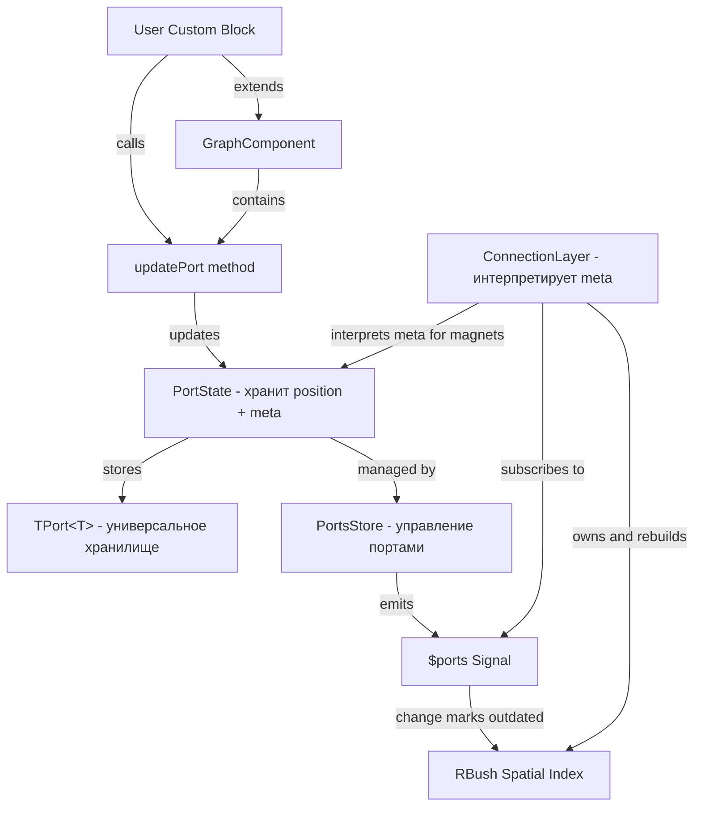

# Реализация магнитов для портов

## Краткое резюме

Добавляется функциональность "магнитов" для портов - автоматическое примагничивание конечной точки связи к ближайшему порту при создании соединений.

**Что получит пользователь:**
- Метод `updatePort(id, x?, y?, meta?)` в любом компоненте (Block, custom components)
- Возможность задать область магнита (width/height) через meta
- Кастомные условия примагничивания через функцию в meta
- Автоматический поиск ближайшего порта при создании связей
- Полный контроль над настройками через простой API

## Архитектурный принцип: Разделение ответственности

**Порты** (PortState, TPort):
- Хранят только позицию (x, y) и произвольные мета-данные (meta: T)
- НЕ знают про магниты - это универсальное хранилище
- Meta может использоваться для любых целей разными слоями

**ConnectionLayer**:
- Решает КАК интерпретировать meta для своих целей
- Если видит meta с полями `magnetWidthArea/magnetHeightArea` - использует для примагничивания
- Строит и управляет RBush для spatial indexing
- Другие слои могут интерпретировать meta по-своему

## Пользовательский API

Пользователи смогут настраивать магниты через метод `updatePort` в любом компоненте, наследующем `GraphComponent` (включая `Block`):

```typescript
// В кастомном блоке
class MyBlock extends Block {
  protected override willMount(): void {
    super.willMount();
    
    // Настроить магнит для анкора
    const portId = createAnchorPortId(this.state.id, "input-1");
    this.updatePort(portId, undefined, undefined, {
      magnetWidthArea: 50,
      magnetHeightArea: 50,
      magnetCondition: (ctx) => ctx.sourcePort.meta?.type === "data"
    });
    
    // Настроить магнит и позицию для output порта блока
    const outputPortId = createBlockPointPortId(this.state.id, false);
    this.updatePort(outputPortId, customX, customY, {
      magnetWidthArea: 40,
      magnetHeightArea: 40
    });
  }
}
```

**Сигнатура метода:**

```typescript
updatePort<T>(id: TPortId, x?: number, y?: number, meta?: T): void
```

## Архитектурная диаграмма



## 1. Сделать TPort generic типом и добавить updatePort

**Файл:** [`src/store/connection/port/Port.ts`](src/store/connection/port/Port.ts)

### Изменения в TPort

Сделать TPort generic с полем meta:

```typescript
export type TPort<T = unknown> = {
  id: TPortId;
  x: number;
  y: number;
  component?: Component;
  lookup?: boolean;
  meta?: T;  // Произвольная мета-информация (порт не знает что в ней)
};
```

### Стандартная структура meta для магнитов

Определить интерфейс для мета-информации магнитов (используется ConnectionLayer):

```typescript
export type TPortMagnetCondition = (context: {
  sourcePort: PortState;
  targetPort: PortState;
  sourceComponent?: Component;
  targetComponent?: Component;
  cursorPosition: TPoint;
  distance: number;
}) => boolean;

/**
 * Опциональная структура meta для магнитных портов
 * ConnectionLayer интерпретирует эту структуру для примагничивания
 */
export interface IPortMagnetMeta {
  magnetWidthArea?: number;     // Ширина области магнита (по умолчанию 40)
  magnetHeightArea?: number;    // Высота области магнита (по умолчанию 40)
  magnetCondition?: TPortMagnetCondition; // Условие примагничивания
}
```

### Обновление PortState

Сделать PortState также generic и добавить метод обновления с мета-информацией:

```typescript
export class PortState<T = unknown> {
  public $state = signal<TPort<T>>(undefined);
  
  // ... остальные поля
  
  constructor(port: TPort<T>) {
    this.$state.value = { ...port };
    if (port.component) {
      this.owner = port.component;
    }
  }
  
  // Геттер для мета-информации
  public get meta(): T | undefined {
    return this.$state.value.meta;
  }
  
  // Обновить позицию и/или мета-информацию порта
  public updatePortWithMeta(x?: number, y?: number, meta?: T): void {
    const updates: Partial<TPort<T>> = {};
    
    if (x !== undefined) updates.x = x;
    if (y !== undefined) updates.y = y;
    if (meta !== undefined) updates.meta = meta;
    
    if (Object.keys(updates).length > 0) {
      this.updatePort(updates);
    }
  }
}
```

## 2. Добавить updatePort в GraphComponent

**Файл:** [`src/components/canvas/GraphComponent/index.tsx`](src/components/canvas/GraphComponent/index.tsx)

Добавить публичный метод для обновления портов:

```typescript
export class GraphComponent {
  // ... существующие методы
  
  /**
   * Update port position and metadata
   * @param id Port identifier
   * @param x New X coordinate (optional)
   * @param y New Y coordinate (optional)
   * @param meta Port metadata (optional)
   */
  public updatePort<T = unknown>(
    id: TPortId, 
    x?: number, 
    y?: number, 
    meta?: T
  ): void {
    const port = this.getPort(id);
    port.updatePortWithMeta(x, y, meta);
  }
}
```

## 3. Добавить RBush в ConnectionLayer

**Файл:** [`src/components/canvas/layers/connectionLayer/ConnectionLayer.ts`](src/components/canvas/layers/connectionLayer/ConnectionLayer.ts)

### Добавить поля в ConnectionLayer

```typescript
import RBush from "rbush";

type MagneticPortBox = {
  minX: number;
  minY: number;
  maxX: number;
  maxY: number;
  port: PortState;
};

export class ConnectionLayer extends Layer {
  // ... существующие поля
  
  private magneticPortsTree: RBush<MagneticPortBox> | null = null;
  private isMagneticTreeOutdated = true;
  private portsUnsubscribe?: () => void;
}
```

### Подписка на изменения портов

В методе `afterInit()`:

```typescript
protected afterInit(): void {
  // ... существующий код
  
  // Подписаться на изменения портов для обновления RBush
  const portsStore = this.context.graph.rootStore.connectionsList.portsStore;
  this.portsUnsubscribe = portsStore.$ports.subscribe(() => {
    this.isMagneticTreeOutdated = true;
  });
  
  super.afterInit();
}
```

### Очистка при unmount

```typescript
public override unmount(): void {
  if (this.portsUnsubscribe) {
    this.portsUnsubscribe();
    this.portsUnsubscribe = undefined;
  }
  this.magneticPortsTree = null;
  super.unmount();
}
```

## 4. Реализовать lazy rebuild RBush

**Файл:** [`src/components/canvas/layers/connectionLayer/ConnectionLayer.ts`](src/components/canvas/layers/connectionLayer/ConnectionLayer.ts)

### Константы по умолчанию

```typescript
const DEFAULT_MAGNET_WIDTH = 40;
const DEFAULT_MAGNET_HEIGHT = 40;
```

### Метод создания bounding box

```typescript
private createMagneticPortBox(port: PortState): MagneticPortBox | null {
  const meta = port.meta as IPortMagnetMeta | undefined;
  
  // Проверить, является ли порт магнитным
  if (!meta?.magnetWidthArea && !meta?.magnetHeightArea) {
    return null; // Порт не магнитный
  }
  
  const widthArea = meta.magnetWidthArea ?? DEFAULT_MAGNET_WIDTH;
  const heightArea = meta.magnetHeightArea ?? DEFAULT_MAGNET_HEIGHT;
  
  return {
    minX: port.x - widthArea / 2,
    minY: port.y - heightArea / 2,
    maxX: port.x + widthArea / 2,
    maxY: port.y + heightArea / 2,
    port: port
  };
}
```

### Метод пересоздания RBush

```typescript
private rebuildMagneticTree(): void {
  if (!this.isMagneticTreeOutdated) {
    return;
  }
  
  const magneticBoxes: MagneticPortBox[] = [];
  const portsStore = this.context.graph.rootStore.connectionsList.portsStore;
  
  for (const port of portsStore.$ports.value) {
    const box = this.createMagneticPortBox(port);
    if (box) {
      magneticBoxes.push(box);
    }
  }
  
  this.magneticPortsTree = new RBush<MagneticPortBox>(9);
  if (magneticBoxes.length > 0) {
    this.magneticPortsTree.load(magneticBoxes);
  }
  
  this.isMagneticTreeOutdated = false;
}
```

## 5. Реализовать поиск ближайшего магнитного порта

**Файл:** [`src/components/canvas/layers/connectionLayer/ConnectionLayer.ts`](src/components/canvas/layers/connectionLayer/ConnectionLayer.ts)

```typescript
private findNearestMagneticPort(
  point: TPoint,
  sourcePort?: PortState,
  sourceComponent?: Component
): { port: PortState; snapPoint: TPoint } | null {
  // Пересоздать RBush если outdated
  this.rebuildMagneticTree();
  
  if (!this.magneticPortsTree) {
    return null;
  }
  
  // Поиск портов в области курсора
  const searchRadius = 100; // можно настроить
  const candidates = this.magneticPortsTree.search({
    minX: point.x - searchRadius,
    minY: point.y - searchRadius,
    maxX: point.x + searchRadius,
    maxY: point.y + searchRadius,
  });
  
  if (candidates.length === 0) {
    return null;
  }
  
  // Найти ближайший порт по векторному расстоянию
  let nearestPort: PortState | null = null;
  let nearestDistance = Infinity;
  
  for (const candidate of candidates) {
    const port = candidate.port;
    
    // Пропустить source порт
    if (sourcePort && port.id === sourcePort.id) {
      continue;
    }
    
    // Вычислить векторное расстояние
    const dx = port.x - point.x;
    const dy = port.y - point.y;
    const distance = Math.sqrt(dx * dx + dy * dy);
    
    // Проверить, находится ли точка в магнитной области
    const meta = port.meta as IPortMagnetMeta | undefined;
    const widthArea = meta?.magnetWidthArea ?? DEFAULT_MAGNET_WIDTH;
    const heightArea = meta?.magnetHeightArea ?? DEFAULT_MAGNET_HEIGHT;
    
    if (Math.abs(dx) > widthArea / 2 || Math.abs(dy) > heightArea / 2) {
      continue; // Вне магнитной области
    }
    
    // Проверить кастомное условие, если есть
    if (meta?.magnetCondition && sourcePort) {
      const canSnap = meta.magnetCondition({
        sourcePort: sourcePort,
        targetPort: port,
        sourceComponent,
        targetComponent: port.component,
        cursorPosition: point,
        distance,
      });
      
      if (!canSnap) {
        continue;
      }
    }
    
    // Обновить ближайший порт
    if (distance < nearestDistance) {
      nearestDistance = distance;
      nearestPort = port;
    }
  }
  
  if (!nearestPort) {
    return null;
  }
  
  return {
    port: nearestPort,
    snapPoint: { x: nearestPort.x, y: nearestPort.y },
  };
}
```

## 6. Интегрировать в onMoveNewConnection

**Файл:** [`src/components/canvas/layers/connectionLayer/ConnectionLayer.ts`](src/components/canvas/layers/connectionLayer/ConnectionLayer.ts)

### Вспомогательные методы

```typescript
private getSourcePort(component: BlockState | AnchorState): PortState | undefined {
  const portsStore = this.context.graph.rootStore.connectionsList.portsStore;
  
  if (component instanceof AnchorState) {
    return portsStore.getPort(createAnchorPortId(component.blockId, component.id));
  }
  
  // Для блока берём output port
  return portsStore.getPort(createBlockPointPortId(component.id, false));
}

private getComponentByPort(port: PortState): Block | Anchor | undefined {
  return port.component?.getViewComponent() as Block | Anchor | undefined;
}
```

### Изменения в onMoveNewConnection

Текущий код (строка 328-338):

```328:338:src/components/canvas/layers/connectionLayer/ConnectionLayer.ts
private onMoveNewConnection(event: MouseEvent, point: Point) {
  if (!this.startState || !this.sourceComponent) {
    return;
  }
  console.log(this.sourceComponent, "onMoveNewConnection", point);

  const newTargetComponent = this.context.graph.getElementOverPoint(point, [Block, Anchor]);

  // Use world coordinates from point instead of screen coordinates
  this.endState = new Point(point.x, point.y);
  this.performRender();
```

**Новая логика:**

```typescript
private onMoveNewConnection(event: MouseEvent, point: Point) {
  if (!this.startState || !this.sourceComponent) {
    return;
  }
  
  // Получаем source port
  const sourcePort = this.getSourcePort(this.sourceComponent);
  
  // Сначала пытаемся примагнититься
  const magnetResult = this.findNearestMagneticPort(
    point,
    sourcePort,
    this.sourceComponent
  );
  
  let actualEndPoint = point;
  let newTargetComponent = null;
  
  if (magnetResult) {
    // Примагничиваемся к порту
    actualEndPoint = magnetResult.snapPoint;
    newTargetComponent = this.getComponentByPort(magnetResult.port);
  } else {
    // Используем существующую логику
    newTargetComponent = this.context.graph.getElementOverPoint(point, [Block, Anchor]);
  }
  
  this.endState = new Point(actualEndPoint.x, actualEndPoint.y);
  this.performRender();
  
  // ... остальная логика обработки target (существующий код)
}
```

## 7. Экспорт типов и API

**Файл:** [`src/index.ts`](src/index.ts)

Экспортировать новые типы и утилиты для использования в приложениях:

```typescript
// Экспорт типов портов
export type { TPort, TPortMagnetCondition, IPortMagnetMeta } from "./store/connection/port/Port";

// Экспорт утилит для создания port ID (если ещё не экспортированы)
export { createAnchorPortId, createBlockPointPortId } from "./store/connection/port/utils";
```

**Примечание:** Метод `updatePort` уже доступен через `GraphComponent`, который экспортируется и от которого наследуется `Block`.

## 8. Примеры использования в Story

**Новый файл:** `src/stories/examples/magneticPorts/magneticPorts.stories.tsx`

### Story 1: Базовое использование

```typescript
import { Block, IPortMagnetMeta, createAnchorPortId } from "@gravity-ui/graph";

class MagneticBlock extends Block {
  protected override willMount(): void {
    super.willMount();
    
    // Настроить магниты для всех анкоров
    this.state.anchors?.forEach(anchor => {
      const portId = createAnchorPortId(this.state.id, anchor.id);
      this.updatePort(portId, undefined, undefined, {
        magnetWidthArea: 50,
        magnetHeightArea: 50
      } as IPortMagnetMeta);
    });
  }
}
```

### Story 2: Динамические магниты

```typescript
class DynamicMagneticBlock extends Block {
  protected override willMount(): void {
    super.willMount();
    this.setupMagnets();
  }
  
  private setupMagnets(): void {
    const inputPortId = createBlockPointPortId(this.state.id, true);
    const outputPortId = createBlockPointPortId(this.state.id, false);
    
    // Магниты зависят от размера блока
    this.updatePort(inputPortId, undefined, undefined, {
      magnetWidthArea: this.state.width * 0.5,
      magnetHeightArea: 60
    } as IPortMagnetMeta);
    
    this.updatePort(outputPortId, undefined, undefined, {
      magnetWidthArea: this.state.width * 0.5,
      magnetHeightArea: 60
    } as IPortMagnetMeta);
  }
  
  protected override stateChanged(nextState: TBlock): void {
    super.stateChanged(nextState);
    if (this.state.width !== nextState.width) {
      this.setupMagnets();
    }
  }
}
```

### Story 3: Условное примагничивание

```typescript
class ConditionalMagneticBlock extends Block {
  protected override willMount(): void {
    super.willMount();
    
    this.state.anchors?.forEach(anchor => {
      const portId = createAnchorPortId(this.state.id, anchor.id);
      
      this.updatePort(portId, undefined, undefined, {
        magnetWidthArea: 50,
        magnetHeightArea: 50,
        magnetCondition: (ctx) => {
          // Примагничиваться только к портам с совместимым типом
          const sourceMeta = ctx.sourcePort.meta as { dataType?: string };
          const targetMeta = ctx.targetPort.meta as { dataType?: string };
          
          return sourceMeta?.dataType === targetMeta?.dataType;
        }
      } as IPortMagnetMeta);
    });
  }
}
```

## Преимущества решения

1. **Чистая архитектура - разделение ответственности**:
   - Порты - универсальное хранилище (позиция + meta)
   - ConnectionLayer - интерпретирует meta для своих нужд
   - Другие слои могут использовать meta по-своему

2. **Простота и удобство API**: 
   - Единый метод `updatePort(id, x?, y?, meta?)` для всех настроек
   - Не требует изменений в TBlock или TAnchor
   - Понятный и предсказуемый интерфейс

3. **Полный контроль**: 
   - Пользователь сам решает, когда и как настраивать порты
   - Возможность динамически менять магниты
   - Можно настроить позицию и meta в одном вызове

4. **Производительность**: 
   - RBush обеспечивает O(log n) поиск
   - Lazy rebuild - пересоздание только при необходимости
   - Подписка на `$ports` автоматически отслеживает изменения

5. **Гибкость**: 
   - Generic TPort<T> для любой мета-информации
   - Кастомные условия через `magnetCondition`
   - Асимметричные области магнитов

6. **Расширяемость**: 
   - Meta может использоваться для других целей
   - Легко добавить другие интерпретации meta в других слоях

7. **Обратная совместимость**: 
   - TPort<T> с дефолтным `unknown`
   - Все поля опциональные
   - Метод updatePort опционален

## Ключевые технические детали

### Формулы bounding box (симметричные)

```typescript
minX = port.x - magnetWidthArea / 2
minY = port.y - magnetHeightArea / 2
maxX = port.x + magnetWidthArea / 2
maxY = port.y + magnetHeightArea / 2
```

### Алгоритм поиска

1. Проверить `isMagneticTreeOutdated`, если true - пересоздать RBush
2. Выполнить поиск в RBush с квадратом вокруг курсора
3. Отфильтровать кандидатов:
   - Исключить source порт
   - Проверить, что точка внутри магнитной области
   - Проверить кастомное условие (если есть)
4. Вернуть порт с минимальным векторным расстоянием

### Когда RBush помечается outdated

- При любом изменении `$ports` signal (через subscription)
- Автоматически отслеживает создание, удаление и обновление портов

## Обратная совместимость

### Существующий код продолжит работать

1. **TPort становится TPort<T = unknown>** - дефолтный generic параметр
2. **PortState становится PortState<T = unknown>** - аналогично
3. **Новый метод updatePort** - опциональный
4. **RBush в ConnectionLayer** - работает прозрачно
5. **Изменения в ConnectionLayer** - сначала магниты, потом старая логика

### Поведение по умолчанию

- Если порт не имеет meta с магнитной информацией - не участвует в магнитном поиске
- Если ни один порт не найден - работает `getElementOverPoint`
- Существующие блоки продолжают работать как раньше