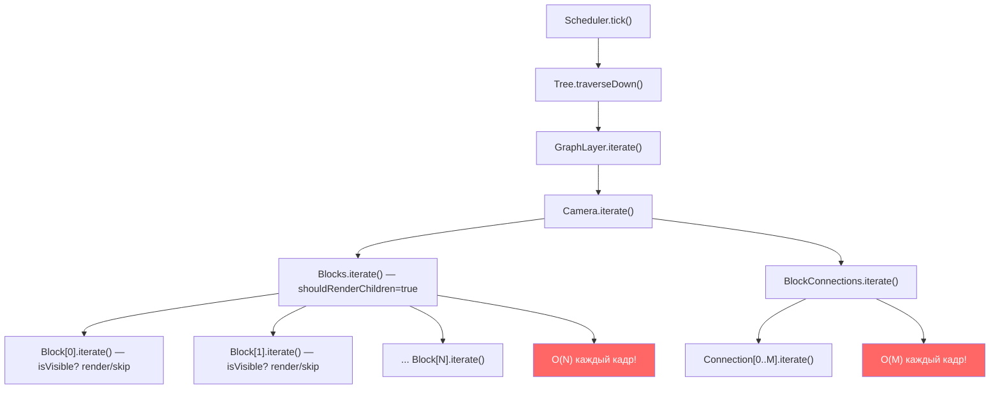
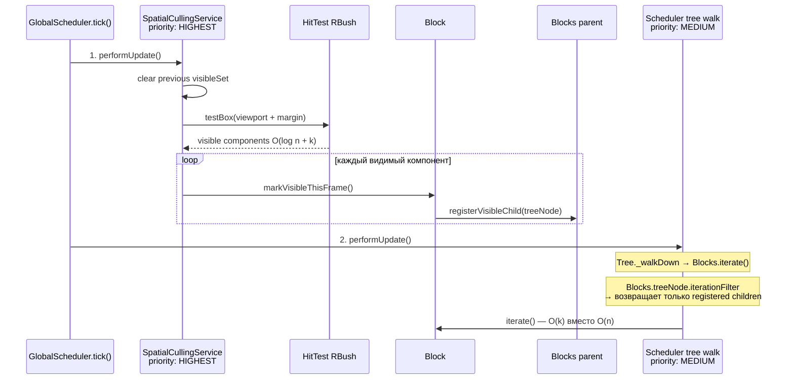

# Оптимизация spatial culling для итерации блоков

## Проблема

Каждый кадр `Tree._walkDown` обходит **все** дочерние узлы `Blocks`, вызывая `iterate()` на каждом блоке. Даже невидимые блоки проходят через `checkData()`, `willIterate()`, `isVisible()` и т.д. При 10K блоков и 1 видимом — ~9999 бесполезных вызовов `iterate()` каждый кадр.




## Выбранный подход: SpatialCullingService + Tree hook

Два слоя оптимизации:

- **SpatialCullingService** — отдельный scheduler с HIGHEST приоритетом, определяет "что видимо" через RBush (push-модель)
- `**Tree.getChildrenForIteration()`** — hook в tree walk, определяет "как пропускать невидимых" (pull-модель)

### Архитектура




### Ключевые решения

**Timing**: SpatialCullingService — отдельный scheduler с `ESchedulerPriority.HIGHEST`. GlobalScheduler выполняет все HIGHEST schedulers перед MEDIUM (tree walk). Это гарантирует, что метки видимости установлены до начала обхода дерева.

**Dirty-флаг**: Сервис не запускается каждый кадр. Он подписывается на события, меняющие видимость (camera-change, HitTest update), и ставит `dirty = true`. В `performUpdate` пересчёт только если dirty.

**Сброс меток**: Происходит в начале следующего `performUpdate` сервиса (перед новым вычислением), а не в конце кадра. Если видимость не менялась — предыдущие метки остаются валидными.

## Изменения по файлам

### 1. `[src/lib/Tree.ts](src/lib/Tree.ts)` — hook для фильтрации детей

Добавить `iterationFilter` callback и `getChildrenForIteration()`:

```typescript
// Callback: позволяет компоненту фильтровать детей для итерации
// Если возвращает null — используются все дети (fallback)
public iterationFilter: ((allChildren: Tree[]) => Tree[] | null) | null = null;

protected getChildrenForIteration(): Tree[] {
  const children = this.zIndexChildrenCache.get();
  if (this.iterationFilter) {
    return this.iterationFilter(children) ?? children;
  }
  return children;
}

protected _walkDown(iterator: TIterator, order: number) {
  this.renderOrder = order;
  if (iterator(this)) {
    if (!this.children.size) return;
    const children = this.getChildrenForIteration();  // <-- изменение
    for (let i = 0; i < children.length; i++) {
      children[i]._walkDown(iterator, i);
    }
  }
}
```

Почему callback, а не subclass: `treeNode` создаётся в `CoreComponent` конструкторе как `new Tree(this)`. Менять конструктор ради одного use-case нецелесообразно. Callback позволяет любому компоненту настроить фильтрацию своего treeNode.

### 2. `src/services/SpatialCullingService.ts` — новый сервис

```typescript
export class SpatialCullingService {
  private dirty = true;
  private visibleSet = new Set<GraphComponent>();
  private schedulerRemove: () => void;
  
  constructor(private graph: Graph) {
    // Регистрация как HIGHEST priority scheduler
    this.schedulerRemove = globalScheduler.addScheduler(
      this, ESchedulerPriority.HIGHEST
    );
    
    // Подписка на события, меняющие видимость
    graph.on("camera-change", () => { this.dirty = true; });
    graph.hitTest.on("update", () => { this.dirty = true; });
  }
  
  public performUpdate(): void {
    if (!this.dirty) return;
    this.dirty = false;
    
    // Сброс предыдущих меток
    for (const comp of this.visibleSet) {
      comp.visibleThisFrame = false;
    }
    this.visibleSet.clear();
    
    // Viewport с margin в мировых координатах
    const state = this.graph.cameraService.getCameraState();
    const margin = 200; // запас для плавного панорамирования
    const viewport = {
      minX: -state.relativeX - margin,
      minY: -state.relativeY - margin,
      maxX: -state.relativeX + state.relativeWidth + margin,
      maxY: -state.relativeY + state.relativeHeight + margin,
    };
    
    // O(log n + k) запрос через RBush
    const visible = this.graph.hitTest.testBox(viewport);
    
    for (const comp of visible) {
      if (comp instanceof GraphComponent) {
        comp.markVisibleThisFrame();
        this.visibleSet.add(comp);
      }
    }
  }
  
  public destroy(): void {
    this.schedulerRemove();
  }
}
```

### 3. `[src/components/canvas/GraphComponent/index.tsx](src/components/canvas/GraphComponent/index.tsx)` — механизм пометки

```typescript
// Новые свойства в GraphComponent:
public visibleThisFrame = false;

public markVisibleThisFrame(): void {
  this.visibleThisFrame = true;
  // Bottom-up уведомление: ребёнок регистрируется у родителя
  const parent = this.getParent();
  if (parent && 'registerVisibleChild' in parent) {
    (parent as ICullingAwareParent).registerVisibleChild(this);
  }
}
```

Интерфейс для родителей, поддерживающих culling:

```typescript
interface ICullingAwareParent {
  registerVisibleChild(child: GraphComponent): void;
}
```

### 4. `[src/components/canvas/blocks/Blocks.ts](src/components/canvas/blocks/Blocks.ts)` — интеграция фильтрации

```typescript
export class Blocks extends Component implements ICullingAwareParent {
  // Набор видимых treeNode для текущего кадра
  private visibleChildNodes = new Set<Tree>();
  // Карта: Component → treeNode (строится при updateChildren)
  private componentToNode = new Map<GraphComponent, Tree>();
  
  constructor(props, parent) {
    super(props, parent);
    // Настройка фильтрации на treeNode
    this.__comp.treeNode.iterationFilter = this.filterChildren.bind(this);
  }
  
  public registerVisibleChild(child: GraphComponent): void {
    const node = this.componentToNode.get(child);
    if (node) {
      this.visibleChildNodes.add(node);
    }
  }
  
  private filterChildren(allChildren: Tree[]): Tree[] | null {
    if (this.visibleChildNodes.size === 0) {
      return null; // fallback: iterate all (culling не активен)
    }
    
    // Добавить новые блоки (firstIterate = true → ещё нет hitBox)
    for (const child of allChildren) {
      const comp = child.data;
      if (comp instanceof Component && comp.firstIterate) {
        this.visibleChildNodes.add(child);
      }
    }
    
    const result = Array.from(this.visibleChildNodes);
    this.visibleChildNodes.clear(); // сброс для следующего кадра
    return result;
  }
  
  protected didUpdateChildren(): void {
    // Пересобрать карту component → treeNode
    this.componentToNode.clear();
    const children = this.__comp.children;
    const keys = this.__comp.childrenKeys;
    for (const key of keys) {
      const child = children[key];
      if (child) {
        this.componentToNode.set(child, child.__comp.treeNode);
      }
    }
  }
}
```

**Доступ к `__comp`**: Свойство `protected` в `CoreComponent`. `Blocks` наследует `Component → CoreComponent`, поэтому имеет доступ к `this.__comp`. Для доступа к `child.__comp` (дети — другие инстансы CoreComponent): в TypeScript `protected` доступен на инстансах того же класса или предков внутри методов класса-наследника. Blocks может обращаться к `children[key].__comp`, т.к. оба наследуют CoreComponent.

### 5. `[src/graph.ts](src/graph.ts)` — инициализация сервиса

```typescript
export class Graph {
  public readonly spatialCulling: SpatialCullingService;
  
  constructor(config) {
    // ... existing init ...
    this.spatialCulling = new SpatialCullingService(this);
  }
}
```

## Поток данных за один кадр (итоговый)

```
Frame N (rAF tick):
  1. GlobalScheduler.performUpdate() проходит по приоритетам:
  
  [HIGHEST] SpatialCullingService.performUpdate():
    - if (!dirty) return;              ← early exit если ничего не менялось
    - reset предыдущих меток           ← O(k_prev)
    - HitTest.testBox(viewport)        ← O(log n + k)
    - для каждого видимого:
        comp.markVisibleThisFrame()    ← O(1)
        parent.registerVisibleChild()  ← O(1), добавляет treeNode в Set
  
  [MEDIUM] Scheduler.performUpdate():
    - if (!scheduled) return;
    - Tree.traverseDown():
        ... → Blocks.iterate() → shouldRenderChildren = true
        Blocks.treeNode.getChildrenForIteration():
          → iterationFilter() возвращает visibleChildNodes ← O(k)
        _walkDown только по видимым детям:
          Block[visible_0].iterate() → render()
          Block[visible_1].iterate() → render()
          ... (k блоков вместо n)
          
  Итого: O(log n + k) вместо O(n)
```

## Edge cases

1. **Новые блоки (firstIterate)** — у них нет hitBox в RBush, SpatialCullingService их не найдёт. Решение: `filterChildren()` проверяет `firstIterate` и добавляет такие блоки в visible set.
2. **Блоки с pending state** — `setProps()`/`setState()` на невидимом блоке ставит `nextProps`/`nextState` в `__data`. Когда блок станет видимым и `iterate()` будет вызван, `checkData()` обработает pending данные. Это ленивая обработка — приемлемо для большинства случаев.
3. **Selected blocks** — выделение через `store` не требует iterate(). Визуальное обновление произойдёт когда блок попадёт в viewport. Если нужно немедленное обновление (например, для "scroll to selected"), это обрабатывается через camera API, который сдвинет viewport.
4. **Margin** — viewport расширяется на 200px (мировых координат) во все стороны для буферизации при панорамировании.
5. **Соединения** — `BlockConnections` аналогичная проблема O(M). Можно применить тот же подход, но с нюансом: линия соединения может пересекать viewport, когда оба конца за пределами. Для соединений bbox в HitTest охватывает всю линию, так что RBush запрос корректно найдёт такие соединения.
6. **Dirty-флаг координация** — сервис ставит `dirty = true` по событиям `camera-change` и `hitTest.update`. Это покрывает: панорамирование, зум, перетаскивание блоков, добавление/удаление блоков.

## Отвергнутые альтернативы

- **Вариант B (Grid cells)** — промежуточные SpatialCell компоненты. O(cells) вместо O(n), но фиксированный размер сетки, сложность переназначения при drag, лишние компоненты.
- **Вариант C (Override iterate)** — ручной обход в Blocks.iterate(). Ломает renderOrder, нарушает контракт tree walk.
- **Flag check в _walkDown** — проверка boolean на каждом ребёнке. Проще, но всё ещё O(n) проверок, хотя и дешёвых.

