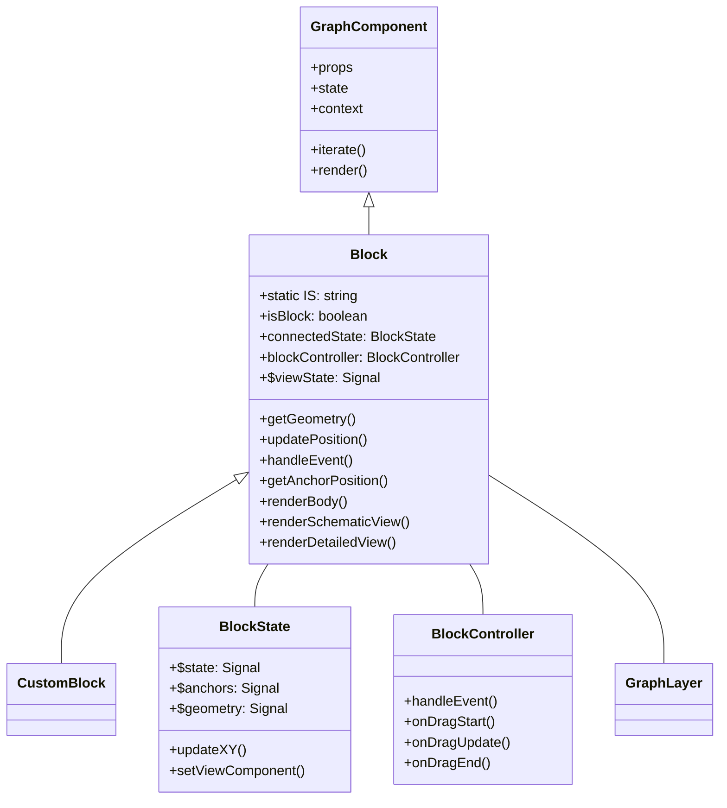
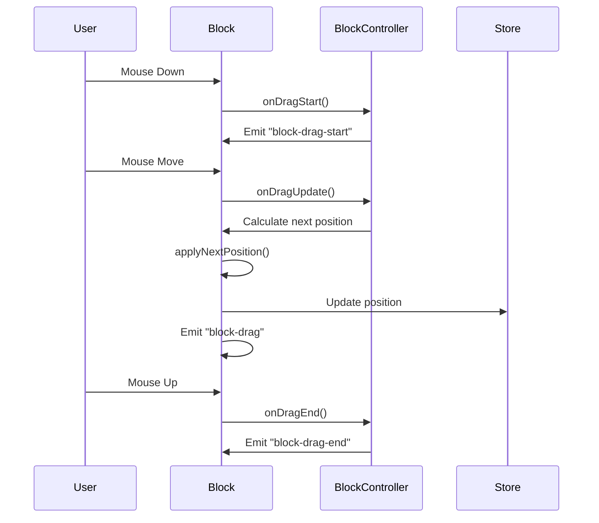

# Block Component Documentation

The Block component is the fundamental building block for rendering graph nodes in the visualization system. This document describes the Block component's structure, behavior, events, and how to extend it with custom implementations.

## Block Architecture

The Block component extends the GraphComponent class and provides the base functionality for rendering and interacting with graph blocks (nodes).



## Core Properties and Types

### TBlock Interface

The basic data structure for a block:

```typescript
type TBlock<T extends Record<string, unknown> = {}> = {
  id: TBlockId;              // Unique identifier
  is: string;                // Block type identifier
  x: number;                 // X coordinate
  y: number;                 // Y coordinate
  group?: string;            // Optional group identifier
  width: number;             // Width of the block
  height: number;            // Height of the block
  selected: boolean;         // Selection state
  label: string;              // Display name
  anchors: TAnchor[];        // Connection points
  settings?: TBlockSettings; // Additional settings
  meta?: T;                  // Custom metadata
};
```

### Block Component Properties

```typescript
type TBlockProps = {
  id: TBlockId;  // ID of the block to render
  font: string;  // Font to use for text rendering
  label: string; // Label of the block to render
};
```

### Block Component State

The Block component maintains several internal state properties:

- `connectedState`: Connection to the block's data in the store
- `shouldRenderText`: Controls text rendering
- `shouldRenderHtml`: Controls HTML overlay rendering
- `raised`: Indicates if the block is raised (higher z-index)
- `hidden`: Controls visibility of the block

## Lifecycle and Rendering

The Block component follows the standard component lifecycle, with additional specific behaviors:

1. **Initialization**:
   - Constructor subscribes to the block's data in the store
   - Sets up event listeners for drag events

2. **Rendering Pipeline**:
   - `willRender()` - Prepares the block for rendering
   - `render()` - Main rendering method, delegates to view-specific methods based on camera scale
   - `renderMinimalisticBlock()` - Renders a basic representation of the block
   - `renderSchematicView()` - Renders the block in schematic (simplified) view
   - `renderDetailedView()` - Renders the block in detailed view

3. **Children Management**:
   - `updateChildren()` - Creates anchor components for the block

4. **State Management**:
   - `stateChanged()` - Handles changes to the block's state
   - `updatePosition()` - Updates the block's position

## Scale-Dependent Rendering

The Block component uses a scale-dependent rendering system that displays different levels of detail based on the camera zoom level. This is controlled in the `render()` method:

```typescript
protected render() {
  const scaleLevel = this.context.graph.cameraService.getCameraBlockScaleLevel();
  
  switch (scaleLevel) {
    case ECameraScaleLevel.Minimalistic:
      this.renderMinimalisticBlock(this.context.ctx);
      break;
    case ECameraScaleLevel.Schematic:
      this.renderSchematicView(this.context.ctx);
      break;
    case ECameraScaleLevel.Detailed:
      this.renderDetailedView(this.context.ctx);
      break;
  }
}
```

The zoom levels are determined by the `SCALES` array in block constants configuration:

1. **Minimalistic View** (zoom < first threshold):
   - Used when blocks are viewed from far away
   - Renders only basic block shapes without text
   - Optimized for performance when many blocks are visible

2. **Schematic View** (between first and third threshold):
   - Standard view for normal interaction
   - Shows block name and basic structure
   - Balances detail and performance

3. **Detailed View** (zoom >= third threshold):
   - Full detail view for close-up inspection
   - Shows all block information and details
   - Used when working with specific blocks

You can configure these thresholds in the graph constants configuration:

```typescript
// Configure zoom level thresholds in graph settings
graph.setConstants({
  block: {
    // Array of three numbers defining zoom thresholds:
    // [minimalistic_threshold, schematic_threshold, detailed_threshold]
    SCALES: [
      0.125,  // Below this - minimalistic view
      0.225,  // Between first and third - schematic view
      0.7     // Above this - detailed view
    ]
  }
});
```

These thresholds control when the block switches between different rendering modes. You can adjust them based on your needs:
- Lower values will make the view mode switch at lower zoom levels (when zoomed out more)
- Higher values will make the view mode switch at higher zoom levels (when zoomed in more)

For example, if you want blocks to stay in detailed view longer when zooming out, you could lower the third threshold:
```typescript
graph.setConstants({
  block: {
    SCALES: [0.125, 0.225, 0.5] // Detailed view stays until zoom = 0.5
  }
});
```

### Rendering Methods

The Block component has three primary rendering methods:

1.  **renderMinimalisticBlock(ctx)**: Renders a basic representation of the block, used when the block is far away from the viewer.
2.  **renderSchematicView(ctx)**: Renders a simplified view of the block, including the block label.
3.  **renderDetailedView(ctx)**: Renders a detailed view of the block, including any additional information.

## Events and Interactions

The Block component handles several events:

### Drag Events



### Event Types

The Block component defines these custom events:

1. **block-drag-start** - Fired when a block drag operation begins
2. **block-drag** - Fired continuously during block dragging
3. **block-drag-end** - Fired when a block drag operation ends

## Anchors

Anchors are connection points on blocks that allow creating connections between blocks.

The Block component provides methods to manage anchors:

- `getAnchorPosition()` - Gets the position of an anchor
- `getConnectionPoint()` - Gets a connection point for in/out directions
- `renderAnchor()` - Renders an anchor at a specific position

## Customizing Block Appearance

The Block component provides several methods that can be overridden to customize appearance:

1. **renderStroke(color)** - Renders the block's border
2. **renderBody(ctx)** - Renders the block's main body
3. **renderSchematicView(ctx)** - Renders the simplified view
4. **renderDetailedView(ctx)** - Renders the detailed view
5. **renderText(text, ctx, options)** - Renders text within the block

## Extending Block with Custom Implementations

To create a custom block type, extend the Block class and override the rendering methods:

```typescript
class CustomBlock extends Block {
  // Override rendering methods to customize appearance
  protected renderBody(ctx: CanvasRenderingContext2D) {
    // Custom rendering code
    ctx.fillStyle = "blue";
    ctx.fillRect(this.state.x, this.state.y, this.state.width, this.state.height);
    
    // Call the base implementation if needed
    // super.renderBody(ctx);
  }
  
  // Override behavior methods to customize interactions
  protected onDragStart(event: MouseEvent) {
    // Custom drag start handling
    console.log("Custom drag start");
    
    // Call the base implementation
    super.onDragStart(event);
  }
}
```

## Configuring Graph to Use Custom Blocks

To use custom block implementations in a graph, you need to register them in the graph configuration:

```typescript
import { Block, EAnchorType } from "@gravity-ui/graph";

// Define a custom block type
class MySpecialBlock extends Block {
  protected renderSchematicView(ctx: CanvasRenderingContext2D) {
    // Custom rendering logic
    ctx.fillStyle = "#FFD700"; // Gold color
    ctx.beginPath();
    this.roundRect(ctx, this.state.x, this.state.y, this.state.width, this.state.height, [10]);
    ctx.fill();
    
    // Render text
    if (this.shouldRenderText) {
      ctx.fillStyle = "#000";
      this.renderText(this.state.label);
    }
  }

  // Polyfill for roundRect
  private roundRect(ctx: CanvasRenderingContext2D, x: number, y: number, width: number, height: number, radius: number[] | number) {
    const radii = typeof radius === 'number' ? [radius, radius, radius, radius] : radius;
    ctx.moveTo(x + radii[0], y);
    ctx.lineTo(x + width - radii[1], y);
    ctx.quadraticCurveTo(x + width, y, x + width, y + radii[1]);
    ctx.lineTo(x + width, y + height - radii[2]);
    ctx.quadraticCurveTo(x + width, y + height, x + width - radii[2], y + height);
    ctx.lineTo(x + radii[3], y + height);
    ctx.quadraticCurveTo(x, y + height, x, y + height - radii[3]);
    ctx.lineTo(x, y + radii[0]);
    ctx.quadraticCurveTo(x, y, x + radii[0], y);
    ctx.closePath();
  }
}

// Define a unique identifier for this block type
const SPECIAL_BLOCK_TYPE = "special-block";

// Create graph configuration with custom block
const graphConfig: TGraphConfig = {
  blocks: [
    {
      id: "block1",
      is: SPECIAL_BLOCK_TYPE, // Use the custom block type
      x: 100,
      y: 200,
      width: 180,
      height: 120,
      label: "My Special Block",
      selected: false,
      anchors: [
        // Define anchors for the block
        { id: "input1", type: EAnchorType.INPUT, point: [0, 0.5] },
        { id: "output1", type: EAnchorType.OUTPUT, point: [1, 0.5] }
      ]
    }
  ],
  settings: {
    // Register the custom block implementation
    blockComponents: {
      [SPECIAL_BLOCK_TYPE]: MySpecialBlock
    }
  }
};

// Create the graph with the custom configuration
const graph = new Graph(graphConfig, rootElement);
```

## Complete Example of a Custom Block

Here's a complete example of creating and using a custom block:

```typescript
import { Group } from "@/lib/Component";
import { Block, CanvasBlock, TGraphConfig, EAnchorType } from "@gravity-ui/graph";

// 1. Define a custom block class
class RoundedBlock extends CanvasBlock {
  // Override the stroke rendering
  protected renderStroke(color: string) {
    this.context.ctx.lineWidth = Math.round(3 / this.context.camera.getCameraScale());
    this.context.ctx.strokeStyle = color;
    this.roundRect(this.context.ctx, this.state.x, this.state.y, this.state.width, this.state.height, [15]);
    this.context.ctx.stroke();
  }

  // Override the schematic view rendering
  public override renderSchematicView() {
    const ctx = this.context.ctx;
    
    // Fill with custom color
    ctx.fillStyle = "#E6F7FF";
    ctx.beginPath();
    this.roundRect(ctx, this.state.x, this.state.y, this.state.width, this.state.height, [15]);
    ctx.fill();
    
    // Stroke
    ctx.lineWidth = 2;
    ctx.strokeStyle = "#0077CC";
    ctx.beginPath();
    this.roundRect(ctx, this.state.x, this.state.y, this.state.width, this.state.height, [15]);
    ctx.stroke();

    // Render text
    if (this.shouldRenderText) {
      ctx.fillStyle = "#003366";
      ctx.textAlign = "center";
      this.renderText(this.state.label);
    }
    
    // Render selection highlight
    if (this.state.selected) {
      this.renderStroke(this.context.colors.block.selectedBorder);
    }
  }

  // Polyfill for roundRect
  private roundRect(ctx: CanvasRenderingContext2D, x: number, y: number, width: number, height: number, radius: number[] | number) {
    const radii = typeof radius === 'number' ? [radius, radius, radius, radius] : radius;
    ctx.moveTo(x + radii[0], y);
    ctx.lineTo(x + width - radii[1], y);
    ctx.quadraticCurveTo(x + width, y, x + width, y + radii[1]);
    ctx.lineTo(x + width, y + height - radii[2]);
    ctx.quadraticCurveTo(x + width, y + height, x + width - radii[2], y + height);
    ctx.lineTo(x + radii[3], y + height);
    ctx.quadraticCurveTo(x, y + height, x, y + height - radii[3]);
    ctx.lineTo(x, y + radii[0]);
    ctx.quadraticCurveTo(x, y, x + radii[0], y);
    ctx.closePath();
  }
}

// 2. Define a unique type for the block
const ROUNDED_BLOCK_TYPE = "rounded-block";

// 3. Create graph configuration that uses the custom block
export const customBlockGraphConfig: TGraphConfig = {
  configurationName: "custom-blocks-example",
  blocks: [
    {
      id: "block1",
      is: ROUNDED_BLOCK_TYPE,
      x: 100,
      y: 100,
      width: 200,
      height: 150,
      label: "Rounded Block 1",
      selected: false,
      anchors: [
        { id: "in1", type: EAnchorType.INPUT, point: [0, 0.3] },
        { id: "in2", type: EAnchorType.INPUT, point: [0, 0.7] },
        { id: "out", type: EAnchorType.OUTPUT, point: [1, 0.5] }
      ]
    },
    {
      id: "block2",
      is: ROUNDED_BLOCK_TYPE,
      x: 400,
      y: 200,
      width: 200,
      height: 150,
      label: "Rounded Block 2",
      selected: false,
      anchors: [
        { id: "in", type: EAnchorType.INPUT, point: [0, 0.5] },
        { id: "out1", type: EAnchorType.OUTPUT, point: [1, 0.3] },
        { id: "out2", type: EAnchorType.OUTPUT, point: [1, 0.7] }
      ]
    }
  ],
  connections: [
    {
      id: "conn1",
      from: { block: "block1", anchor: "out" },
      to: { block: "block2", anchor: "in" }
    }
  ],
  settings: {
    blockComponents: {
      // Register the custom block implementation
      [ROUNDED_BLOCK_TYPE]: RoundedBlock
    }
  }
};

// 4. Create the graph with the custom blocks
const graph = new Graph(customBlockGraphConfig, document.getElementById("graph-container"));
```

## Best Practices for Custom Blocks

When creating custom block implementations, follow these best practices:

1. **Respect Camera Scale**: 
   ```typescript
   // Scale line widths based on camera zoom
   ctx.lineWidth = Math.round(2 / this.context.camera.getCameraScale());
   ```

2. **Use Theme Colors**:
   ```typescript
   // Use colors from graph theme
   ctx.fillStyle = this.context.colors.block.background;
   ctx.strokeStyle = this.context.colors.block.border;
   ```

3. **Handle Selection State**:
   ```typescript
   if (this.state.selected) {
     // Custom selection visualization
     this.renderStroke(this.context.colors.block.selectedBorder);
   }
   ```

4. **Optimize Rendering**:
   ```typescript
   // Only render text when needed
   if (this.shouldRenderText && this.context.camera.getCameraScale() > 0.5) {
     this.renderText(this.state.label);
   }
   ```

5. **Don't Transform Coordinates**:
   ```typescript
   // Incorrect - don't transform coordinates manually
   // const worldX = originalX * transform.scale + transform.x;
   
   // Correct - use original coordinates
   ctx.fillRect(this.state.x, this.state.y, this.state.width, this.state.height);
   ```

6. **Consider Performance**:
   ```typescript
   // Optimize for performance with complex custom blocks
   protected willRender() {
     // Only update complex calculations when needed
     if (this.needsRecalculation) {
       this.calculateGeometry();
       this.needsRecalculation = false;
     }
   }
   ```

7. **Support Different View Modes**:
   ```typescript
   // Implement both schematic and detailed views
   public renderSchematicView(ctx: CanvasRenderingContext2D) {
     // Simplified rendering for schematic view
   }
   
   public renderDetailedView(ctx: CanvasRenderingContext2D) {
     // More detailed rendering for close-up view
   }
   ```

## Handling State and Props Changes

The Block component provides lifecycle methods to respond to changes in state and props. By overriding these methods, custom blocks can optimize rendering and perform specific actions when data changes.

### Responding to State Changes

```typescript
class OptimizedBlock extends Block {
  protected stateChanged(nextState: TBlock): void {
    // Check what changed in the state
    if (nextState.selected !== this.state.selected) {
      // Handle selection state change
      console.log(`Block ${this.state.id} selection changed to ${nextState.selected}`);
      
      // Raise block z-index when selected
      this.zIndex = nextState.selected ? 
        this.context.constants.block.DEFAULT_Z_INDEX + 1 : 
        this.context.constants.block.DEFAULT_Z_INDEX;
    }
    
    if (nextState.label !== this.state.label) {
      // Handle label change
      console.log(`Block label changed from "${this.state.label}" to "${nextState.label}"`);
      
      // Only trigger a render if text-related properties change
      this.shouldRender = true;
    } else if (nextState.x !== this.state.x || nextState.y !== this.state.y) {
      // Handle position change
      console.log(`Block position changed to (${nextState.x}, ${nextState.y})`);
      
      // Update hit box for interaction
      // this.updateHitBox(nextState); // TODO: Implement updateHitBox
    } else {
      // Skip render for other property changes
      this.shouldRender = false;
    }
    
    // Always call parent method after your custom logic
    super.stateChanged(nextState);
  }
```

### Custom Property Change Detection

```typescript
class OptimizedBlock extends Block {
  // Override shouldRender to customize rendering behavior
  protected shouldRender(nextState: TBlock, nextProps: TBlockProps): boolean {
    // Check if relevant properties have changed
    if (nextState.x !== this.state.x || nextState.y !== this.state.y) {
      // Position changed, need to render
      return true;
    }
    
    if (nextProps.font !== this.props.font) {
      // Font changed, need to render
      return true;
    }
    
    // No relevant changes, skip rendering
    return false;
  }
}
```

### Advanced State Diffing for Optimizing Renders

For complex blocks with many properties, you can use advanced state diffing techniques to optimize rendering performance. This involves comparing the current and next state to identify only the properties that have changed and trigger a render only when necessary.

```typescript
import { isEqual } from 'lodash';

class OptimizedBlock extends Block {
  protected stateChanged(nextState: TBlock): void {
    // Compare relevant properties using lodash's isEqual
    if (!isEqual(nextState.style, this.state.style)) {
      // Style changed, need to render
      this.shouldRender = true;
    } else if (!isEqual(nextState.data, this.state.data)) {
      // Data changed, need to render
      this.shouldRender = true;
    } else {
      // No relevant changes, skip rendering
      this.shouldRender = false;
    }
    
    // Always call parent method after your custom logic
    super.stateChanged(nextState);
  }
}
```

By implementing these techniques, you can create custom block implementations that are both flexible and performant.