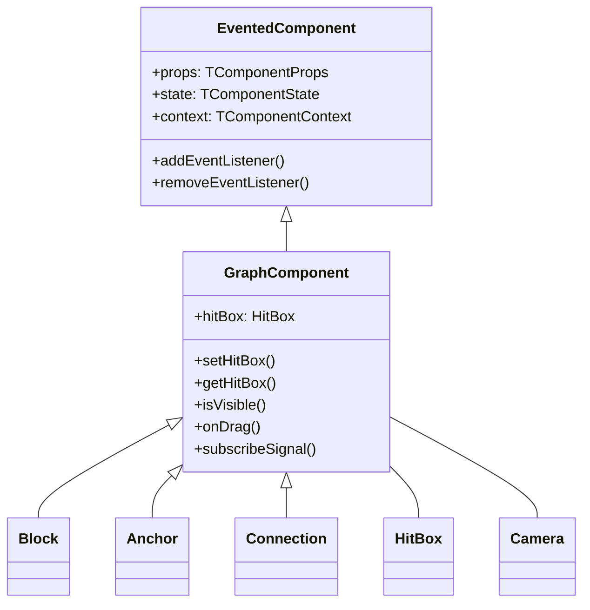
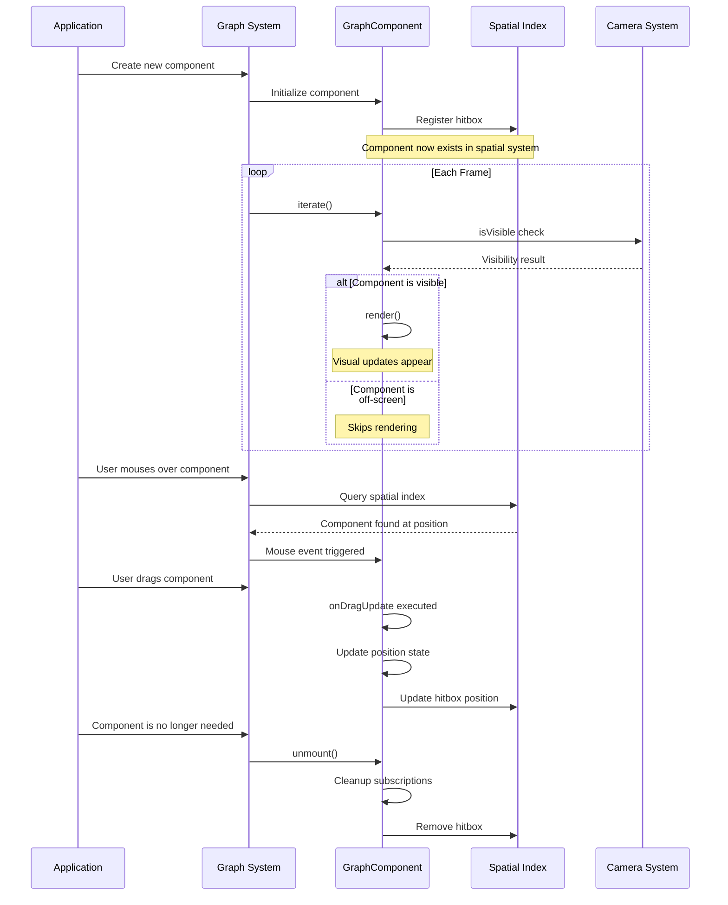

# Canvas GraphComponent: The Foundation of Visual Rendering

The `GraphComponent` class serves as the cornerstone for all visual elements within the graph system. Think of it as the "DNA" that all visible components share - blocks, connections, anchors, and interactive elements all inherit from this foundational class.

## What Makes GraphComponent Special?

Unlike standard components, GraphComponent adds crucial capabilities that transform simple rendering into an interactive, efficient visualization system:



## The Four Core Capabilities

### 1. Spatial Awareness with HitBox

Every GraphComponent maintains awareness of its position in space through a HitBox - a crucial system that:

```typescript
constructor(props: Props, parent: Component) {
  super(props, parent);
  // This line is critical - it registers the component in the spatial system
  this.hitBox = new HitBox(this, this.context.graph.hitTest);
}
```

**Behind the scenes:**
- When you create a component, it automatically gets registered in the graph's spatial index
- The HitBox maintains a rectangular boundary that represents where this component exists
- This boundary is used for mouse interaction detection, visibility culling, and spatial queries
- Without proper HitBox management, your component would be "invisible" to mouse interactions and queries!

**Real-world impact:**
When a user moves their mouse over the graph, the system uses these hitboxes to efficiently determine which component should respond, without having to check every component individually.

```typescript
// Setting your hitbox is about saying "I exist in this rectangular space"
public setHitBox(minX: number, minY: number, maxX: number, maxY: number, force?: boolean) {
  this.hitBox.update(minX, minY, maxX, maxY, force);
  // After this call, your component can be found in spatial queries
}
```

### 2. Smart Rendering with Visibility Checks

GraphComponent only renders when it makes sense to do so:

```typescript
protected willIterate(): void {
  super.willIterate();
  if (!this.firstIterate) {
    // This optimization prevents drawing components that aren't visible
    this.shouldRender = this.isVisible();
  }
}
```

**What's happening here:**
- Before each render cycle, the component checks if it's within the camera's visible area
- If not in view, the component skips rendering - saving precious CPU/GPU time
- This is crucial for performance when handling graphs with hundreds or thousands of elements
- The first iteration always renders (to establish initial state) but subsequent renders are optimized

**Visualization of the process:**
```
┌────────────────────┐
│   Camera Viewport  │
│                    │
│    ┌──────┐        │
│    │Visible│        │
│    │Comp A │        │
│    └──────┘        │
│                    │
└────────────────────┘
                        ┌──────┐
                        │Hidden │
                        │Comp B │ (Not rendered)
                        └──────┘
```

### 3. Universal Drag Behavior

The GraphComponent provides a standardized, powerful drag system:

```typescript
this.onDrag({
  isDraggable: (event) => !this.props.locked && event.button === 0,
  onDragStart: (event) => {
    // This runs when dragging starts
    this.setState({ dragging: true });
    this.context.graph.emit('element-drag-start', { element: this });
  },
  onDragUpdate: ({ diffX, diffY }, event) => {
    // This runs continuously during dragging, with precise calculations
    this.updatePosition(this.state.x - diffX, this.state.y - diffY);
  },
  onDrop: () => {
    // This runs when the user releases the mouse
    this.setState({ dragging: false });
    this.context.graph.emit('element-drag-end', { element: this });
  }
});
```

**The magic under the hood:**
- Handles all browser-specific event details and mouse capture
- Applies precise coordinate transformations between screen space and graph space
- Manages calculation of movement deltas even during camera pan/zoom
- Provides natural, responsive interaction without writing complex event code
- Works across devices and input methods with consistent behavior

**Behavior flow:**
1. `isDraggable` - First checks if dragging should be allowed 
2. `onDragStart` - Captures initial coordinates and prepares for movement
3. `onDragUpdate` - Provides movement data with precise world-space calculations
4. `onDrop` - Finalizes the operation and cleans up event listeners

### 4. Reactive Data with Signal Subscriptions

GraphComponent enables reactive programming with a simple subscription system:

```typescript
// Subscribe to a color theme change
this.subscribeSignal(this.context.theme.colorSignal, (newColors) => {
  this.setState({ fillColor: newColors.getColorFor(this.props.type) });
  this.performRender(); // Request a render with the new colors
});

// Subscribe to selection state
this.subscribeSignal(this.props.selectionManager.selectionSignal, (selection) => {
  const isSelected = selection.has(this.props.id);
  if (isSelected !== this.state.selected) {
    this.setState({ selected: isSelected });
  }
});
```

**What makes this powerful:**
- Signals provide a push-based reactive system (rather than polling for changes)
- Components automatically react to changes in data they care about
- All subscriptions are automatically cleaned up when the component unmounts
- Enables complex coordination between components without tight coupling
- Perfect for responding to theme changes, selection changes, data updates, etc.

## A Day in the Life of a GraphComponent

Let's follow a component through its lifecycle to understand how these systems work together:



## Making Your Custom Component Behave Well

When creating your own components based on GraphComponent, following these patterns will ensure they work harmoniously with the graph system:

### Pattern 1: Consistent HitBox Management

```typescript
class MyRectangleComponent extends GraphComponent {
  constructor(props, parent) {
    super(props, parent);
    
    // Always initialize the hitbox in constructor
    this.updateHitBoxFromState();
  }
  
  // Centralize hitbox updates in one method
  private updateHitBoxFromState() {
    // For rectangular components, use the bounds
    this.setHitBox(
      this.state.x,
      this.state.y,
      this.state.x + this.state.width,
      this.state.y + this.state.height
    );
  }
  
  // Update hitbox whenever geometry changes
  protected stateChanged(nextState) {
    if (
      nextState.x !== this.state.x ||
      nextState.y !== this.state.y ||
      nextState.width !== this.state.width ||
      nextState.height !== this.state.height
    ) {
      // We must update this immediately, not wait for render
      // Otherwise mouse interaction would be incorrect
      super.stateChanged(nextState);
      this.updateHitBoxFromState();
    } else {
      super.stateChanged(nextState);
    }
  }
}
```

**Why this matters:**
- Without proper hitbox updates, your component won't be clickable in the right places
- Updating the hitbox immediately after state changes ensures consistent interaction
- Centralizing the hitbox update logic prevents bugs and inconsistencies

### Pattern 2: Intelligent Rendering

```typescript
class MyEfficientComponent extends GraphComponent {
  protected render() {
    // First check: are we visible at all?
    if (!this.isVisible()) return;
    
    const ctx = this.context.ctx;
    const scale = this.context.camera.getCameraScale();
    
    // Second check: at current zoom level, which detail to show?
    if (scale < 0.5) {
      // At far zoom levels, render simplified version
      this.renderSimplified(ctx);
    } else {
      // At closer zoom levels, show full detail
      this.renderDetailed(ctx);
    }
    
    // Only render text if it would be legible
    if (scale > 0.3) {
      this.renderText(ctx);
    }
  }
}
```

**Benefits of this approach:**
- Components adapt their visual complexity based on zoom level
- Far-away objects use simpler rendering for better performance
- Up-close objects show rich detail for better usability
- Text only appears when it would be readable, reducing visual noise

### Pattern 3: Proper Cleanup

```typescript
class MyCleanComponent extends GraphComponent {
  constructor(props, parent) {
    super(props, parent);
    
    // Custom resources or listeners
    this.myCustomResource = createExpensiveResource();
    this.externalListener = window.addEventListener('resize', this.handleResize);
  }
  
  protected unmount() {
    // Release any resources you created
    this.myCustomResource.dispose();
    window.removeEventListener('resize', this.handleResize);
    
    // ALWAYS call super.unmount() last!
    // This ensures GraphComponent's cleanup runs
    super.unmount();
  }
}
```

**Why proper cleanup is critical:**
- Without proper cleanup, components can cause memory leaks
- Resources like event listeners, timers, and subscriptions must be released
- The GraphComponent's unmount method handles HitBox removal and signal unsubscription
- Always call `super.unmount()` to ensure this base cleanup occurs

### Pattern 4: Reactive Updates

```typescript
class DataAwareComponent extends GraphComponent {
  constructor(props, parent) {
    super(props, parent);
    
    // Subscribe to external data sources
    this.subscribeSignal(this.context.dataService.itemSignal, (items) => {
      const myItem = items.find(item => item.id === this.props.itemId);
      if (myItem) {
        this.setState({ 
          label: myItem.name,
          value: myItem.value,
          status: myItem.status
        });
      }
    });
    
    // Respond to theme changes
    this.subscribeSignal(this.context.theme.colorSignal, (colors) => {
      this.colorMap = {
        active: colors.success,
        warning: colors.warning,
        error: colors.error
      };
      this.performRender();
    });
  }
  
  protected render() {
    if (!this.isVisible()) return;
    
    const ctx = this.context.ctx;
    
    // Use the current state and theme colors
    ctx.fillStyle = this.colorMap[this.state.status] || '#cccccc';
    ctx.fillRect(this.state.x, this.state.y, this.state.width, this.state.height);
    
    // Render text if needed
    ctx.fillStyle = '#ffffff';
    this.renderText(`${this.state.label}: ${this.state.value}`);
  }
}
```

**The power of this pattern:**
- Components can automatically react to changes in multiple data sources
- Visual appearance updates in response to theme changes
- State remains consistent with external data
- No manual polling or update mechanisms needed

## Practical Examples

### Example 1: A Simple Badge Component

This example shows a circular badge that reacts to selection and displays a count:

```typescript
class BadgeComponent extends GraphComponent {
  constructor(props, parent) {
    super(props, parent);
    
    this.state = {
      x: props.x,
      y: props.y,
      radius: props.radius || 20,
      count: props.count || 0,
      selected: false
    };
    
    // Set up the circular hitbox
    this.updateHitBox();
    
    // Subscribe to selection changes
    this.subscribeSignal(this.context.selectionService.signal, (selection) => {
      const isSelected = selection.has(this.props.id);
      if (isSelected !== this.state.selected) {
        this.setState({ selected: isSelected });
      }
    });
    
    // Make it draggable
    this.onDrag({
      isDraggable: () => !this.props.locked,
      onDragUpdate: ({ diffX, diffY }) => {
        this.setState({
          x: this.state.x - diffX,
          y: this.state.y - diffY
        });
        this.updateHitBox();
      }
    });
  }
  
  private updateHitBox() {
    // Create a square hitbox that encompasses the circle
    const r = this.state.radius;
    this.setHitBox(
      this.state.x - r,
      this.state.y - r,
      this.state.x + r,
      this.state.y + r
    );
  }
  
  // Precise hit detection for the circle
  public onHitBox(data: HitBoxData) {
    if (!super.onHitBox(data)) return false;
    
    // Check if the point is actually within the circle
    const dx = data.point.x - this.state.x;
    const dy = data.point.y - this.state.y;
    const distSquared = dx*dx + dy*dy;
    
    return distSquared <= this.state.radius * this.state.radius;
  }
  
  protected render() {
    if (!this.isVisible()) return;
    
    const ctx = this.context.ctx;
    const { x, y, radius, count, selected } = this.state;
    
    // Draw circle
    ctx.beginPath();
    ctx.arc(x, y, radius, 0, Math.PI * 2);
    
    // Fill with appropriate color
    ctx.fillStyle = selected ? 
      this.context.colors.selectedBackground : 
      this.context.colors.badgeBackground;
    ctx.fill();
    
    // Draw border
    ctx.lineWidth = 2;
    ctx.strokeStyle = selected ?
      this.context.colors.selectedBorder :
      this.context.colors.badgeBorder;
    ctx.stroke();
    
    // Draw count
    if (this.context.camera.getCameraScale() > 0.3) {
      ctx.fillStyle = this.context.colors.badgeText;
      ctx.font = '16px Arial';
      ctx.textAlign = 'center';
      ctx.textBaseline = 'middle';
      ctx.fillText(count.toString(), x, y);
    }
  }
}
```

### Example 2: A Connection Line with Hover Effects

This example shows a connection line that highlights when hovered. Using the `BaseConnection` class as a foundation:

```typescript
class AnnotatedConnection extends BaseConnection {
  constructor(props, parent) {
    super(props, parent);
    
    // BaseConnection already sets up hitbox and state from the connection store
    // and subscribes to geometry changes
    
    // Additional initialization if needed
    this.listenEvents(["click"]);
  }
  
  // Use updateChildren to create and manage child components
  protected updateChildren() {
    // Connection points are provided by BaseConnection
    if (!this.connectionPoints) return [];
    
    const [sourcePoint, targetPoint] = this.connectionPoints;
    
    // Calculate midpoint for label
    const midX = (sourcePoint.x + targetPoint.x) / 2;
    const midY = (sourcePoint.y + targetPoint.y) / 2;
    
    // Calculate angle for arrow
    const angle = Math.atan2(
      targetPoint.y - sourcePoint.y,
      targetPoint.x - sourcePoint.x
    );
    
    return [
      // Create label at the middle of the connection
      ConnectionLabelComponent.create({
        text: this.state.label || "Connection",
        x: midX,
        y: midY - 15,
        connectionId: this.props.id
      }),
      
      // Create arrow at the end of the connection
      ArrowComponent.create({
        x: targetPoint.x,
        y: targetPoint.y,
        angle: angle,
        size: 10
      })
    ];
  }
  
  protected render() {
    if (!this.isVisible() || !this.connectionPoints) return;
    
    const ctx = this.context.ctx;
    const [sourcePoint, targetPoint] = this.connectionPoints;
    
    // Draw connection line
    ctx.beginPath();
    ctx.moveTo(sourcePoint.x, sourcePoint.y);
    ctx.lineTo(targetPoint.x, targetPoint.y);
    
    // Style based on state
    ctx.strokeStyle = this.state.selected ? 
      this.context.colors.selectedConnection : 
      (this.state.hovered ? this.context.colors.hoveredConnection : this.context.colors.connection);
    ctx.lineWidth = this.state.selected ? 2 : (this.state.hovered ? 1.5 : 1);
    ctx.stroke();
    
    // Children components will handle their own rendering
  }
  
  // BaseConnection already handles updating hitBox and points
  // So we don't need to implement those methods
}

// Example of a more complex connection with multiple segments
class MultiSegmentConnection extends BaseConnection {
  constructor(props, parent) {
    super(props, parent);
    
    // Add additional state for control points
    this.setState({
      controlPoints: props.controlPoints || this.generateDefaultControlPoints(),
      editMode: false
    });
    
    // Listen for selection changes to enable edit mode
    this.subscribeSignal(this.context.selectionService.signal, (selection) => {
      const isSelected = selection.has(this.props.id);
      
      if (isSelected !== this.state.selected) {
        this.setState({ 
          selected: isSelected,
          // Enable edit mode (showing control points) when selected
          editMode: isSelected
        });
      }
    });
  }
  
  private generateDefaultControlPoints() {
    // Generate default control points if connectionPoints are available
    if (!this.connectionPoints) return [];
    
    const [source, target] = this.connectionPoints;
    
    // Create a default control point at 1/3 and 2/3 of the way
    return [
      {
        x: source.x + (target.x - source.x) / 3,
        y: source.y + (target.y - source.y) / 3
      },
      {
        x: source.x + 2 * (target.x - source.x) / 3,
        y: source.y + 2 * (target.y - source.y) / 3
      }
    ];
  }
  
  // Use updateChildren to create control point components when in edit mode
  protected updateChildren() {
    if (!this.connectionPoints) return [];
    
    const children = [];
    
    // Add label component
    const [sourcePoint, targetPoint] = this.connectionPoints;
    const midX = (sourcePoint.x + targetPoint.x) / 2;
    const midY = (sourcePoint.y + targetPoint.y) / 2;
    
    children.push(
      ConnectionLabelComponent.create({
        text: this.state.label || "Connection",
        x: midX,
        y: midY - 15,
        connectionId: this.props.id
      })
    );
    
    // Add control points if in edit mode
    if (this.state.editMode) {
      this.state.controlPoints.forEach((point, index) => {
        children.push(
          ControlPointComponent.create({
            x: point.x,
            y: point.y,
            index: index,
            onMove: (newX, newY) => {
              // Create a new array to ensure state change detection
              const newControlPoints = [...this.state.controlPoints];
              newControlPoints[index] = { x: newX, y: newY };
              this.setState({ controlPoints: newControlPoints });
            }
          })
        );
      });
    }
    
    return children;
  }
  
  // Override render to draw a bezier curve instead of straight line
  protected render() {
    if (!this.isVisible() || !this.connectionPoints) return;
    
    const ctx = this.context.ctx;
    const [sourcePoint, targetPoint] = this.connectionPoints;
    const { controlPoints } = this.state;
    
    // Start the path
    ctx.beginPath();
    ctx.moveTo(sourcePoint.x, sourcePoint.y);
    
    // Draw curve through control points
    if (controlPoints.length >= 2) {
      // With two control points, use a cubic bezier
      ctx.bezierCurveTo(
        controlPoints[0].x, controlPoints[0].y,
        controlPoints[1].x, controlPoints[1].y,
        targetPoint.x, targetPoint.y
      );
    } else if (controlPoints.length === 1) {
      // With one control point, use a quadratic bezier
      ctx.quadraticCurveTo(
        controlPoints[0].x, controlPoints[0].y,
        targetPoint.x, targetPoint.y
      );
    } else {
      // Fallback to straight line
      ctx.lineTo(targetPoint.x, targetPoint.y);
    }
    
    // Style based on state
    ctx.strokeStyle = this.state.selected ? 
      this.context.colors.selectedConnection : 
      (this.state.hovered ? this.context.colors.hoveredConnection : this.context.colors.connection);
    ctx.lineWidth = this.state.selected ? 2 : (this.state.hovered ? 1.5 : 1);
    ctx.stroke();
    
    // Draw control point lines in edit mode
    if (this.state.editMode) {
      ctx.strokeStyle = 'rgba(100, 100, 100, 0.4)';
      ctx.lineWidth = 1;
      ctx.setLineDash([4, 4]);
      
      // Draw lines to control points
      ctx.beginPath();
      ctx.moveTo(sourcePoint.x, sourcePoint.y);
      
      controlPoints.forEach(point => {
        ctx.lineTo(point.x, point.y);
      });
      
      ctx.lineTo(targetPoint.x, targetPoint.y);
      ctx.stroke();
      
      // Reset dash pattern
      ctx.setLineDash([]);
    }
  }
}

// Control point component for bezier connections
class ControlPointComponent extends GraphComponent {
  constructor(props, parent) {
    super(props, parent);
    
    this.state = {
      x: props.x,
      y: props.y,
      size: props.size || 8,
      hovered: false
    };
    
    // Set up hitbox
    this.updateHitBox();
    
    // Set up event listeners
    this.listenEvents(['mouseenter', 'mouseleave']);
    
    // Make draggable
    this.onDrag({
      isDraggable: () => true,
      onDragUpdate: ({ diffX, diffY }) => {
        const newX = this.state.x - diffX;
        const newY = this.state.y - diffY;
        
        this.setState({
          x: newX,
          y: newY
        });
        
        this.updateHitBox();
        
        // Notify parent of position change
        if (typeof this.props.onMove === 'function') {
          this.props.onMove(newX, newY);
        }
      }
    });
  }
  
  private updateHitBox() {
    const size = this.state.size;
    this.setHitBox(
      this.state.x - size,
      this.state.y - size,
      this.state.x + size,
      this.state.y + size
    );
  }
  
  protected handleEvent(event) {
    super.handleEvent(event);
    
    switch (event.type) {
      case 'mouseenter':
        this.setState({ hovered: true });
        break;
      case 'mouseleave':
        this.setState({ hovered: false });
        break;
    }
  }
  
  protected render() {
    if (!this.isVisible()) return;
    
    const ctx = this.context.ctx;
    const { x, y, size, hovered } = this.state;
    
    // Draw control point
    ctx.fillStyle = hovered ? '#4285f4' : '#999999';
    ctx.strokeStyle = '#ffffff';
    ctx.lineWidth = 1.5;
    
    ctx.beginPath();
    ctx.arc(x, y, size, 0, Math.PI * 2);
    ctx.fill();
    ctx.stroke();
  }
}

// Reusing the ConnectionLabelComponent from previous example
```

## Performance Tips for GraphComponent

1. **Optimize Hit Testing**
   - Only update hitboxes when geometry changes, not every frame
   - For complex shapes, implement efficient `onHitBox` methods
   - Consider simplified hitboxes for initial testing, with precise testing in `onHitBox`

2. **Minimize State Updates**
   - Group related state changes into single `setState` calls
   - Use `shouldRender` and `shouldUpdateChildren` flags to prevent unnecessary rendering
   - Compare old and new values before triggering updates

3. **Render Adaptively**
   - Adjust detail level based on zoom level (camera scale)
   - Skip text rendering at far zoom levels
   - Use simplified shapes for distant elements

4. **Be Smart About Signal Subscriptions**
   - Only subscribe to signals your component actually needs
   - Keep subscription callbacks lightweight
   - Consider debouncing rapidly changing signals

5. **Leverage Visibility Optimization**
   - Don't perform expensive calculations for off-screen components
   - Pre-compute and cache complex geometries
   - Consider an extra buffer zone around visibility checks to prevent pop-in 

## GraphComponent in Different Contexts

GraphComponent is extremely versatile and can be used in various contexts within the graph system:

### 1. As Children in Blocks

Blocks can contain child components that provide additional visualizations or functionality:

```typescript
class DataBlock extends GraphComponent {
  constructor(props, parent) {
    super(props, parent);
    
    this.state = {
      x: props.x,
      y: props.y,
      width: 200,
      height: 150,
      data: props.data || []
    };
    
    // Set up the hit box
    this.updateHitBox();
    
    // Make block draggable
    this.setupDragging();
  }
  
  // Use updateChildren method to create and manage child components
  protected updateChildren() {
    return [
      // Create child chart component
      ChartComponent.create({
        data: this.state.data,
        width: this.state.width - 20,
        height: this.state.height - 40,
        x: 10,
        y: 30
      }),
      
      // Create child label component
      LabelComponent.create({
        text: this.props.title || "Data Block",
        x: 10,
        y: 10,
        width: this.state.width - 20
      })
    ];
  }
  
  private updateHitBox() {
    this.setHitBox(
      this.state.x, 
      this.state.y, 
      this.state.x + this.state.width, 
      this.state.y + this.state.height
    );
  }
  
  private setupDragging() {
    this.onDrag({
      isDraggable: (event) => !this.props.locked && event.button === 0,
      onDragUpdate: ({ diffX, diffY }) => {
        this.setState({
          x: this.state.x - diffX,
          y: this.state.y - diffY
        });
        this.updateHitBox();
      }
    });
  }
  
  // When parent moved, position children correctly by passing down transform
  protected render() {
    if (!this.isVisible()) return;
    
    const ctx = this.context.ctx;
    const { x, y, width, height } = this.state;
    
    // Draw block background
    ctx.fillStyle = this.context.colors.blockBackground;
    ctx.strokeStyle = this.context.colors.blockBorder;
    ctx.lineWidth = 1;
    
    ctx.fillRect(x, y, width, height);
    ctx.strokeRect(x, y, width, height);
    
    // Note: Child components handle their own rendering
    // Their coordinates are relative to this block's position
    
    // Position is handled by their own state plus parent transform
    this.context.transform.pushTranslate(x, y);
  }
  
  protected afterRender() {
    this.context.transform.pop();
  }
  
  // Update child components when data changes
  protected stateChanged(nextState) {
    super.stateChanged(nextState);
    
    if (
      nextState.x !== this.state.x || 
      nextState.y !== this.state.y
    ) {
      this.updateHitBox();
    }
    
    // When data changes, children will be automatically updated because
    // updateChildren() will be called and will use the latest state
  }
}

// Child component example - Chart
class ChartComponent extends GraphComponent {
  constructor(props, parent) {
    super(props, parent);
    
    this.state = {
      x: props.x,
      y: props.y,
      width: props.width,
      height: props.height,
      data: props.data
    };
    
    // Only set hit box within the parent's coordinate system
    this.setHitBox(
      this.state.x, 
      this.state.y, 
      this.state.x + this.state.width, 
      this.state.y + this.state.height
    );
  }
  
  protected render() {
    if (!this.isVisible()) return;
    
    const ctx = this.context.ctx;
    const { x, y, width, height, data } = this.state;
    
    // Draw chart background
    ctx.fillStyle = '#f5f5f5';
    ctx.fillRect(x, y, width, height);
    
    // Draw chart data
    if (data.length > 0) {
      const maxValue = Math.max(...data);
      const barWidth = width / data.length;
      
      ctx.fillStyle = '#4285f4';
      
      data.forEach((value, index) => {
        const barHeight = (value / maxValue) * height;
        const barX = x + index * barWidth;
        const barY = y + height - barHeight;
        
        ctx.fillRect(barX, barY, barWidth - 2, barHeight);
      });
    }
  }
}
```

**Key insights for block children:**
- Use `updateChildren()` method to create and manage children instead of direct instantiation
- Use `Component.create()` instead of `new Component()`
- Child components automatically receive updated props from parent when parent state changes
- Parent's transform is applied to position children correctly
- Children benefit from all GraphComponent features (hit testing, visibility, etc.)

### 2. As Children in Custom Connections

Connections can have child components for labels, arrows, or interactive elements. Using the `BaseConnection` class as a foundation:

```typescript
class AnnotatedConnection extends BaseConnection {
  constructor(props, parent) {
    super(props, parent);
    
    // BaseConnection already sets up hitbox and state from the connection store
    // and subscribes to geometry changes
    
    // Additional initialization if needed
    this.listenEvents(["click"]);
  }
  
  // Use updateChildren to create and manage child components
  protected updateChildren() {
    // Connection points are provided by BaseConnection
    if (!this.connectionPoints) return [];
    
    const [sourcePoint, targetPoint] = this.connectionPoints;
    
    // Calculate midpoint for label
    const midX = (sourcePoint.x + targetPoint.x) / 2;
    const midY = (sourcePoint.y + targetPoint.y) / 2;
    
    // Calculate angle for arrow
    const angle = Math.atan2(
      targetPoint.y - sourcePoint.y,
      targetPoint.x - sourcePoint.x
    );
    
    return [
      // Create label at the middle of the connection
      ConnectionLabelComponent.create({
        text: this.state.label || "Connection",
        x: midX,
        y: midY - 15,
        connectionId: this.props.id
      }),
      
      // Create arrow at the end of the connection
      ArrowComponent.create({
        x: targetPoint.x,
        y: targetPoint.y,
        angle: angle,
        size: 10
      })
    ];
  }
  
  protected render() {
    if (!this.isVisible() || !this.connectionPoints) return;
    
    const ctx = this.context.ctx;
    const [sourcePoint, targetPoint] = this.connectionPoints;
    
    // Draw connection line
    ctx.beginPath();
    ctx.moveTo(sourcePoint.x, sourcePoint.y);
    ctx.lineTo(targetPoint.x, targetPoint.y);
    
    // Style based on state
    ctx.strokeStyle = this.state.selected ? 
      this.context.colors.selectedConnection : 
      (this.state.hovered ? this.context.colors.hoveredConnection : this.context.colors.connection);
    ctx.lineWidth = this.state.selected ? 2 : (this.state.hovered ? 1.5 : 1);
    ctx.stroke();
    
    // Children components will handle their own rendering
  }
  
  // BaseConnection already handles updating hitBox and points
  // So we don't need to implement those methods
}

// Example of a more complex connection with multiple segments
class MultiSegmentConnection extends BaseConnection {
  constructor(props, parent) {
    super(props, parent);
    
    // Add additional state for control points
    this.setState({
      controlPoints: props.controlPoints || this.generateDefaultControlPoints(),
      editMode: false
    });
    
    // Listen for selection changes to enable edit mode
    this.subscribeSignal(this.context.selectionService.signal, (selection) => {
      const isSelected = selection.has(this.props.id);
      
      if (isSelected !== this.state.selected) {
        this.setState({ 
          selected: isSelected,
          // Enable edit mode (showing control points) when selected
          editMode: isSelected
        });
      }
    });
  }
  
  private generateDefaultControlPoints() {
    // Generate default control points if connectionPoints are available
    if (!this.connectionPoints) return [];
    
    const [source, target] = this.connectionPoints;
    
    // Create a default control point at 1/3 and 2/3 of the way
    return [
      {
        x: source.x + (target.x - source.x) / 3,
        y: source.y + (target.y - source.y) / 3
      },
      {
        x: source.x + 2 * (target.x - source.x) / 3,
        y: source.y + 2 * (target.y - source.y) / 3
      }
    ];
  }
  
  // Use updateChildren to create control point components when in edit mode
  protected updateChildren() {
    if (!this.connectionPoints) return [];
    
    const children = [];
    
    // Add label component
    const [sourcePoint, targetPoint] = this.connectionPoints;
    const midX = (sourcePoint.x + targetPoint.x) / 2;
    const midY = (sourcePoint.y + targetPoint.y) / 2;
    
    children.push(
      ConnectionLabelComponent.create({
        text: this.state.label || "Connection",
        x: midX,
        y: midY - 15,
        connectionId: this.props.id
      })
    );
    
    // Add control points if in edit mode
    if (this.state.editMode) {
      this.state.controlPoints.forEach((point, index) => {
        children.push(
          ControlPointComponent.create({
            x: point.x,
            y: point.y,
            index: index,
            onMove: (newX, newY) => {
              // Create a new array to ensure state change detection
              const newControlPoints = [...this.state.controlPoints];
              newControlPoints[index] = { x: newX, y: newY };
              this.setState({ controlPoints: newControlPoints });
            }
          })
        );
      });
    }
    
    return children;
  }
  
  // Override render to draw a bezier curve instead of straight line
  protected render() {
    if (!this.isVisible() || !this.connectionPoints) return;
    
    const ctx = this.context.ctx;
    const [sourcePoint, targetPoint] = this.connectionPoints;
    const { controlPoints } = this.state;
    
    // Start the path
    ctx.beginPath();
    ctx.moveTo(sourcePoint.x, sourcePoint.y);
    
    // Draw curve through control points
    if (controlPoints.length >= 2) {
      // With two control points, use a cubic bezier
      ctx.bezierCurveTo(
        controlPoints[0].x, controlPoints[0].y,
        controlPoints[1].x, controlPoints[1].y,
        targetPoint.x, targetPoint.y
      );
    } else if (controlPoints.length === 1) {
      // With one control point, use a quadratic bezier
      ctx.quadraticCurveTo(
        controlPoints[0].x, controlPoints[0].y,
        targetPoint.x, targetPoint.y
      );
    } else {
      // Fallback to straight line
      ctx.lineTo(targetPoint.x, targetPoint.y);
    }
    
    // Style based on state
    ctx.strokeStyle = this.state.selected ? 
      this.context.colors.selectedConnection : 
      (this.state.hovered ? this.context.colors.hoveredConnection : this.context.colors.connection);
    ctx.lineWidth = this.state.selected ? 2 : (this.state.hovered ? 1.5 : 1);
    ctx.stroke();
    
    // Draw control point lines in edit mode
    if (this.state.editMode) {
      ctx.strokeStyle = 'rgba(100, 100, 100, 0.4)';
      ctx.lineWidth = 1;
      ctx.setLineDash([4, 4]);
      
      // Draw lines to control points
      ctx.beginPath();
      ctx.moveTo(sourcePoint.x, sourcePoint.y);
      
      controlPoints.forEach(point => {
        ctx.lineTo(point.x, point.y);
      });
      
      ctx.lineTo(targetPoint.x, targetPoint.y);
      ctx.stroke();
      
      // Reset dash pattern
      ctx.setLineDash([]);
    }
  }
}

// Control point component for bezier connections
class ControlPointComponent extends GraphComponent {
  constructor(props, parent) {
    super(props, parent);
    
    this.state = {
      x: props.x,
      y: props.y,
      size: props.size || 8,
      hovered: false
    };
    
    // Set up hitbox
    this.updateHitBox();
    
    // Set up event listeners
    this.listenEvents(['mouseenter', 'mouseleave']);
    
    // Make draggable
    this.onDrag({
      isDraggable: () => true,
      onDragUpdate: ({ diffX, diffY }) => {
        const newX = this.state.x - diffX;
        const newY = this.state.y - diffY;
        
        this.setState({
          x: newX,
          y: newY
        });
        
        this.updateHitBox();
        
        // Notify parent of position change
        if (typeof this.props.onMove === 'function') {
          this.props.onMove(newX, newY);
        }
      }
    });
  }
  
  private updateHitBox() {
    const size = this.state.size;
    this.setHitBox(
      this.state.x - size,
      this.state.y - size,
      this.state.x + size,
      this.state.y + size
    );
  }
  
  protected handleEvent(event) {
    super.handleEvent(event);
    
    switch (event.type) {
      case 'mouseenter':
        this.setState({ hovered: true });
        break;
      case 'mouseleave':
        this.setState({ hovered: false });
        break;
    }
  }
  
  protected render() {
    if (!this.isVisible()) return;
    
    const ctx = this.context.ctx;
    const { x, y, size, hovered } = this.state;
    
    // Draw control point
    ctx.fillStyle = hovered ? '#4285f4' : '#999999';
    ctx.strokeStyle = '#ffffff';
    ctx.lineWidth = 1.5;
    
    ctx.beginPath();
    ctx.arc(x, y, size, 0, Math.PI * 2);
    ctx.fill();
    ctx.stroke();
  }
}

// Reusing the ConnectionLabelComponent from previous example
```

**Key insights for connection children using BaseConnection:**
- `BaseConnection` provides a solid foundation with connection state management
- It handles connection geometry updates automatically
- Connection points are maintained between source and target blocks
- Uses `updateChildren()` to create and manage label and control point components
- Allows for complex customizations like bezier curves with editable control points
- Children react to connection state changes like selection or hover

### 3. As Children in Custom Layers

GraphComponent can be used to create specialized layers for background effects, grid systems, or informational overlays:

```typescript
class ContextMenuLayer extends GraphComponent {
  constructor(props, parent) {
    super(props, parent);
    
    this.state = {
      visible: false,
      x: 0,
      y: 0,
      targetId: null,
      menuItems: []
    };
    
    // Set hit box for the entire graph to capture clicks
    this.setHitBox(-Infinity, -Infinity, Infinity, Infinity);
    
    // Listen for right-click events
    this.addEventListener('contextmenu', this.onContextMenu.bind(this));
    this.addEventListener('click', this.onClick.bind(this));
  }
  
  private onContextMenu(event) {
    // Prevent default context menu
    event.preventDefault();
    
    // Get coordinates in graph space
    const { x, y } = this.context.camera.transformClientToGraph(event.clientX, event.clientY);
    
    // Find what was clicked on
    const hitElement = this.context.graph.hitTest.getElementAt(x, y);
    const targetId = hitElement ? hitElement.id : null;
    
    // Set menu items based on what was clicked
    const menuItems = this.getMenuItemsForTarget(targetId);
    
    // Show menu
    this.setState({
      visible: true,
      x: x,
      y: y,
      targetId: targetId,
      menuItems: menuItems
    });
  }
  
  private onClick(event) {
    // Hide menu on any click
    if (this.state.visible) {
      this.setState({ visible: false });
    }
  }
  
  private getMenuItemsForTarget(targetId) {
    // Return different menu items based on what was clicked
    if (!targetId) {
      return [
        { label: "Add Block", action: "add-block" },
        { label: "Paste", action: "paste" },
        { label: "Select All", action: "select-all" }
      ];
    } else {
      return [
        { label: "Edit", action: "edit" },
        { label: "Copy", action: "copy" },
        { label: "Delete", action: "delete" }
      ];
    }
  }
  
  // Child components are created using updateChildren
  protected updateChildren() {
    if (!this.state.visible) {
      return [];
    }
    
    // Create menu background
    const children = [
      MenuBackgroundComponent.create({
        x: this.state.x,
        y: this.state.y,
        width: 120,
        height: this.state.menuItems.length * 30 + 10,
        opacity: 0.95
      })
    ];
    
    // Create menu items
    this.state.menuItems.forEach((item, index) => {
      children.push(
        MenuItemComponent.create({
          label: item.label,
          action: item.action,
          x: this.state.x + 5,
          y: this.state.y + 5 + index * 30,
          width: 110,
          height: 25,
          targetId: this.state.targetId
        })
      );
    });
    
    return children;
  }
  
  // Override the visibility check - we always want this layer to exist
  protected willIterate() {
    this.shouldRender = true;
  }
  
  protected render() {
    // No direct rendering needed - all done by children
  }
}

// Menu item component
class MenuItemComponent extends GraphComponent {
  constructor(props, parent) {
    super(props, parent);
    
    this.state = {
      x: props.x,
      y: props.y,
      width: props.width,
      height: props.height,
      label: props.label,
      action: props.action,
      hovered: false
    };
    
    // Set hit box
    this.setHitBox(
      this.state.x,
      this.state.y,
      this.state.x + this.state.width,
      this.state.y + this.state.height
    );
    
    // Listen for mouse events
    this.addEventListener('mousemove', () => {
      this.setState({ hovered: true });
    });
    
    this.addEventListener('mouseout', () => {
      this.setState({ hovered: false });
    });
    
    this.addEventListener('click', (event) => {
      // Prevent event propagation
      event.stopPropagation();
      
      // Trigger action
      this.context.graph.emit(this.state.action, {
        targetId: this.props.targetId,
        action: this.state.action
      });
    });
  }
  
  protected render() {
    if (!this.isVisible()) return;
    
    const ctx = this.context.ctx;
    const { x, y, width, height, label, hovered } = this.state;
    
    // Draw item background
    ctx.fillStyle = hovered ? '#e0e0e0' : 'transparent';
    ctx.fillRect(x, y, width, height);
    
    // Draw item text
    ctx.fillStyle = '#333333';
    ctx.font = '12px Arial';
    ctx.textAlign = 'left';
    ctx.textBaseline = 'middle';
    ctx.fillText(label, x + 10, y + height / 2);
  }
}
```

**Key insights for layer children:**
- Layers manage their children through the `updateChildren()` method
- Children are created based on layer state
- Use `Component.create()` to instantiate children
- Children can appear, disappear, or change based on layer state
- Layers often have special visibility behavior (always visible or screen-space fixed)

### Real-World Use Cases

1. **Dashboard Widget Block**
   ```typescript
   class DashboardWidget extends GraphComponent {
     protected updateChildren() {
       return [
         HeaderComponent.create({
           title: this.props.title,
           x: 0,
           y: 0,
           width: this.state.width
         }),
         
         // Dynamic children based on widget type
         ...this.getContentComponents()
       ];
     }
     
     private getContentComponents() {
       switch (this.props.type) {
         case 'chart':
           return [ChartComponent.create({ 
             data: this.props.data,
             x: 10, 
             y: 40,
             width: this.state.width - 20,
             height: this.state.height - 50
           })];
           
         case 'list':
           return this.props.items.map((item, index) => 
             ListItemComponent.create({
               item: item,
               x: 10,
               y: 40 + index * 30,
               width: this.state.width - 20
             })
           );
           
         default:
           return [];
       }
     }
   }
   ```

2. **Multi-Part Connection with Control Points**
   ```typescript
   class BezierConnection extends GraphComponent {
     protected updateChildren() {
       // Create all the segments and control points
       const children = [];
       
       // Add control points if connection is selected
       if (this.state.selected) {
         this.state.controlPoints.forEach((point, index) => {
           children.push(
             ControlPointComponent.create({
               x: point.x,
               y: point.y,
               index: index,
               onMove: (newX, newY) => {
                 const newPoints = [...this.state.controlPoints];
                 newPoints[index] = { x: newX, y: newY };
                 this.setState({ controlPoints: newPoints });
               }
             })
           );
         });
       }
       
       // Add connection label
       children.push(
         ConnectionLabelComponent.create({
           text: this.props.label,
           x: this.state.midPointX,
           y: this.state.midPointY
         })
       );
       
       return children;
     }
   }
   ```

3. **Annotation Layer with Multiple Annotation Types**
   ```typescript
   class AnnotationLayer extends GraphComponent {
     protected updateChildren() {
       return this.state.annotations.map(annotation => {
         switch (annotation.type) {
           case 'text':
             return TextAnnotationComponent.create({
               text: annotation.text,
               x: annotation.x,
               y: annotation.y,
               fontSize: annotation.fontSize || 14,
               color: annotation.color || '#000000'
             });
             
           case 'arrow':
             return ArrowAnnotationComponent.create({
               startX: annotation.startX,
               startY: annotation.startY,
               endX: annotation.endX,
               endY: annotation.endY,
               color: annotation.color || '#ff0000'
             });
             
           case 'highlight':
             return HighlightAnnotationComponent.create({
               targetId: annotation.targetId,
               color: annotation.color || 'rgba(255, 255, 0, 0.3)'
             });
             
           default:
             return null;
         }
       }).filter(child => child !== null);
     }
   }
   ``` 