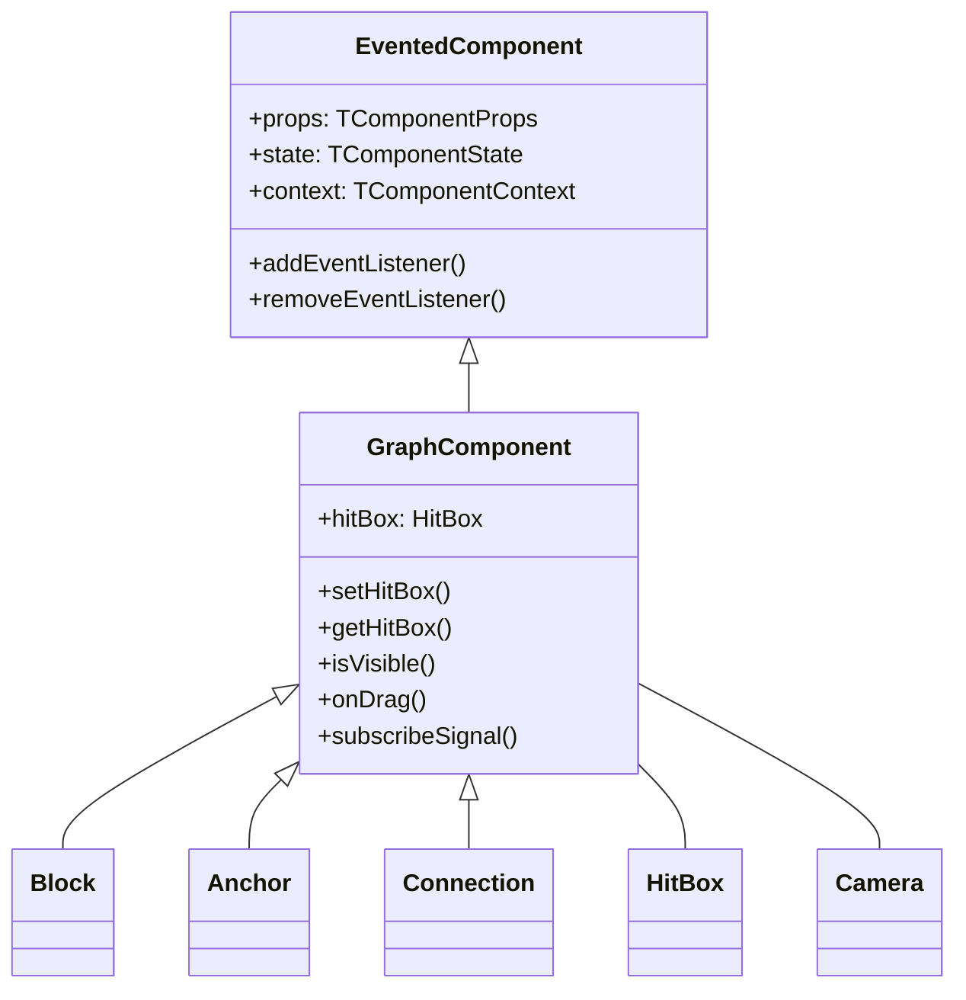
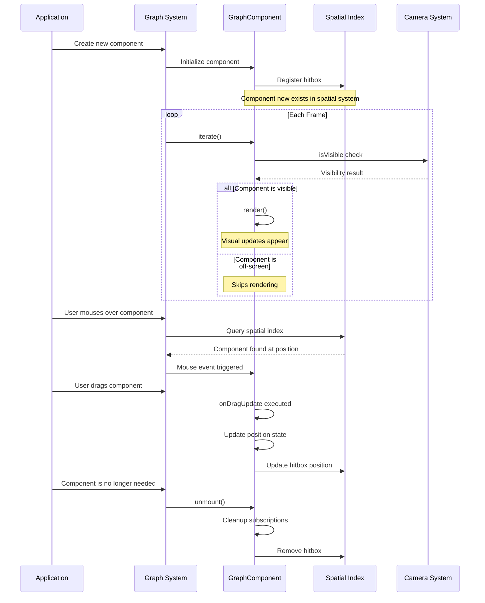

# Canvas GraphComponent: The Foundation of Visual Rendering

The `GraphComponent` class serves as the cornerstone for all visual elements within the graph system. Think of it as the "DNA" that all visible components share - blocks, connections, anchors, and interactive elements all inherit from this foundational class.

## What Makes GraphComponent Special?

Unlike standard components, GraphComponent adds crucial capabilities that transform simple rendering into an interactive, efficient visualization system:



## The Four Core Capabilities

### 1. Spatial Awareness with HitBox

Every GraphComponent maintains awareness of its position in space through a HitBox - a crucial system that:

```typescript
import { Component } from "@/lib/Component";
import { HitBox } from "@/services/HitTest";

interface Props {
  x: number;
  y: number;
}

class GraphComponent extends Component<Props> {
  constructor(props: Props, parent: Component) {
    super(props, parent);
    // This line is critical - it registers the component in the spatial system
    this.hitBox = new HitBox(this, this.context.graph.hitTest);
  }
}
```

**Behind the scenes:**
- When you create a component, it automatically gets registered in the graph's spatial index
- The HitBox maintains a rectangular boundary that represents where this component exists
- This boundary is used for mouse interaction detection, visibility culling, and spatial queries
- Without proper HitBox management, your component would be "invisible" to mouse interactions and queries!

**Real-world impact:**
When a user moves their mouse over the graph, the system uses these hitboxes to efficiently determine which component should respond, without having to check every component individually.

```typescript
// Setting your hitbox is about saying "I exist in this rectangular space"
public setHitBox(minX: number, minY: number, maxX: number, maxY: number, force?: boolean) {
  this.hitBox.update(minX, minY, maxX, maxY, force);
  // After this call, your component can be found in spatial queries
}
```

### 2. Smart Rendering with Visibility Checks

GraphComponent only renders when it makes sense to do so:

```typescript
protected willIterate(): void {
  super.willIterate();
  if (!this.firstIterate) {
    // This optimization prevents drawing components that aren't visible
    this.shouldRender = this.isVisible();
  }
}
```

**What's happening here:**
- Before each render cycle, the component checks if it's within the camera's visible area
- If not in view, the component skips rendering - saving precious CPU/GPU time
- This is crucial for performance when handling graphs with hundreds or thousands of elements
- The first iteration always renders (to establish initial state) but subsequent renders are optimized

**Visualization of the process:**
```
┌────────────────────┐
│   Camera Viewport  │
│                    │
│    ┌──────┐        │
│    │Visible│        │
│    │Comp A │        │
│    └──────┘        │
│                    │
└────────────────────┘
                        ┌──────┐
                        │Hidden │
                        │Comp B │ (Not rendered)
                        └──────┘
```

### 3. Universal Drag Behavior

The GraphComponent provides a standardized, powerful drag system:

```typescript
this.onDrag({
  isDraggable: (event) => !this.props.locked && event.button === 0,
  onDragStart: (event) => {
    // This runs when dragging starts
    this.setState({ dragging: true });
    this.context.graph.emit('element-drag-start', { element: this });
  },
  onDragUpdate: ({ diffX, diffY }, event) => {
    // This runs continuously during dragging, with precise calculations
    this.updatePosition(this.state.x - diffX, this.state.y - diffY);
  },
  onDrop: () => {
    // This runs when the user releases the mouse
    this.setState({ dragging: false });
    this.context.graph.emit('element-drag-end', { element: this });
  }
});
```

**The magic under the hood:**
- Handles all browser-specific event details and mouse capture
- Applies precise coordinate transformations between screen space and graph space
- Manages calculation of movement deltas even during camera pan/zoom
- Provides natural, responsive interaction without writing complex event code
- Works across devices and input methods with consistent behavior

**Behavior flow:**
1. `isDraggable` - First checks if dragging should be allowed 
2. `onDragStart` - Captures initial coordinates and prepares for movement
3. `onDragUpdate` - Provides movement data with precise world-space calculations
4. `onDrop` - Finalizes the operation and cleans up event listeners

### 4. Reactive Data with Signal Subscriptions

GraphComponent enables reactive programming with a simple subscription system:

```typescript
// Subscribe to a color theme change
this.subscribeSignal(this.context.theme.colorSignal, (newColors) => {
  this.setState({ fillColor: newColors.getColorFor(this.props.type) });
  this.performRender(); // Request a render with the new colors
});

// Subscribe to selection state
this.subscribeSignal(this.props.selectionManager.selectionSignal, (selection) => {
  const isSelected = selection.has(this.props.id);
  if (isSelected !== this.state.selected) {
    this.setState({ selected: isSelected });
  }
});
```

**What makes this powerful:**
- Signals provide a push-based reactive system (rather than polling for changes)
- Components automatically react to changes in data they care about
- All subscriptions are automatically cleaned up when the component unmounts
- Enables complex coordination between components without tight coupling
- Perfect for responding to theme changes, selection changes, data updates, etc.

## A Day in the Life of a GraphComponent

Let's follow a component through its lifecycle to understand how these systems work together:



## Making Your Custom Component Behave Well

When creating your own components based on GraphComponent, following these patterns will ensure they work harmoniously with the graph system:

### Pattern 1: Consistent HitBox Management

```typescript
import { Component } from "@/lib/Component";
import { HitBox } from "@/services/HitTest";

interface MyRectangleComponentState {
  x: number;
  y: number;
  width: number;
  height: number;
}

class MyRectangleComponent extends GraphComponent<any, MyRectangleComponentState> {
  constructor(props: any, parent: Component) {
    super(props, parent);
    
    this.state = {
      x: 0,
      y: 0,
      width: 0,
      height: 0
    };

    // Always initialize the hitbox in constructor
    this.updateHitBoxFromState();
  }
  
  // Centralize hitbox updates in one method
  private updateHitBoxFromState() {
    // For rectangular components, use the bounds
    this.setHitBox(
      this.state.x,
      this.state.y,
      this.state.x + this.state.width,
      this.state.y + this.state.height
    );
  }
  
  // Update hitbox whenever geometry changes
  protected stateChanged(nextState: MyRectangleComponentState) {
    if (
      nextState.x !== this.state.x ||
      nextState.y !== this.state.y ||
      nextState.width !== this.state.width ||
      nextState.height !== this.state.height
    ) {
      // We must update this immediately, not wait for render
      // Otherwise mouse interaction would be incorrect
      super.stateChanged(nextState);
      this.updateHitBoxFromState();
    } else {
      super.stateChanged(nextState);
    }
  }
}
```

**Why this matters:**
- Without proper hitbox updates, your component won't be clickable in the right places
- Updating the hitbox immediately after state changes ensures consistent interaction
- Centralizing the hitbox update logic prevents bugs and inconsistencies

### Pattern 2: Intelligent Rendering

```typescript
class MyEfficientComponent extends GraphComponent {
  protected render() {
    // First check: are we visible at all?
    if (!this.isVisible()) return;
    
    const ctx = this.context.ctx;
    const scale = this.context.camera.getCameraScale();
    
    // Second check: at current zoom level, which detail to show?
    if (scale < 0.5) {
      // At far zoom levels, render simplified version
      this.renderSimplified(ctx);
    } else {
      // At closer zoom levels, show full detail
      this.renderDetailed(ctx);
    }
    
    // Only render text if it would be legible
    if (scale > 0.3) {
      this.renderText(ctx);
    }
  }
}
```

**Benefits of this approach:**
- Components adapt their visual complexity based on zoom level
- Far-away objects use simpler rendering for better performance
- Up-close objects show rich detail for better usability
- Text only appears when it would be readable, reducing visual noise

### Pattern 3: Proper Cleanup

```typescript
class MyCleanComponent extends GraphComponent {
  constructor(props, parent) {
    super(props, parent);
    
    // Custom resources or listeners
    this.myCustomResource = createExpensiveResource();
    this.externalListener = window.addEventListener('resize', this.handleResize);
  }
  
  protected unmount() {
    // Release any resources you created
    this.myCustomResource.dispose();
    window.removeEventListener('resize', this.handleResize);
    
    // ALWAYS call super.unmount() last!
    // This ensures GraphComponent's cleanup runs
    super.unmount();
  }
}
```

**Why proper cleanup is critical:**
- Without proper cleanup, components can cause memory leaks
- Resources like event listeners, timers, and subscriptions must be released
- The GraphComponent's unmount method handles HitBox removal and signal unsubscription
- Always call `super.unmount()` to ensure this base cleanup occurs

### Pattern 4: Reactive Updates

```typescript
class DataAwareComponent extends GraphComponent {
  constructor(props, parent) {
    super(props, parent);
    
    // Subscribe to graph updates
    this.subscribeSignal(this.context.graph.updateSignal, (updateData) => {
      this.setState({
        graphData: updateData
      });
      this.performRender(); // Request a render with the new graph data
    });
  }
  
  protected render() {
    if (!this.isVisible()) return;
    
    const ctx = this.context.ctx;
    
    // Use the current state and theme colors
    ctx.fillStyle = this.colorMap[this.state.status] || '#cccccc';
    ctx.fillRect(this.state.x, this.state.y, this.state.width, this.state.height);
    
    // Render text if needed
    ctx.fillStyle = '#ffffff';
    this.renderText(`${this.state.label}: ${this.state.value}`);
  }
}
```

**The power of this pattern:**
- Components can automatically react to changes in multiple data sources
- Visual appearance updates in response to theme changes
- State remains consistent with external data
- No manual polling or update mechanisms needed

## Practical Examples

### Example 1: A Simple Badge Component

This example shows a circular badge that reacts to selection and displays a count:

```typescript
import { Component } from "@/lib/Component";
import { HitBox, HitBoxData } from "@/services/HitTest";

interface BadgeComponentProps {
  x: number;
  y: number;
  radius?: number;
  count?: number;
  id: string;
  locked: boolean;
}

interface BadgeComponentState {
  x: number;
  y: number;
  radius: number;
  count: number;
  selected: boolean;
}

class BadgeComponent extends GraphComponent<BadgeComponentProps, BadgeComponentState> {
  constructor(props: BadgeComponentProps, parent: Component) {
    super(props, parent);
    
    this.state = {
      x: props.x,
      y: props.y,
      radius: props.radius || 20,
      count: props.count || 0,
      selected: false
    };
    
    // Set up the circular hitbox
    this.updateHitBox();
    
    // Subscribe to selection changes
    this.subscribeSignal(this.context.selectionService.signal, (selection) => {
      const isSelected = selection.has(this.props.id);
      if (isSelected !== this.state.selected) {
        this.setState({ selected: isSelected });
      }
    });
    
    // Make it draggable
    this.onDrag({
      isDraggable: () => !this.props.locked,
      onDragUpdate: ({ diffX, diffY }) => {
        this.setState({
          x: this.state.x - diffX,
          y: this.state.y - diffY
        });
        this.updateHitBox();
      }
    });
  }
  
  private updateHitBox() {
    // Create a square hitbox that encompasses the circle
    const r = this.state.radius;
    this.setHitBox(
      this.state.x - r,
      this.state.y - r,
      this.state.x + r,
      this.state.y + r
    );
  }
  
  // Precise hit detection for the circle
  public onHitBox(data: HitBoxData) {
    if (!super.onHitBox(data)) return false;
    
    // Check if the point is actually within the circle
    const dx = data.point.x - this.state.x;
    const dy = data.point.y - this.state.y;
    const distSquared = dx*dx + dy*dy;
    
    return distSquared <= this.state.radius * this.state.radius;
  }
  
  protected render() {
    if (!this.isVisible()) return;
    
    const ctx = this.context.ctx;
    const { x, y, radius, count, selected } = this.state;
    
    // Draw circle
    ctx.beginPath();
    ctx.arc(x, y, radius, 0, Math.PI * 2);
    
    // Fill with appropriate color
    ctx.fillStyle = selected ? 
      this.context.colors.selectedBackground : 
      this.context.colors.badgeBackground;
    ctx.fill();
    
    // Draw border
    ctx.lineWidth = 2;
    ctx.strokeStyle = selected ?
      this.context.colors.selectedBorder :
      this.context.colors.badgeBorder;
    ctx.stroke();
    
    // Draw count
    if (this.context.camera.getCameraScale() > 0.3) {
      ctx.fillStyle = this.context.colors.badgeText;
      ctx.font = '16px Arial';
      ctx.textAlign = 'center';
      ctx.textBaseline = 'middle';
      ctx.fillText(count.toString(), x, y);
    }
  }
}
```

### Example 2: A Connection Line with Hover Effects

This example shows a connection line that highlights when hovered. Using the `BaseConnection` class as a foundation:

```typescript
import { BaseConnection } from "@/components/canvas/connections/BaseConnection";
import { Component } from "@/lib/Component";

interface AnnotatedConnectionProps {
  id: string;
  from: {
    block: string;
    anchor: string;
  };
  to: {
    block: string;
    anchor: string;
  };
}

class AnnotatedConnection extends BaseConnection<AnnotatedConnectionProps> {
  constructor(props: AnnotatedConnectionProps, parent: Component) {
    super(props, parent);
    
    // BaseConnection already sets up hitbox and state from the connection store
    // and subscribes to geometry changes
    
    // Additional initialization if needed
    // this.listenEvents(["click"]); // TODO: Implement listenEvents
  }
  
  // Use updateChildren to create and manage child components
  protected updateChildren() {
    // Connection points are provided by BaseConnection
    if (!this.connectionPoints) return [];
    
    const [sourcePoint, targetPoint] = this.connectionPoints;
    
    // Calculate midpoint for label
    const midX = (sourcePoint.x + targetPoint.x) / 2;
    const midY = (sourcePoint.y + targetPoint.y) / 2;
    
    // Calculate angle for arrow
    const angle = Math.atan2(
      targetPoint.y - sourcePoint.y,
      targetPoint.x - sourcePoint.x
    );
```

## Performance Tips for GraphComponent

## GraphComponent in Different Contexts

### 1. As Children in Blocks

### 2. As Children in Custom Connections

### 3. As Children in Custom Layers

### Real-World Use Cases