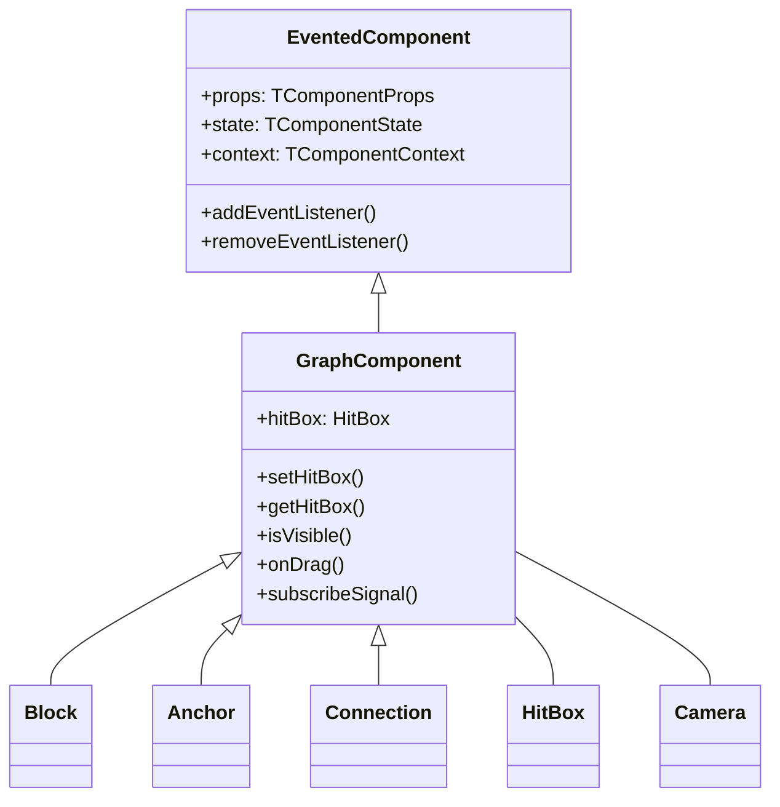
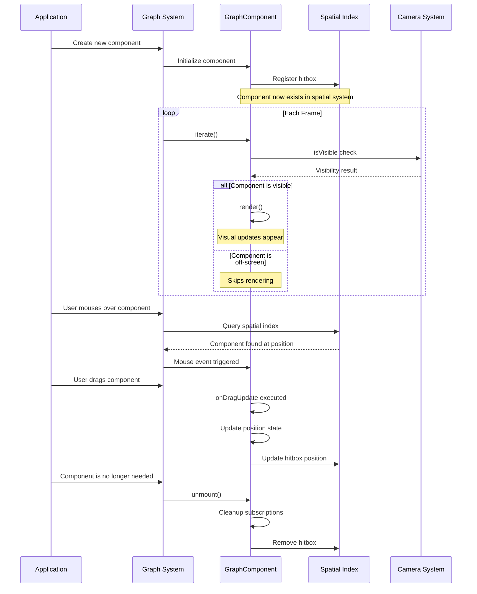

# Canvas GraphComponent: The Foundation of Visual Rendering

The `GraphComponent` class serves as the cornerstone for all visual elements within the graph system. Think of it as the "DNA" that all visible components share - blocks, connections, anchors, and interactive elements all inherit from this foundational class.

## What Makes GraphComponent Special?

Unlike standard components, GraphComponent adds crucial capabilities that transform simple rendering into an interactive, efficient visualization system:



## The Four Core Capabilities

### 1. Spatial Awareness with HitBox and R-tree

Every GraphComponent maintains awareness of its position in space through a HitBox. These hitboxes are organized in an R-tree spatial index for efficient querying - a crucial system that:

```typescript
import { Component } from "@/lib/Component";
import { HitBox } from "@/services/HitTest";

interface Props {
  x: number;
  y: number;
}

class GraphComponent extends Component<Props> {
  constructor(props: Props, parent: Component) {
    super(props, parent);
    // This line is critical - it registers the component in the spatial system
    this.hitBox = new HitBox(this, this.context.graph.hitTest);
  }
}
```

**Behind the scenes:**
- When you create a component, it automatically gets registered in the graph's spatial index
- The HitBox maintains a rectangular boundary that represents where this component exists
- This boundary is used for mouse interaction detection, visibility culling, and spatial queries
- Without proper HitBox management, your component would be "invisible" to mouse interactions and queries!

**Real-world impact:**
When a user moves their mouse over the graph, the system uses the R-tree spatial index to efficiently determine which component should respond. Instead of checking every component individually (O(n) complexity), the R-tree allows for logarithmic O(log n) lookups by quickly eliminating large sections of the spatial area that don't contain the point. This is critical for performance when dealing with graphs containing hundreds or thousands of components.

```typescript
// Setting your hitbox is about saying "I exist in this rectangular space"
public setHitBox(minX: number, minY: number, maxX: number, maxY: number, force?: boolean) {
  this.hitBox.update(minX, minY, maxX, maxY, force);
  // After this call, your component can be found in spatial queries
}
```

### 2. Camera-based Culling with HitBox Visibility Checks

GraphComponent only renders when its hitbox is within the camera's view area:

```typescript
protected willIterate(): void {
  super.willIterate();
  if (!this.firstIterate) {
    // This optimization prevents drawing components that aren't visible
    this.shouldRender = this.isVisible();
  }
}
```

**What's happening here:**
- Before each render cycle, the component checks if it's within the camera's visible area
- If not in view, the component skips rendering - saving precious CPU/GPU time
- This is crucial for performance when handling graphs with hundreds or thousands of elements
- The first iteration always renders (to establish initial state) but subsequent renders are optimized

**Visualization of the process:**
```
┌────────────────────┐
│   Camera Viewport  │
│                    │
│    ┌──────┐        │
│    │Visible│        │
│    │Comp A │        │
│    └──────┘        │
│                    │
└────────────────────┘
                         ┌──────┐
                         │Hidden │
                         │Comp B │ (Not rendered)
                         └──────┘
```

### 3. Mouse Event Handling

GraphComponent adds the ability to listen to mouse events on the element, including drag operations:

```typescript
// Listen for basic mouse events
this.addEventListener('click', (event) => {
  console.log('Component clicked at:', event.point);
  this.setState({ selected: true });
});

this.addEventListener('mouseenter', () => {
  this.setState({ hovered: true });
  this.performRender();
});

this.addEventListener('mouseleave', () => {
  this.setState({ hovered: false });
  this.performRender();
});

// Use the specialized drag handling system
this.onDrag({
  isDraggable: (event) => !this.props.locked && event.button === 0,
  onDragStart: (event) => {
    this.setState({ dragging: true });
    this.context.graph.emit('element-drag-start', { element: this });
  },
  onDragUpdate: ({ startCoords, diffX, diffY, deltaX, deltaY }, event) => {
    // diffX/diffY - absolute displacement from drag start position
    // deltaX/deltaY - incremental change since previous frame
    // Use diffX/diffY for absolute positioning from initial position
    this.updatePosition(this.initialX + diffX, this.initialY + diffY);
    // Or use deltaX/deltaY for incremental updates
    // this.updatePosition(this.state.x + deltaX, this.state.y + deltaY);
  },
  onDrop: () => {
    this.setState({ dragging: false });
    this.context.graph.emit('element-drag-end', { element: this });
  }
});
```

**What makes this powerful:**
- Events operate in world coordinates rather than screen coordinates
- Event bubbling works through the component hierarchy
- Proper mouse hit testing via the HitBox system
- Camera transforms are handled automatically
- Events that require capture (like drag) are managed for you
- Event handlers are automatically cleaned up on unmount

**Supported events:**
- `click`, `dblclick` - Mouse button clicks
- `mousedown`, `mouseup` - Mouse button press and release
- `mouseenter`, `mouseleave` - Mouse pointer entering or leaving the component
- Specialized `onDrag` system with precise coordinate handling

**The `onDrag` callback structure:**

```typescript
onDragUpdate: (diff: {
  startCoords: [number, number];    // Initial position when drag started
  prevCoords: [number, number];     // Position on previous frame
  currentCoords: [number, number];  // Current mouse position
  
  diffX: number;    // Absolute X displacement from start (currentCoords.x - startCoords.x)
  diffY: number;    // Absolute Y displacement from start (currentCoords.y - startCoords.y)
  
  deltaX: number;   // Incremental X change since last frame (currentCoords.x - prevCoords.x)
  deltaY: number;   // Incremental Y change since last frame (currentCoords.y - prevCoords.y)
}, event: MouseEvent) => void;
```

- Use `diffX`/`diffY` when you need to calculate position relative to drag start (e.g., `initialPosition + diffX`)
- Use `deltaX`/`deltaY` when you need frame-to-frame movement (e.g., `currentPosition + deltaX`)

### 4. Reactive Data with Signal Subscriptions

GraphComponent enables reactive programming with a simple subscription system:

```typescript
// Subscribe to a color theme change
this.subscribeSignal(this.context.theme.colorSignal, (newColors) => {
  this.setState({ fillColor: newColors.getColorFor(this.props.type) });
  this.performRender(); // Request a render with the new colors
});

// Subscribe to selection state
this.subscribeSignal(this.props.selectionManager.selectionSignal, (selection) => {
  const isSelected = selection.has(this.props.id);
  if (isSelected !== this.state.selected) {
    this.setState({ selected: isSelected });
  }
});
```

**What makes this powerful:**
- Signals provide a push-based reactive system (rather than polling for changes)
- Components automatically react to changes in data they care about
- All subscriptions are automatically cleaned up when the component unmounts
- Enables complex coordination between components without tight coupling
- Perfect for responding to theme changes, selection changes, data updates, etc.

## A Day in the Life of a GraphComponent

Let's follow a component through its lifecycle to understand how these systems work together:



## Making Your Custom Component Behave Well

When creating your own components based on GraphComponent, following these patterns will ensure they work harmoniously with the graph system:

### Pattern 1: Consistent HitBox Management

```typescript
import { Component } from "@/lib/Component";
import { HitBox } from "@/services/HitTest";

interface MyRectangleComponentState {
  x: number;
  y: number;
  width: number;
  height: number;
}

class MyRectangleComponent extends GraphComponent<any, MyRectangleComponentState> {
  constructor(props: any, parent: Component) {
    super(props, parent);
    
    this.state = {
      x: 0,
      y: 0,
      width: 0,
      height: 0
    };

    // Always initialize the hitbox in constructor
    this.updateHitBoxFromState();
  }
  
  // Centralize hitbox updates in one method
  private updateHitBoxFromState() {
    // For rectangular components, use the bounds
    this.setHitBox(
      this.state.x,
      this.state.y,
      this.state.x + this.state.width,
      this.state.y + this.state.height
    );
  }
  
  // Update hitbox whenever geometry changes
  protected stateChanged(nextState: MyRectangleComponentState) {
    if (
      nextState.x !== this.state.x ||
      nextState.y !== this.state.y ||
      nextState.width !== this.state.width ||
      nextState.height !== this.state.height
    ) {
      // We must update this immediately, not wait for render
      // Otherwise mouse interaction would be incorrect
      super.stateChanged(nextState);
      this.updateHitBoxFromState();
    } else {
      super.stateChanged(nextState);
    }
  }
}
```

**Why this matters:**
- Without proper hitbox updates, your component won't be clickable in the right places
- Updating the hitbox immediately after state changes ensures consistent interaction
- Centralizing the hitbox update logic prevents bugs and inconsistencies

### Pattern 2: Intelligent Rendering

```typescript
import { ECameraScaleLevel } from "@/services/camera/CameraService";

class MyEfficientComponent extends GraphComponent {
  protected render() {
    // First check: are we visible at all?
    if (!this.isVisible()) return;
    
    const ctx = this.context.ctx;
    const detailLevel = this.context.camera.getCameraBlockScaleLevel();
    
    // Second check: at current zoom level, which detail to show?
    if (detailLevel === ECameraScaleLevel.Minimalistic) {
      // At far zoom levels, render simplified version
      this.renderSimplified(ctx);
    } else if (detailLevel === ECameraScaleLevel.Schematic) {
      // At medium zoom levels, show schematic version
      this.renderSchematic(ctx);
    } else {
      // At closest zoom level (Detailed), show full detail
      this.renderDetailed(ctx);
    }
    
    // Only render text if it would be legible
    if (detailLevel === ECameraScaleLevel.Schematic || detailLevel === ECameraScaleLevel.Detailed) {
      this.renderText(ctx);
    }
  }
}
```

**Benefits of this approach:**
- Components adapt their visual complexity based on zoom level
- Far-away objects use simpler rendering for better performance
- Up-close objects show rich detail for better usability
- Text only appears when it would be readable, reducing visual noise

### Pattern 3: Proper Cleanup

```typescript
class MyCleanComponent extends GraphComponent {
  constructor(props, parent) {
    super(props, parent);
    
    // Custom resources or listeners
    this.myCustomResource = createExpensiveResource();
    this.externalListener = window.addEventListener('resize', this.handleResize);
  }
  
  protected unmount() {
    // Release any resources you created
    this.myCustomResource.dispose();
    window.removeEventListener('resize', this.handleResize);
    
    // ALWAYS call super.unmount() last!
    // This ensures GraphComponent's cleanup runs
    super.unmount();
  }
}
```

**Why proper cleanup is critical:**
- Without proper cleanup, components can cause memory leaks
- Resources like event listeners, timers, and subscriptions must be released
- The GraphComponent's unmount method handles HitBox removal and signal unsubscription
- Always call `super.unmount()` to ensure this base cleanup occurs

### Pattern 4: Reactive Updates

```typescript
class DataAwareComponent extends GraphComponent {
  constructor(props, parent) {
    super(props, parent);
    
    // Subscribe to graph updates
    this.subscribeSignal(this.context.graph.updateSignal, (updateData) => {
      this.setState({
        graphData: updateData
      });
      this.performRender(); // Request a render with the new graph data
    });
  }
  
  protected render() {
    if (!this.isVisible()) return;
    
    const ctx = this.context.ctx;
    
    // Use the current state and theme colors
    ctx.fillStyle = this.colorMap[this.state.status] || '#cccccc';
    ctx.fillRect(this.state.x, this.state.y, this.state.width, this.state.height);
    
    // Render text if needed
    ctx.fillStyle = '#ffffff';
    this.renderText(`${this.state.label}: ${this.state.value}`);
  }
}
```

**The power of this pattern:**
- Components can automatically react to changes in multiple data sources
- Visual appearance updates in response to theme changes
- State remains consistent with external data
- No manual polling or update mechanisms needed

## Practical Examples

### Example 1: A Simple Badge Component

This example shows a circular badge that reacts to selection and displays a count:

```typescript
import { Component } from "@/lib/Component";
import { HitBox, HitBoxData } from "@/services/HitTest";

interface BadgeComponentProps {
  x: number;
  y: number;
  radius?: number;
  count?: number;
  id: string;
  locked: boolean;
}

interface BadgeComponentState {
  x: number;
  y: number;
  radius: number;
  count: number;
  selected: boolean;
}

class BadgeComponent extends GraphComponent<BadgeComponentProps, BadgeComponentState> {
  constructor(props: BadgeComponentProps, parent: Component) {
    super(props, parent);
    
    this.state = {
      x: props.x,
      y: props.y,
      radius: props.radius || 20,
      count: props.count || 0,
      selected: false
    };
    
    // Set up the circular hitbox
    this.updateHitBox();
    
    // Subscribe to selection changes
    this.subscribeSignal(this.context.selectionService.signal, (selection) => {
      const isSelected = selection.has(this.props.id);
      if (isSelected !== this.state.selected) {
        this.setState({ selected: isSelected });
      }
    });
    
    // Make it draggable using incremental delta values
    this.onDrag({
      isDraggable: () => !this.props.locked,
      onDragUpdate: ({ deltaX, deltaY }) => {
        // deltaX/deltaY provide frame-to-frame movement
        this.setState({
          x: this.state.x + deltaX,
          y: this.state.y + deltaY
        });
        this.updateHitBox();
      }
    });
  }
  
  private updateHitBox() {
    // Create a square hitbox that encompasses the circle
    const r = this.state.radius;
    this.setHitBox(
      this.state.x - r,
      this.state.y - r,
      this.state.x + r,
      this.state.y + r
    );
  }
  
  // Precise hit detection for the circle
  public onHitBox(data: HitBoxData) {
    if (!super.onHitBox(data)) return false;
    
    // Check if the point is actually within the circle
    const dx = data.point.x - this.state.x;
    const dy = data.point.y - this.state.y;
    const distSquared = dx*dx + dy*dy;
    
    return distSquared <= this.state.radius * this.state.radius;
  }
  
  protected render() {
    if (!this.isVisible()) return;
    
    const ctx = this.context.ctx;
    const { x, y, radius, count, selected } = this.state;
    
    // Draw circle
    ctx.beginPath();
    ctx.arc(x, y, radius, 0, Math.PI * 2);
    
    // Fill with appropriate color
    ctx.fillStyle = selected ? 
      this.context.colors.selectedBackground : 
      this.context.colors.badgeBackground;
    ctx.fill();
    
    // Draw border
    ctx.lineWidth = 2;
    ctx.strokeStyle = selected ?
      this.context.colors.selectedBorder :
      this.context.colors.badgeBorder;
    ctx.stroke();
    
    // Draw count
    if (this.context.camera.getCameraBlockScaleLevel() !== ECameraScaleLevel.Minimalistic) {
      ctx.fillStyle = this.context.colors.badgeText;
      ctx.font = '16px Arial';
      ctx.textAlign = 'center';
      ctx.textBaseline = 'middle';
      ctx.fillText(count.toString(), x, y);
    }
  }
}
```

### Example 2: A Connection Line with Hover Effects

This example shows a connection line that highlights when hovered. Using the `BaseConnection` class as a foundation:

```typescript
import { BaseConnection } from "@/components/canvas/connections/BaseConnection";
import { Component } from "@/lib/Component";

interface AnnotatedConnectionProps {
  id: string;
  from: {
    block: string;
    anchor: string;
  };
  to: {
    block: string;
    anchor: string;
  };
}

class AnnotatedConnection extends BaseConnection<AnnotatedConnectionProps> {
  constructor(props: AnnotatedConnectionProps, parent: Component) {
    super(props, parent);
    
    // BaseConnection already sets up hitbox and state from the connection store
    // and subscribes to geometry changes
    
    // Additional initialization if needed
    this.state = {
      ...this.state,
      hovered: false,
      labelText: 'Connection'
    };
    
    // Listen for mouse events
    this.addEventListener('mouseover', this.handleMouseOver);
    this.addEventListener('mouseout', this.handleMouseOut);
  }
  
  private handleMouseOver = () => {
    this.setState({ hovered: true });
  }
  
  private handleMouseOut = () => {
    this.setState({ hovered: false });
  }
  
  // Use updateChildren to create and manage child components
  protected updateChildren() {
    // Connection points are provided by BaseConnection
    if (!this.connectionPoints) return [];
    
    const [sourcePoint, targetPoint] = this.connectionPoints;
    
    // Calculate midpoint for label
    const midX = (sourcePoint.x + targetPoint.x) / 2;
    const midY = (sourcePoint.y + targetPoint.y) / 2;
    
    // Calculate angle for arrow
    const angle = Math.atan2(
      targetPoint.y - sourcePoint.y,
      targetPoint.x - sourcePoint.x
    );
    
    // Create label component
    return [
      // Create a label at the midpoint
      Label.create(
        {
          x: midX,
          y: midY,
          text: this.state.labelText,
          angle: angle,
          highlighted: this.state.hovered
        },
        { key: 'label' }
      ),
      
      // Create an arrow at the end
      Arrow.create(
        {
          x: targetPoint.x,
          y: targetPoint.y,
          angle: angle,
          size: 10,
          highlighted: this.state.hovered
        },
        { key: 'arrow' }
      )
    ];
  }
  
  // Override the path creation to customize the line style
  protected createPath() {
    if (!this.connectionPoints || this.connectionPoints.length < 2) return null;
    
    const [sourcePoint, targetPoint] = this.connectionPoints;
    const path = new Path2D();
    
    // Simple straight line
    path.moveTo(sourcePoint.x, sourcePoint.y);
    path.lineTo(targetPoint.x, targetPoint.y);
    
    return path;
  }
  
  // Override the render method to customize the visual appearance
  protected render() {
    super.render(); // This draws the base connection line
    
    // Add custom highlights when hovered
    if (this.state.hovered && this.path) {
      const ctx = this.context.ctx;
      
      // Draw glow effect
      ctx.save();
      ctx.strokeStyle = this.context.colors.highlightColor;
      ctx.lineWidth = this.context.lineWidth + 4;
      ctx.globalAlpha = 0.4;
      ctx.stroke(this.path);
      ctx.restore();
    }
  }
}
```

## Performance Tips for GraphComponent

When working with graph visualizations, especially those with hundreds or thousands of elements, performance becomes critical. Here are essential tips to keep your GraphComponents efficient:

1. **Minimize HitBox Updates**: Only update your hitbox when geometry actually changes. Excessive hitbox updates can stress the spatial index.

   ```typescript
   // Bad - updating hitbox on every state change
   protected stateChanged() {
     super.stateChanged();
     this.updateHitBox(); // Don't do this for every state change!
   }
   
   // Good - only update when position changes
   protected stateChanged(nextState) {
     if (nextState.x !== this.state.x || nextState.y !== this.state.y) {
       super.stateChanged(nextState);
       this.updateHitBox();
     } else {
       super.stateChanged(nextState);
     }
   }
   ```

2. **Use Path2D Caching**: For complex shapes, create and cache Path2D objects instead of redrawing paths every frame.

   ```typescript
   // Cache the path when geometry changes
   private updatePath() {
     const path = new Path2D();
     // Complex path drawing operations...
     this.cachedPath = path;
   }
   
   // Use the cached path during rendering
   protected render() {
     if (!this.isVisible()) return;
     if (!this.cachedPath) this.updatePath();
     
     const ctx = this.context.ctx;
     ctx.stroke(this.cachedPath);
   }
   ```

3. **Level of Detail (LOD)**: Adjust rendering complexity based on zoom level.

   ```typescript
   import { ECameraScaleLevel } from "@/services/camera/CameraService";
   
   protected render() {
     const detailLevel = this.context.camera.getCameraBlockScaleLevel();
     
     // Render based on the detail level enum from Camera
     if (detailLevel === ECameraScaleLevel.Minimalistic) {
       // Lowest detail: render as a single pixel dot
       this.renderAsDot();
     } else if (detailLevel === ECameraScaleLevel.Schematic) {
       // Medium detail: render simplified shape
       this.renderSimple();
     } else {
       // Highest detail (ECameraScaleLevel.Detailed): render full detail
       this.renderDetailed();
     }
   }
   ```

4. **Minimize Context State Changes**: Group similar rendering operations to reduce the overhead of changing context properties.

   ```typescript
   // Group similar drawing operations together
   protected render() {
     if (!this.isVisible()) return;
     
     const ctx = this.context.ctx;
     
     // Set styles once for all similar elements
     ctx.fillStyle = '#ff0000';
     
     // Draw all red elements
     this.redElements.forEach(element => {
       ctx.fillRect(element.x, element.y, element.width, element.height);
     });
     
     // Then change style once for the next group
     ctx.fillStyle = '#0000ff';
     
     // Draw all blue elements
     this.blueElements.forEach(element => {
       ctx.fillRect(element.x, element.y, element.width, element.height);
     });
   }
   ```

5. **Optimize Child Component Creation**: Only create child components when necessary and use stable keys to prevent recreation.

   ```typescript
   protected updateChildren() {
     // Only create children if parent is visible
     if (!this.isVisible()) return [];
     
     // Use stable keys so React/GraphComponents don't recreate unnecessarily
     return [
       ChildComponent.create({...}, { key: 'stable-id-1' }),
       ChildComponent.create({...}, { key: 'stable-id-2' })
     ];
   }
   ```

## GraphComponent in Different Contexts

GraphComponents can be used in various contexts within the graph system. Understanding these contexts helps you create more effective and cohesive visualizations.

### 1. As Children in Blocks

When used as children within blocks, GraphComponents can create rich, interactive block content:

```typescript
class ComplexBlock extends Block {
  protected updateChildren() {
    return [
      // Add a badge to top-right corner with absolute positioning
      BadgeComponent.create({
        x: this.state.x + this.state.width - 10,
        y: this.state.y,
        count: this.props.notifications,
      }, { key: 'badge' }),
      
      // Add an icon to the left side with absolute positioning
      IconComponent.create({
        x: this.state.x,
        y: this.state.y + this.state.height / 2,
        icon: this.props.icon,
      }, { key: 'icon' }),
      
      // Add a progress indicator to the bottom with absolute positioning
      ProgressBarComponent.create({
        x: this.state.x,
        y: this.state.y + this.state.height - 5,
        width: this.state.width,
        progress: this.props.progress,
      }, { key: 'progress' })
    ];
  }
}
```

**Best practices:**
- Always use absolute positioning for all child components
- Update child positions when the block is resized
- When placing child components, use the block's dimensions to calculate positions
- Consider block selection state when styling children

### 2. As Children in Custom Connections

GraphComponents can enhance connections with labels, decorations, and interactive elements:

```typescript
class EnhancedConnection extends BaseConnection {
  protected updateChildren() {
    if (!this.connectionPoints) return [];
    
    const [start, end] = this.connectionPoints;
    const midX = (start.x + end.x) / 2;
    const midY = (start.y + end.y) / 2;
    
    return [
      // Add a label in the middle with absolute positioning
      ConnectionLabel.create({
        x: midX,
        y: midY,
        text: this.props.label,
      }, { key: 'label' }),
      
      // Add interactive buttons with absolute positioning
      ActionButton.create({
        x: midX + 20,
        y: midY - 10,
        icon: 'edit',
        action: () => this.props.onEdit(),
      }, { key: 'edit-button' }),
      
      // Add decorative elements with absolute positioning
      ArrowComponent.create({
        x: end.x,
        y: end.y,
        angle: Math.atan2(end.y - start.y, end.x - start.x),
      }, { key: 'arrow' })
    ];
  }
}
```

**Special considerations:**
- Connection points may change when blocks move
- Children need to reposition with absolute coordinates when the connection changes
- Hitboxes should follow the connection path for proper interaction
- Consider connection selection/hover states

### 3. As Children in Custom Layers

GraphComponents can create global UI elements in custom layers that float above the graph:

```typescript
class ToolbarLayer extends Layer {
  protected updateChildren() {
    return [
      ButtonComponent.create({
        icon: 'zoom-in',
        action: () => this.context.camera.zoomIn(),
      }, { key: 'zoom-in' }),
      
      ButtonComponent.create({
        icon: 'zoom-out',
        action: () => this.context.camera.zoomOut(),
      }, { key: 'zoom-out' }),
      
      SelectionInfoComponent.create({
        selection: this.context.selection,
      }, { key: 'selection-info' })
    ];
  }
}
```

### Real-World Use Cases

GraphComponent flexibility enables diverse visualization applications:

**1. Data Flow Diagrams**: Create blocks that visualize data processing steps with stats and progress indicators.

```typescript
class ProcessNode extends GraphComponent {
  render() {
    // Render node with inner components showing:
    // - Processing status
    // - Data throughput metrics
    // - Error indicators
    // - Resource utilization
  }
}
```

**2. Interactive Diagrams**: Build diagrams with tooltips, highlighting, and interactive elements.

```typescript
class DiagramNode extends GraphComponent {
  constructor(props, parent) {
    super(props, parent);
    this.addEventListener('click', this.handleClick);
    this.addEventListener('mouseover', this.handleMouseOver);
  }
  
  handleClick = () => {
    // Show detailed information panel
    this.context.uiService.showDetails(this.props.id);
  }
  
  handleMouseOver = () => {
    // Highlight connected elements
    this.context.highlightService.highlightConnected(this.props.id);
  }
}
```

**3. Real-time Monitoring**: Create components that update automatically with real-time data.

```typescript
class MonitoringNode extends GraphComponent {
  constructor(props, parent) {
    super(props, parent);
    
    // Update component every 5 seconds with new data
    this.interval = setInterval(() => {
      fetch(`/api/metrics/${this.props.id}`)
        .then(res => res.json())
        .then(data => {
          this.setState({ metrics: data });
        });
    }, 5000);
  }
  
  unmount() {
    clearInterval(this.interval);
    super.unmount();
  }
}
```

**4. Interactive Graph Editors**: Build full-featured graph editors with GraphComponent.

```typescript
class EditorNode extends GraphComponent {
  constructor(props, parent) {
    super(props, parent);
    
    // Make node draggable using incremental delta values
    this.onDrag({
      isDraggable: () => this.context.editMode === 'move',
      onDragUpdate: ({ deltaX, deltaY }) => {
        // deltaX/deltaY provide frame-to-frame movement
        this.setState({
          x: this.state.x + deltaX,
          y: this.state.y + deltaY
        });
      }
    });
  }
  
  // Add resize handles as child components with absolute positioning
  updateChildren() {
    return [
      ResizeHandle.create({ 
        position: 'topLeft',
        x: this.state.x,
        y: this.state.y,
        onResize: this.handleResize 
      }, { key: 'resize-tl' }),
      // ... other handles
    ];
  }
}
```

By leveraging GraphComponent's core capabilities, you can build sophisticated, high-performance graph visualizations tailored to your specific use case.