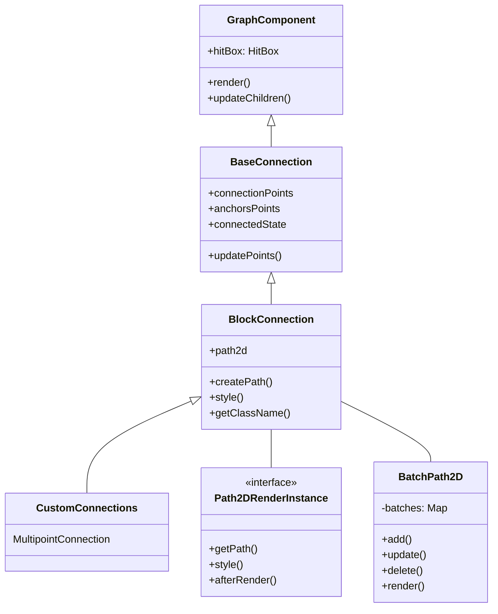

# Canvas Connection System: Efficient Rendering of Graph Connections

The Connection System is a sophisticated framework for rendering and interacting with connections between blocks in the graph. It consists of several key components that work together to provide efficient rendering, reliable interaction, and customizable appearance.

## Core Connection Classes Hierarchy



## 1. BaseConnection: The Foundation

`BaseConnection` extends `GraphComponent` (see [GraphComponent documentation](canvas-graph-component.md)) and serves as the foundation for all connection types in the system. It establishes the core functionality that all connections need:

### Core Features

1. **Connection State Management**
```typescript
import { Component } from "@/lib/Component";
import { selectConnectionById } from "@/store/connection/selectors";
import { ConnectionState } from "@/store/connection/ConnectionState";
import { Block } from "@/store/block/Block";
import { HitBox, HitBoxData } from "@/services/HitTest";

interface Props {
  id: string;
}

interface TBaseConnectionState {
  id: string;
  sourceBlockId: string;
  targetBlockId: string;
}

interface Path2DRenderStyleResult {
  type: 'stroke' | 'fill' | 'both';
}

interface Connection {
  id: string;
}

class BaseConnection extends Component<Props> {
  protected connectedState: ConnectionState<Connection>;

  constructor(props: Props, parent: Component) {
    super(props, parent);
    this.connectedState = selectConnectionById(this.context.graph, this.props.id);
    this.setState({ ...(this.connectedState.$state.value as TBaseConnectionState), hovered: false });
  }
}
```

BaseConnection automatically connects to the store and maintains a synchronized state with the data model. This means:
- Your connection always reflects the current data in the store
- Changes in the store automatically update your connection
- No manual synchronization code needed

2. **Source and Target Block References**

```typescript
protected get sourceBlock(): Block {
  return this.connectedState.$sourceBlock.value?.getViewComponent();
}

protected get targetBlock(): Block {
  return this.connectedState.$targetBlock.value?.getViewComponent();
}
```

BaseConnection maintains references to the blocks it connects, making it easy to:
- Access source and target block properties
- Respond to changes in block positions
- Implement custom connection logic based on block attributes

3. **Connection Points Calculation**

```typescript
protected updatePoints() {
  if (!this.sourceBlock || !this.targetBlock) return;

  this.connectionPoints = [
    this.sourceBlock.getConnectionPoint("out"), 
    this.targetBlock.getConnectionPoint("in")
  ];
  
  // ... further processing ...

  this.updateHitBox();
}
```

BaseConnection automatically calculates and updates the connection endpoints whenever:
- Blocks move
- Connection geometry changes
- Anchors are updated

4. **Hit Box Management**

```typescript
private updateHitBox = () => {
  const [x1, y1, x2, y2] = this.getBBox();
  const threshold = this.context.constants.connection.THRESHOLD_LINE_HIT;
  this.setHitBox(
    Math.min(x1, x2) - threshold,
    Math.min(y1, y2) - threshold,
    Math.max(x1, x2) + threshold,
    Math.max(y1, y2) + threshold
  );
};
```

The connection automatically maintains a proper hit box, making it:
- Clickable and interactive
- Properly detected in spatial queries
- Responsive to hover and selection events

### When to Use BaseConnection

Use `BaseConnection` when:
- You need the most basic connection functionality without rendering
- You're implementing a custom rendering system
- You want to build a connection from scratch with your own rendering logic

Example:
```typescript
class SimpleConnection extends BaseConnection {
  protected render() {
    if (!this.connectionPoints) return;
    
    const [source, target] = this.connectionPoints;
    const ctx = this.context.ctx;
    
    ctx.beginPath();
    ctx.moveTo(source.x, source.y);
    ctx.lineTo(target.x, target.y);
    ctx.stroke();
  }
}
```

## 2. BlockConnection: Optimized Rendering with Path2D

`BlockConnection` extends `BaseConnection` and adds an optimized rendering system using HTML5's Path2D and the BatchPath2D rendering system.

### Performance Optimizations

1. **Path2D-based Rendering**

```typescript
import { bezierCurveLine } from "@/utils/shapes/curvePolyline";
import { curvePolyline } from "@/utils/shapes/polyline";

protected generatePath() {
  this.path2d = this.createPath();
  return this.path2d;
}

protected createPath(): Path2D {
  if (this.props.useBezier) {
    return bezierCurveLine(
      { x: this.geometry.x1, y: this.geometry.y1 },
      { x: this.geometry.x2, y: this.geometry.y2 },
      this.props.bezierDirection
    );
  }
  const path2d = new Path2D();
  path2d.moveTo(this.geometry.x1, this.geometry.y1);
  path2d.lineTo(this.geometry.x2, this.geometry.y2);
  return path2d;
}
```

The Path2D approach offers several advantages:
- **Performance**: Path objects are optimized by the browser
- **Reusability**: Paths can be reused without recalculation
- **Precision**: More accurate hit detection on complex paths

2. **Batch Rendering System**

```typescript
constructor(props: TConnectionProps, parent: BlockConnections) {
  super(props, parent);
  this.addEventListener("click", this);

  this.context.batch.add(this, { zIndex: this.zIndex, group: this.getClassName() });
  this.context.batch.add(this.arrowShape, { zIndex: this.zIndex, group: `arrow/${this.getClassName()}` });
}
```

BlockConnection integrates with the BatchPath2D system, which:
- Groups similar connections to reduce draw calls
- Handles Z-index ordering automatically
- Efficiently manages rendering of hundreds or thousands of connections

### Styling and Appearance

1. **Dynamic Connection Styling**

```typescript
public getClassName(state = this.state) {
  const hovered = state.hovered ? "hovered" : "none";
  const selected = state.selected ? "selected" : "none";
  const stroke = this.getStrokeColor(state);
  const dash = state.dashed ? (state.styles?.dashes || [6, 4]).join(",") : "";
  return `connection/${hovered}/${selected}/${stroke}/${dash}`;
}

public style(ctx: CanvasRenderingContext2D): Path2DRenderStyleResult | undefined {
  this.setRenderStyles(ctx, this.state);
  return { type: "stroke" };
}
```

BlockConnection provides a flexible styling system:
- Connections automatically change appearance on hover/selection
- Styles are grouped by visual properties for efficient rendering
- Custom styles can be applied through connection state

2. **Label Rendering**

```typescript
public afterRender?(ctx: CanvasRenderingContext2D): void {
  const cameraClose = this.context.camera.getCameraScale() >= 
    this.context.constants.connection.MIN_ZOOM_FOR_CONNECTION_ARROW_AND_LABEL;

  if (this.state.label && this.props.showConnectionLabels && cameraClose) {
    this.renderLabelText(ctx);
  }
}
```

BlockConnection handles label rendering with:
- Automatic positioning based on connection geometry
- Visibility rules based on zoom level
- Hit detection for label interaction

#### Label Positioning and Styling

The `renderLabelText` method handles the rendering and positioning of the connection label. It calculates the label's position based on the connection's geometry and the zoom level, ensuring that the label is legible and doesn't overlap with other elements.

The label's styling (font, color, background) is also determined dynamically based on the connection's state (hovered, selected).

### Arrow Rendering

The `BlockConnection` uses a separate `ConnectionArrow` component to render the arrow at the end of the connection. The `createArrowPath` method calculates the arrow's geometry based on the connection's end points and the bezier direction (if applicable).

The arrow's styling is also dynamic and changes based on the connection's state.

### Hit Detection

```typescript
import { isPointInStroke } from "@/utils/functions/isPointInStroke";

public onHitBox(shape: HitBoxData): boolean {
  const THRESHOLD_LINE_HIT = this.context.constants.connection.THRESHOLD_LINE_HIT;

  if (isPointInStroke(this.context.ctx, this.path2d, shape.x, shape.y, THRESHOLD_LINE_HIT * 2)) {
    return true;
  }

  // Or if pointer over label
  if (this.labelGeometry !== undefined) {
    // ... label hit detection ...
  }
  return false;
}
```

BlockConnection implements precise hit detection:
- Uses Path2D's `isPointInStroke` for pixel-perfect detection
- Includes padding for easier mouse interaction
- Handles both line and label hit detection

### When to Use BlockConnection

Use BlockConnection when:
- You need optimized rendering for many connections
- You want standard styling with hover/selection states
- You need labels and arrows to be handled automatically

Example:
```typescript
// The BlockConnection class is typically used directly
// with different options for customization
const connection = new BlockConnection({
  id: "connection1",
  useBezier: true,
  bezierDirection: "vertical",
  showConnectionArrows: true,
  showConnectionLabels: true
}, parent);
```

## 3. BatchPath2D: The Connection Rendering Engine

`BatchPath2D` is a sophisticated rendering system specifically designed for efficient handling of large numbers of similar graphical elements (like connections).

### How BatchPath2D Works

1. **Element Grouping**

```typescript
this.context.batch.add(this, { 
  zIndex: this.zIndex, 
  group: this.getClassName() 
});
```

BatchPath2D groups similar elements:
- Elements with the same visual properties are batched together
- Each group only requires one style setup (color, line width, etc.)
- This dramatically reduces the number of state changes in the canvas context

2. **Render Order Management**

```typescript
// In BatchPath2D
private sortRenderOrder() {
  this.renderOrder = [...this.batches.keys()].sort((a, b) => {
    const aSettings = this.batchSettings.get(a);
    const bSettings = this.batchSettings.get(b);
    return (aSettings?.zIndex || 0) - (bSettings?.zIndex || 0);
  });
}
```

BatchPath2D automatically:
- Sorts elements by z-index for proper layering
- Ensures selected/hovered elements appear on top
- Minimizes context switching for better performance

3. **Batch Rendering Process**

The rendering process follows these steps:
- Group elements by visual properties (stroke color, line width, etc.)
- Sort groups by z-index
- For each group:
  - Set up the canvas context once
  - Render all paths in the group
  - Apply any post-processing

### Benefits of BatchPath2D

1. **Performance**
   - **Reduced Context Switching**: Setting stroke styles is expensive; batching reduces this
   - **Optimized Memory Usage**: Path2D objects are memory-efficient
   - **Fewer Draw Calls**: Batching similar elements reduces CPU usage

2. **Visual Consistency**
   - Elements with the same style are guaranteed to look identical
   - Z-indexing ensures proper layering of elements

3. **Simplicity for Developers**
   - Declarative style definition (just return a class name)
   - Automatic handling of state changes (hover, selection)
   - Built-in support for arrows and labels

### How to Integrate with BatchPath2D

**Important**: BlockConnection already fully implements the BatchPath2D integration. You only need to implement the Path2DRenderInstance interface directly if you're creating a completely custom connection type that doesn't extend BlockConnection.

For most cases, simply extend BlockConnection and override the necessary methods:

```typescript
class MyCustomConnection extends BlockConnection {
  // Override createPath() to change the path geometry
  public createPath(): Path2D {
    // Your custom path creation logic
    return new Path2D();
  }
  
  // Override style() to change the appearance
  public style(ctx: CanvasRenderingContext2D) {
    // Your custom styling logic
    return { type: 'stroke' };
  }
}
```

For completely custom implementations, implement the Path2DRenderInstance interface:

```typescript
// Only for completely custom connection types not using BlockConnection
class MyCustomPathImplementation implements Path2DRenderInstance {
  public getPath(): Path2D {
    // Create and return a Path2D object
    const path = new Path2D();
    // ... draw your path ...
    return path;
  }
  
  public style(ctx: CanvasRenderingContext2D) {
    // Set up styles for your path
    ctx.strokeStyle = '#4285f4';
    ctx.lineWidth = 2;
    return { type: 'stroke' };  // or 'fill' or 'both'
  }
  
  public afterRender?(ctx: CanvasRenderingContext2D): void {
    // Optional: Add any additional rendering after the main path
    // This is ideal for labels, arrows, etc.
  }
}
```

## 4. Advanced Example: MultipointConnection

`MultipointConnection` extends `BlockConnection` to implement connections with multiple segments, typically used in auto-layout scenarios.

### Key Features

1. **Multiple Path Segments**

```typescript
public createPath() {
  const { points } = this.connectedState.$state.value;
  if (!points.length) {
    return super.createPath();
  }
  return curvePolyline(points, 10);
}
```

MultipointConnection handles:
- An array of points defining a multi-segment path
- Curved corners with controllable radius
- Fallback to standard connection when no points are available

2. **Custom Arrow Rendering**

```typescript
import { trangleArrowForVector } from "@/utils/shapes";

public createArrowPath(): Path2D {
  const { points } = this.connectedState.$state.value;
  if (!points.length) {
    return undefined;
  }

  const [start, end] = points.slice(points.length - 2);
  return trangleArrowForVector(start, end, 16, 10);
}
```

Arrow is automatically:
- Positioned at the end of the last segment
- Oriented according to the direction of the last segment
- Sized appropriately for the connection

3. **Multiple Labels**

```typescript
private renderLabelsText(ctx: CanvasRenderingContext2D) {
  const { labels } = this.connectedState.$state.value;
  if (!labels || !labels.length) {
    return;
  }

  this.labelsGeometry = [];
  labels.forEach(({ x, y, text, height, width }) => {
    // ... label rendering ...
  });
}
```

MultipointConnection supports:
- Multiple labels along the path
- Custom positioning for each label
- Efficient hit detection for all labels

### Creating a Custom Connection

Here's how to create your own custom connection based on this system:

```typescript
class MyCustomConnection extends BlockConnection {
  // Override the path creation for custom appearance
  public createPath(): Path2D {
    const path = new Path2D();
    
    // Example: Create a dashed custom path
    const { x1, y1, x2, y2 } = this.geometry;
    const midX = (x1 + x2) / 2;
    
    path.moveTo(x1, y1);
    path.lineTo(midX, y1);
    path.lineTo(midX, y2);
    path.lineTo(x2, y2);
    
    return path;
  }
```

### 1. Optimize Path Creation

### 2. Efficient State Handling

### 3. Leverage the Batch Rendering System

### 4. Handle Hit Detection Carefully

## Connection System Architecture Overview