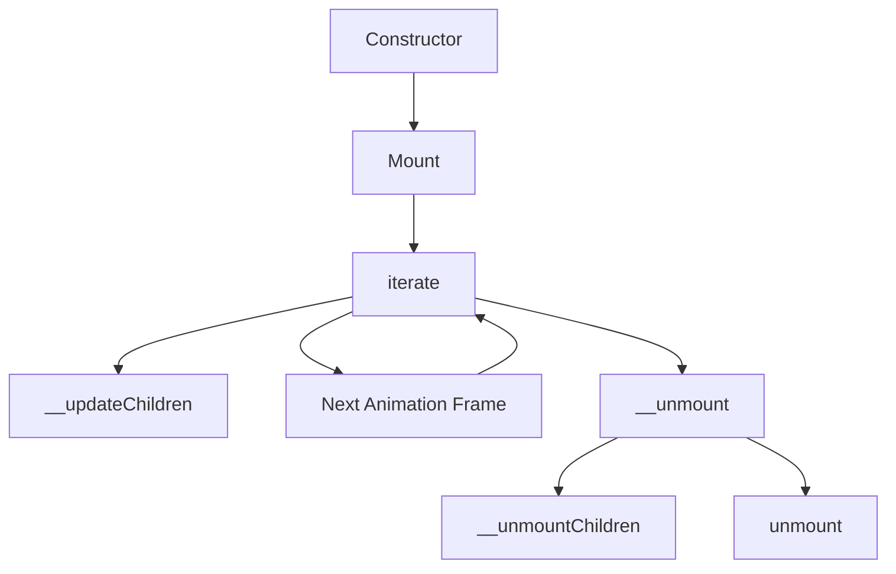
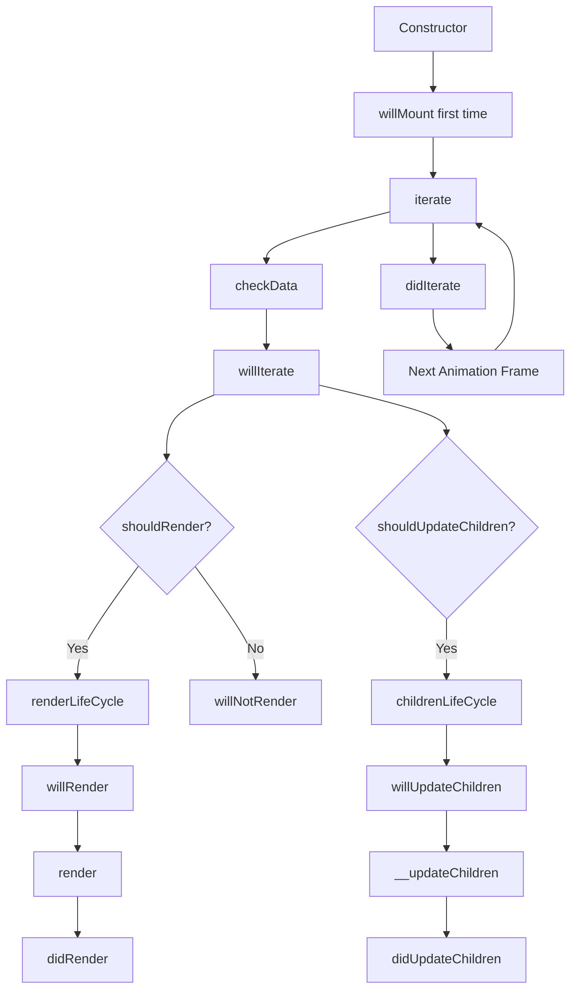
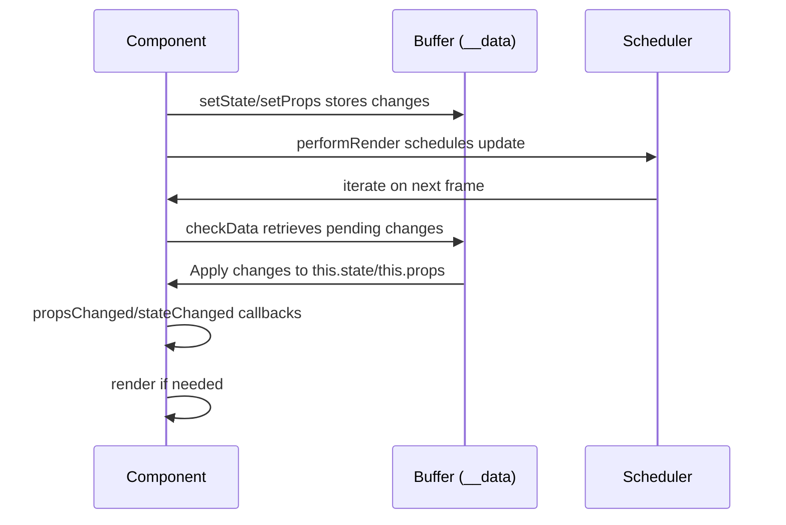

# Rendering Mechanism Documentation

This document provides a detailed explanation of the rendering mechanism implemented in the library, focusing on the Component and CoreComponent classes and their lifecycles.

## Architecture Overview

The rendering mechanism is built upon a hierarchical tree structure with the following key components:

1. **Tree** - The base hierarchical structure that manages parent-child relationships with z-index ordering
2. **CoreComponent** - The fundamental component class that implements tree traversal and child management
3. **Component** - Extends CoreComponent to add lifecycle hooks and state management
4. **Scheduler** - Manages the timing of updates and traversal of the component tree

## Component Structure

### Tree Class

The `Tree` class provides the foundational hierarchy structure with:
- Parent-child relationship management
- Z-index based ordering of children
- Traversal methods for walking the tree

### CoreComponent Class

`CoreComponent` is the base component class that:
- Implements the `ITree` interface
- Manages the tree structure for components
- Handles the creation, updating, and removal of child components
- Provides the basic update and render architecture

### Component Class

`Component` extends `CoreComponent` to add:
- State management
- Comprehensive lifecycle hooks
- Control flags for rendering optimization
- More fine-grained control over the rendering process

### Scheduler

The `Scheduler` orchestrates the rendering process by:
- Managing request animation frame (rAF) timing
- Traversing the component tree
- Triggering component iterations
- Providing global and component-level scheduling

## Rendering Pipeline

The rendering process follows these steps:

1. Component state/props update via `setState`/`setProps`
2. `performRender()` schedules an update through the `Scheduler`
3. On the next animation frame, `Scheduler` traverses the component tree
4. Each component's `iterate()` method is called
5. Components process their data and execute their lifecycle methods
6. Child components are created, updated, or removed as needed
7. The process repeats for each animation frame when changes occur

## Component Lifecycle

### CoreComponent Lifecycle

### Component Lifecycle

## State and Props Management

Components manage their state and props using a two-phase approach:

1. **Request Phase**: `setState` or `setProps` stores the next state/props in a temporary buffer
2. **Apply Phase**: During `checkData`, the buffered changes are applied to the actual state/props

This approach allows for batching multiple state/props updates into a single render cycle.

## Z-Index Management

Components support z-index ordering through the Tree class:

1. Each component has a z-index value (default: 1)
2. Parent components maintain z-index groups to sort children
3. Children are rendered in z-index order during traversal
4. Z-index changes trigger re-ordering in the parent

## Integration with Animation

The rendering mechanism integrates with the browser's animation frame:

1. GlobalScheduler manages requestAnimationFrame
2. Component updates are scheduled within animation frames
3. Multiple schedulers can be registered with different priorities
4. The system aims to complete updates within the 16ms frame budget

## API Overview

### CoreComponent API

- `constructor(props, parent)` - Create a component instance
- `performRender()` - Schedule a render update
- `setContext(context)` - Update the context
- `iterate()` - Process component updates
- `static create(props, options)` - Factory method
- `static mount(Component, props)` - Mount a component as root
- `static unmount(instance)` - Unmount a component

### Component API

- `setState(state)` - Update component state
- `setProps(props)` - Update component props
- Additional lifecycle hooks:
  - `willMount()` - Before first iteration
  - `willRender()` - Before rendering
  - `didRender()` - After rendering
  - `willIterate()` - Before iteration
  - `didIterate()` - After iteration
  - `willUpdateChildren()` - Before updating children
  - `didUpdateChildren()` - After updating children
  - `propsChanged(nextProps)` - When props change
  - `stateChanged(nextState)` - When state changes 