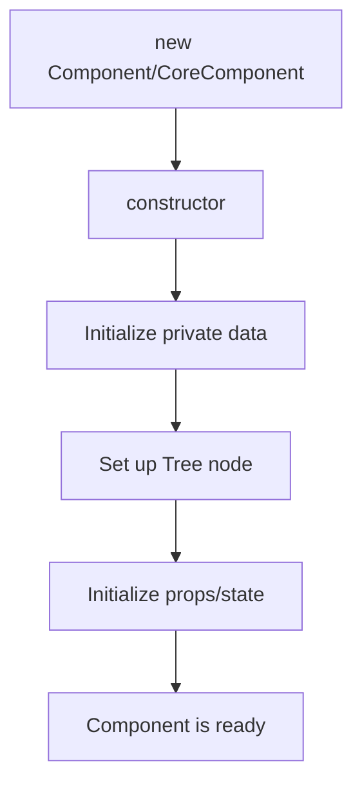
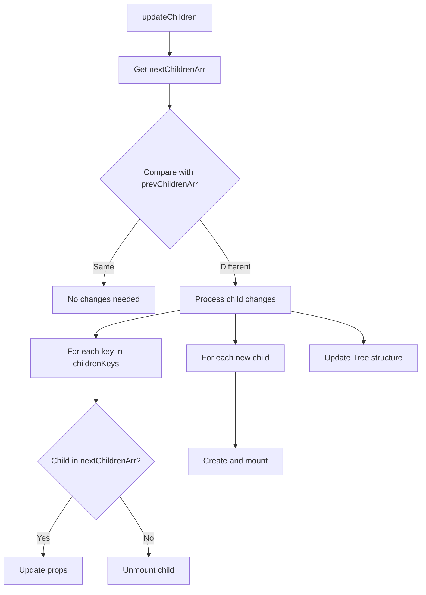
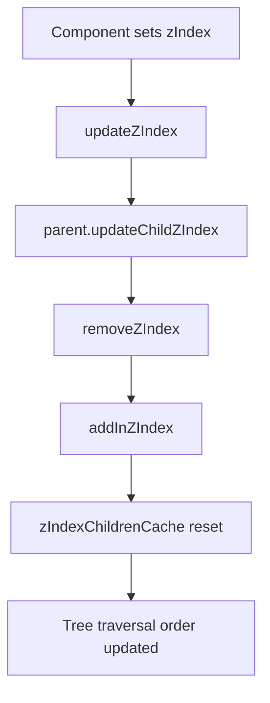

# Component Lifecycle Documentation

This document provides an in-depth explanation of the component lifecycle in the rendering system, focusing on both the CoreComponent and Component classes and their specific lifecycle methods.

> **Note:** This document is part of a series on the rendering architecture. See also [Rendering Mechanism](../rendering/rendering-mechanism.md), [Scheduler System](./scheduler-system.md), and the integration document [Component Rendering and Lifecycle Integration](./component-rendering-lifecycle.md).

## Overview

The component lifecycle is a sequence of stages and methods that each component goes through from creation to removal. Understanding this lifecycle is essential for effectively using the graph visualization library.

## 1. Lifecycle Phases

The component lifecycle consists of five main phases:

1. **Initialization** - Component creation and setup
2. **Mounting** - First addition to the component tree
3. **Updating** - Processing state/props changes and rendering
4. **Children Management** - Creating and updating child components
5. **Unmounting** - Cleanup and removal from the tree

## 2. Initialization Phase

When a component is created, it goes through these initialization steps:



During initialization:
- The component's constructor sets up private properties
- The component is registered in the Tree structure
- Initial props and state are established

## 3. Basic CoreComponent Lifecycle

CoreComponent provides the foundation for all components in the system.

The CoreComponent has three main methods:
- **iterate()** - Called on each frame, manages the update cycle
- **updateChildren()** - Defines and updates child components
- **render()** - Handles the visual rendering of the component

Note: For details on how these methods interact with the rendering pipeline, see [Rendering Mechanism](../rendering/rendering-mechanism.md).

## 4. Component Lifecycle in Detail

The Component class extends CoreComponent with additional lifecycle hooks that provide more control:

### 4.1 Lifecycle Method Sequence

During component iteration, methods are called in this order:

1. First iteration only:
   - `willMount()`

2. Every iteration:
   - `checkData()` - Processes buffered state/props changes
   - `willIterate()` - Called at the start of each iteration
   - Rendering phase (if `shouldRender` is true):
     - `willRender()`
     - `render()`
     - `didRender()`
   - If `shouldRender` is false:
     - `willNotRender()`
   - Children update phase (if `shouldUpdateChildren` is true):
     - `willUpdateChildren()`
     - `updateChildren()`
     - `didUpdateChildren()`
   - `didIterate()` - Called at the end of each iteration

See [Component Rendering and Lifecycle Integration](./component-rendering-lifecycle.md) for detailed flow diagrams.

## 5. State and Props Lifecycle

When state or props change:

1. Changes are called through `setState()` or `setProps()`
2. Changes are buffered in `__data` until the next frame
3. The component calls `performRender()` to schedule an update
4. On the next frame, `checkData()` processes the buffered changes
5. The `propsChanged()` or `stateChanged()` callbacks are triggered
6. The component renders if needed based on the `shouldRender` flag

For details on how this integrates with the scheduler, see [Scheduler System](./scheduler-system.md).

## 6. Complete Lifecycle Method Execution Order

| Phase | Method | Description | When Called |
|-------|--------|-------------|------------|
| **Initialization** | `constructor(props, parent)` | Set up the component | Component creation |
| **First Iteration** | `willMount()` | One-time setup before first render | First iteration only |
| | `willIterate()` | Prepare for iteration | Start of every iteration |
| **Render Phase** | `checkData()` | Process buffered state/props changes | Each iteration (internal) |
| | `propsChanged(nextProps)` | React to props changes | When props change |
| | `stateChanged(nextState)` | React to state changes | When state changes |
| | `willRender()` | Prepare for rendering | Before render if shouldRender is true |
| | `render()` | Create visual output | During render phase if shouldRender is true |
| | `didRender()` | Post-render actions | After render if shouldRender is true |
| | `willNotRender()` | Alternative to render | When shouldRender is false |
| **Children Phase** | `willUpdateChildren()` | Prepare for children updates | Before updating children |
| | `updateChildren()` | Define child components | During children update |
| | `didUpdateChildren()` | React to children updates | After updating children |
| **Completion** | `didIterate()` | Finalize iteration | End of every iteration |
| **Unmounting** | `unmount()` | Clean up resources | When component is removed |

## 7. Control Flags

Components use several boolean flags to control their behavior:

| Flag | Purpose | Default |
|------|---------|---------|
| `firstIterate` | Tracks if this is the first iteration | `true` until first iteration completes |
| `firstRender` | Tracks if this is the first render | `true` until first render completes |
| `firstUpdateChildren` | Tracks if this is the first children update | `true` until first update completes |
| `shouldRender` | Controls whether render() is called | `true` |
| `shouldUpdateChildren` | Controls whether children are updated | `true` |
| `shouldRenderChildren` | Controls whether children should render | `true` |

You can modify these flags in lifecycle methods to optimize performance.

## 8. Child Component Management

Child components are managed through a structured process:



Important rules:
- Each child needs a unique `key` for proper updating
- Use `Component.create()` instead of direct instantiation
- Children should only be created in `updateChildren()`

## 9. Z-Index Management

Components use z-index values to control rendering order:



Higher z-index values render on top of lower ones.

## 10. Practical Examples

### 10.1 Basic Component

```typescript
import { Component } from "@/lib/Component";

class MyComponent extends Component {
  protected willMount() {
    // Initialize, similar to constructor but guaranteed to run before first render
    this.setState({ counter: 0 });
  }
  
  protected render() {
    // Render logic
    console.log('Rendering with counter:', this.state.counter);
  }
  
  public increment() {
    this.setState({ counter: this.state.counter + 1 });
  }
}
```

### 10.2 Component with Children

```typescript
import { Component } from "@/lib/Component";

class ParentComponent extends Component {
  protected updateChildren() {
    return [
      ChildComponent.create({ value: this.state.value }, { key: 'child1' }),
      AnotherChild.create({ data: this.props.data }, { key: 'child2' })
    ];
  }
  
  protected willUpdateChildren() {
    console.log('About to update children');
  }
  
  protected didUpdateChildren() {
    console.log('Children updated');
  }
}
```

### 10.3 Optimizing Renders

```typescript
import { Component } from "@/lib/Component";

class OptimizedComponent extends Component {
  protected propsChanged(nextProps) {
    // Only render if specific props changed
    this.shouldRender = nextProps.value !== this.props.value;
  }
  
  protected stateChanged(nextState) {
    // Only update children if specific state changed
    this.shouldUpdateChildren = nextState.items !== this.state.items;
  }
}
```

## 11. Best Practices

### 11.1 Performance Optimization

1. **Control rendering with lifecycle flags**
   ```typescript
   protected propsChanged(nextProps) {
     // Only render if relevant props have changed
     this.shouldRender = nextProps.value !== this.props.value;
   }
   ```

2. **Batch state updates**
   ```typescript
   // Instead of multiple setState calls
   // this.setState({ value: 1 });
   // this.setState({ count: 2 });
   
   // Batch updates in one call
   this.setState({ value: 1, count: 2 });
   ```

3. **Use z-index for proper layering**
   ```typescript
   // Set z-index for proper rendering order
   this.zIndex = 5; // Higher z-index components render on top
   ```

### 11.2 Component Structure

1. **Initialize state in willMount**
   ```typescript
   protected willMount() {
     this.setState({
       count: 0,
       items: [],
       isLoaded: false
     });
   }
   ```

2. **Clean up resources in unmount**
   ```typescript
   protected unmount() {
     // Clean up any subscriptions or timers
     this.eventEmitter.off('event', this.handler);
     clearInterval(this.timer);
   }
   ```

3. **Use keys for dynamic children**
   ```typescript
   protected updateChildren() {
     return this.state.items.map((item, index) => 
       ItemComponent.create(
         { data: item },
         { key: `item-${item.id || index}` }
       )
     );
   }
   ```

### 11.3 Component Creation and Management

1. **Always use Component.create**
   ```typescript
   // Incorrect - Don't use direct instantiation
   // new MyComponent(props, parent)
   
   // Correct - Use static create method
   MyComponent.create(props, { key: 'unique-key' })
   ```

2. **Only create children in updateChildren**
   ```typescript
   protected updateChildren() {
     return [
       ChildComponent.create({ value: this.state.value }, { key: 'child1' }),
       AnotherChild.create({ data: this.props.data }, { key: 'child2' })
     ];
   }
   ```

3. **Keep original coordinates**
   ```typescript
   // Let the rendering system handle transformations
   protected render() {
     // Use original coordinates directly
   }
   ```

### 11.4 Component Communication

1. **Use props for parent-to-child communication**
   ```typescript
   protected updateChildren() {
     return [
       ChildComponent.create({ 
         value: this.state.value,
         onAction: this.handleChildAction.bind(this)
       }, { key: 'child' })
     ];
   }
   ```

2. **Use context for deep prop passing**
   ```typescript
   // Parent component
   this.setContext({
     theme: 'dark',
     locale: 'en-US'
   });
   
   // Child components can access this.context.theme
   ```

3. **Use component references for direct access**
   ```typescript
   protected updateChildren() {
     return [
       ChildComponent.create(
         { value: this.state.value },
         { key: 'child', ref: 'childRef' } // Access as this.$.childRef
       )
     ];
   }
   
   public someMethod() {
     // Call method on child component
     this.$.childRef.doSomething();
   }
   ```

## 12. Summary

The component lifecycle provides a predictable pattern for managing component behavior:

1. Components are created with `Component.create()`
2. During first iteration, `willMount()` is called for initialization
3. Each iteration runs through a predictable sequence of methods
4. State/props changes are buffered and processed during `checkData()`
5. Rendering and children updates can be conditionally controlled
6. When no longer needed, components are unmounted

By understanding and leveraging these lifecycle methods, you can create efficient, maintainable components for your graph visualizations.

## 13. Related Documentation

- [Rendering Mechanism](../rendering/rendering-mechanism.md) - Detailed explanation of the rendering architecture
- [Scheduler System](./scheduler-system.md) - Documentation about the system that coordinates component updates
- [Component Rendering and Lifecycle Integration](./component-rendering-lifecycle.md) - Comprehensive guide showing how these systems work together
