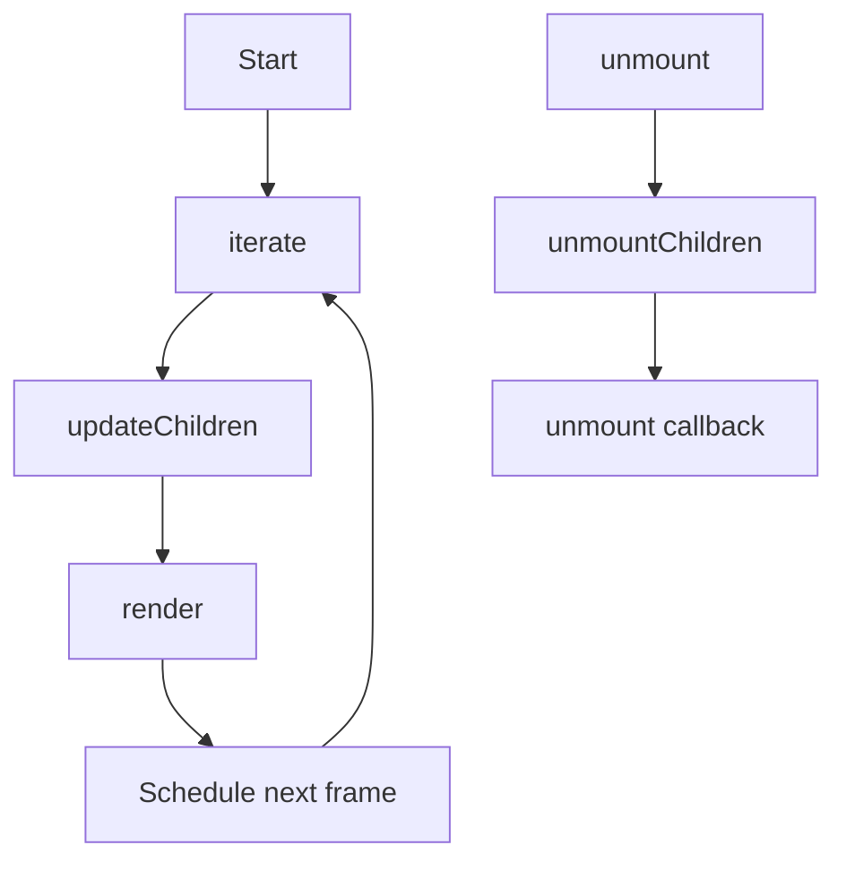
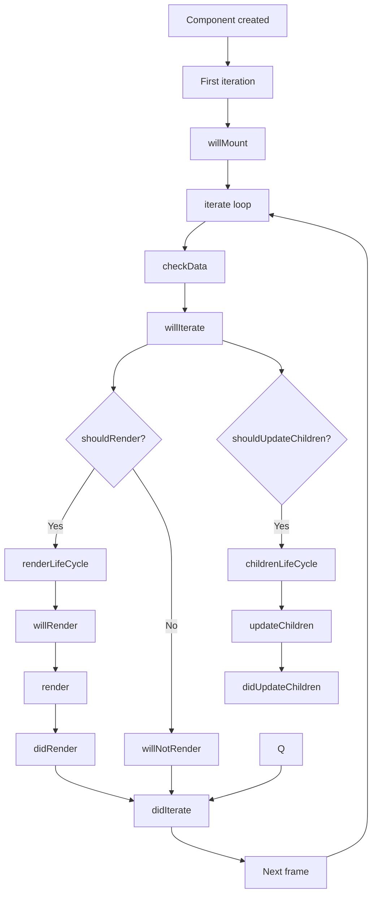

# Component Lifecycle Documentation

This document provides an in-depth explanation of the component lifecycle in the rendering system, focusing on both the CoreComponent and Component classes and their specific lifecycle methods.

**Note: This documentation file appears to be truncated. Please verify the completeness of the information below once the full content is available.**

## Lifecycle Flow Overview

The component lifecycle consists of several phases, from initialization to unmounting, with specific hooks at each stage to allow for customization.

## Initialization Phase


## CoreComponent Basic Lifecycle

The CoreComponent provides the fundamental lifecycle methods:



## Component Detailed Lifecycle

The Component class extends CoreComponent with additional lifecycle hooks:



## Component State/Props Lifecycle


## Lifecycle Method Execution Order

The complete lifecycle method execution order for a Component:

1. **Initialization**
   - `constructor(props, parent)`

2. **First Iteration**
   - `willMount()` (only on first iteration)
   - `willIterate()`

3. **Render Phase**
   - `checkData()` (internal)
   - If `shouldRender` is true:
     - `willRender()`
     - `render()`
     - `didRender()`
   - Else:
     - `willNotRender()`

4. **Children Update Phase**
   - If `shouldUpdateChildren` is true:
     - `willUpdateChildren()`
     - `updateChildren()` (internal)
     - `didUpdateChildren()`

5. **Completion**
   - `didIterate()`

6. **Unmounting**
   - `unmount()` (internal)
   - `unmountChildren()` (internal)
   - `unmount()`

## Lifecycle Hooks and Their Usage

### CoreComponent Hooks

- **render()**
  - Purpose: Render the component's visual representation. This is where you define the component's output based on its current state and props.
  - Called during: Rendering phase
  - Default: No-op, meant to be overridden

- **updateChildren()**
  - Purpose: Define the component's child components. This method should return an array of child component definitions, specifying the component class, props, and options for each child.
  - Return value: Array of child component definitions or void
  - Default: No-op, meant to be overridden

- **unmount()**
  - Purpose: Clean up any resources or subscriptions before the component is removed from the tree. This is where you should unsubscribe from events, clear timers, and release any other resources held by the component.
  - Called during: Unmounting phase
  - Default: No-op, meant to be overridden

### Component Hooks

- **willMount()**
  - Purpose: Perform initialization tasks that need to be done before the component is first rendered. This is a good place to fetch data, set up initial state, or perform other one-time setup tasks.
  - Called during: First iteration only
  - Default: No-op

- **willIterate()**
  - Purpose: Prepare for each iteration of the component's lifecycle. This method is called at the beginning of each iteration, before any rendering or children updates are performed.
  - Called during: Start of every iteration
  - Default: No-op

- **willRender()**
  - Purpose: Prepare for the rendering phase. This method is called before the `render()` method is invoked, allowing you to perform any last-minute calculations or adjustments before rendering.
  - Called during: Before render
  - Default: No-op

- **didRender()**
  - Purpose: React after the rendering phase. This method is called after the `render()` method has been invoked, allowing you to perform any post-rendering tasks, such as updating the DOM or triggering animations.
  - Called during: After render
  - Default: No-op

- **willNotRender()**
  - Purpose: Handle the case where the component will not be rendered. This method is called when the `shouldRender` flag is set to `false`, allowing you to perform any necessary cleanup or alternative actions.
  - Called during: When shouldRender is false
  - Default: No-op

- **willUpdateChildren()**
  - Purpose: Prepare before updating the component's children. This method is called before the `updateChildren()` method is invoked, allowing you to perform any necessary setup or calculations before the children are updated.
  - Called during: Before children updated
  - Default: No-op

- **didUpdateChildren()**
  - Purpose: React after updating the component's children. This method is called after the `updateChildren()` method has been invoked, allowing you to perform any post-update tasks, such as updating the layout or triggering animations.
  - Called during: After children updated
  - Default: No-op

- **didIterate()**
  - Purpose: Finalize each iteration of the component's lifecycle. This method is called at the end of each iteration, after all rendering and children updates have been performed.
  - Called during: End of every iteration
  - Default: No-op

- **propsChanged(nextProps)**
  - Purpose: React to changes in the component's props. This method is called when the component receives new props, allowing you to update the component's state or perform other actions in response to the prop changes.
  - Called during: checkData when props changed
  - Default: No-op

- **stateChanged(nextState)**
  - Purpose: React to changes in the component's state. This method is called when the component's state is updated, allowing you to perform any necessary calculations or adjustments in response to the state changes.
  - Called during: checkData when state changed
  - Default: No-op

## Control Flags

The Component class uses several boolean flags to control rendering behavior:

- **firstIterate**: True until the first iteration completes
- **firstRender**: True until the first render completes
- **firstUpdateChildren**: True until the first children update completes
- **shouldRender**: Controls whether render() is called
- **shouldUpdateChildren**: Controls whether children are updated
- **shouldRenderChildren**: Controls whether children should render

## Child Component Management

The CoreComponent handles child component lifecycle with these steps:


## Z-Index Management in the Lifecycle


## Practical Usage Examples

### Basic Component Usage

```typescript
import { Component } from "@/lib/Component";

class MyComponent extends Component {
  protected willMount() {
    // Initialize, similar to constructor but guaranteed to run before first render
    this.setState({ counter: 0 });
  }
  
  protected render() {
    // Render logic
    console.log('Rendering with counter:', this.state.counter);
  }
  
  public increment() {
    this.setState({ counter: this.state.counter + 1 });
  }
}
```

### Component with Children

```typescript
import { Component } from "@/lib/Component";

class ChildComponent extends Component {
  protected render() {
    return null;
  }
}

class AnotherChild extends Component {
  protected render() {
    return null;
  }
}

class ParentComponent extends Component {
  protected updateChildren() {
    return [
      { klass: ChildComponent, props: { value: this.state.value }, options: { key: 'child1' } },
      { klass: AnotherChild, props: { data: this.props.data }, options: { key: 'child2' } }
    ];
  }
  
  protected willUpdateChildren() {
    console.log('About to update children');
  }
  
  protected didUpdateChildren() {
    console.log('Children updated');
  }
}
```

### Optimizing Renders

```typescript
import { Component } from "@/lib/Component";

class OptimizedComponent extends Component {
  protected propsChanged(nextProps) {
    // Only render if specific props changed
    this.shouldRender = nextProps.value !== this.props.value;
  }
  
  protected stateChanged(nextState) {
    // Only update children if specific state changed
    this.shouldUpdateChildren = nextState.items !== this.state.items;
  }
}
```

## Best Practices

### Performance Optimization

1. **Control Rendering with Lifecycle Flags**
   ```typescript
   protected propsChanged(nextProps) {
     // Only render if relevant props have changed
     this.shouldRender = nextProps.value !== this.props.value;
   }

   protected stateChanged(nextState) {
     // Only update children if relevant state has changed
     this.shouldUpdateChildren = nextState.items !== this.state.items;
   }
   ```

2. **Use Z-Index Management for Layering**
   ```typescript
   // Set z-index for proper rendering order
   this.zIndex = 5; // Higher z-index components render on top
   ```

3. **Batch State Updates**
   ```typescript
   // Instead of multiple setState calls
   // this.setState({ value: 1 });
   // this.setState({ count: 2 });
   
   // Batch updates in one call
   this.setState({ value: 1, count: 2 });
   ```

### Component Structure

1. **Initialize State in willMount Using setState**
   ```typescript
   import { Component } from "@/lib/Component";

   protected willMount() {
     // Don't use this.state = {} directly as per rules
     this.setState({
       count: 0,
       items: [],
       isLoaded: false
     });
   }
   ```

2. **Clean Up in unmount**
   ```typescript
   import { Component } from "@/lib/Component";

   protected unmount() {
     // Clean up any subscriptions or timers
     this.eventEmitter.off('event', this.handler);
     clearInterval(this.timer);
   }
   ```

3. **Use Keys for Dynamic Children**
   ```typescript
   import { Component } from "@/lib/Component";

   protected updateChildren() {
     // Use Component.create method instead of direct instantiation
     return this.state.items.map((item, index) => 
       ItemComponent.create(
         { data: item },
         { key: `item-${item.id || index}` }
       )
     );
   }
   ```

### Component Creation and Management

1. **Always Use Component.create**
   ```typescript
   import { Component } from "@/lib/Component";

   // Incorrect - Don't use direct instantiation
   // new MyComponent(props, parent)
   
   // Correct - Use static create method
   MyComponent.create(props, { key: 'unique-key' })
   ```

2. **Only Create Children in updateChildren Method**
   ```typescript
   import { Component } from "@/lib/Component";

   protected updateChildren() {
     return [
       ChildComponent.create({ value: this.state.value }, { key: 'child1' }),
       AnotherChild.create({ data: this.props.data }, { key: 'child2' })
     ];
   }
   ```

3. **Don't Transform Original Coordinates to World Coordinates**
   ```typescript
   import { Component } from "@/lib/Component";

   // Incorrect
   // const worldX = originalX * transform.scale + transform.x;
   
   // Correct - Keep original coordinates in the component
   protected render() {
     // Use original coordinates directly
     // Let the rendering system handle transformations
   }
   ```

### Component Communication

1. **Use Props for Parent-to-Child Communication**
   ```typescript
   import { Component } from "@/lib/Component";

   // Parent component
   protected updateChildren() {
     return [
       ChildComponent.create({ 
         value: this.state.value,
         onAction: this.handleChildAction.bind(this)
       }, { key: 'child' })
     ];
   }
   ```

2. **Use Context for Deep Prop Passing**
   ```typescript
   import { Component } from "@/lib/Component";

   // Parent component
   this.setContext({
     theme: 'dark',
     locale: 'en-US'
   });
   
   // Child components can access this.context.theme
   ```

3. **Use Component References for Direct Communication**
   ```typescript
   import { Component } from "@/lib/Component";

   protected updateChildren() {
     return [
       ChildComponent.create(
         { value: this.state.value },
         { key: 'child', ref: 'childRef' } // Access as this.$.childRef
       )
     ];
   }
   
   public someMethod() {
     // Call method on child component
     this.$.childRef.doSomething();
   }
   ```

### Props and State Management

1. **Always Use setProps/setState Methods**
   ```typescript
   import { Component } from "@/lib/Component";

   // Incorrect
   // this.props.value = newValue;
   // this.state.count = newCount;
   
   // Correct
   this.setProps({ value: newValue });
   this.setState({ count: newCount });
   ```

2. **Batch Updates When Possible**
   ```typescript
   import { Component } from "@/lib/Component";

   // Instead of multiple calls
   // this.setState({ value: 1 });
   // this.setState({ count: 2 });
   
   // Batch updates in one call
   this.setState({ value: 1, count: 2 });
