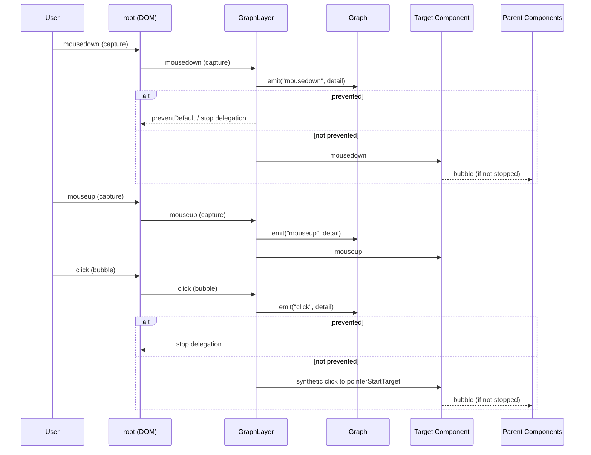

## Event Model in @gravity-ui/graph

This is a strictly technical document that details the event model implementation, based on `GraphLayer` and `EventedComponent`. It explains capturing choices, click emulation, and subtle behaviors that affect reliability and performance. The document also covers how layers with CSS `pointer-events` other than `none` impact event delivery.

See also: `docs/system/events.md` for a high-level overview.

### Terms and Actors

- **Graph** — central event emitter at the graph level, with `emit` and event types defined in `src/graphEvents.ts`.
- **GraphLayer** — the layer that:
  - Subscribes to DOM events on the graph `root` element.
  - Performs hit‑testing in camera space to determine the target component.
  - Emits graph‑level events (`graph.emit`) and delegates DOM events into the canvas component tree.
- **EventedComponent** — base component class that supports subscriptions and dispatch with custom bubbling over the component tree.

### Event Flow (high level)

1. A DOM event arrives at `root`.
2. `GraphLayer` intercepts it (some events via capturing), recomputes the current target from camera‑space coordinates, and updates gesture state (e.g., whether a button is pressed).
3. `GraphLayer` may first emit a graph event via `graph.emit(eventName, { target, sourceEvent, pointerPressed })`.
   - If any graph handler calls `event.preventDefault()`, delegation into components is aborted (see `dispatchNativeEvent`).
4. If not prevented, `GraphLayer` delegates the original or a synthetic event into the canvas component tree via `target.dispatchEvent(event)`.
5. `EventedComponent` processes the event, including custom bubbling to parents until `stopPropagation` is invoked.



### Role of GraphLayer: what the layer actually does

Key points from `GraphLayer`:

- Registers listeners on `root`:
  - In bubbling phase: `mousedown`, `touchstart`, `mouseup`, `touchend`, `click`, `dblclick`, `contextmenu`, and `mousemove`.
  - In capturing phase: `mousedown`, `touchstart`, `mouseup`, `touchend`.
- Tracks `targetComponent` and `prevTargetComponent`.
- On `mousemove`, when target changes, synthesizes hover semantics:
  - For the previous target: `mouseleave` (non‑bubbling) and `mouseout` (bubbling).
  - For the new target: `mouseenter` (non‑bubbling) and `mouseover` (bubbling).
- Tracks `pointerPressed` and supports explicit capture via `captureEvents/releaseCapture`.
- Emulates click and double click (`tryEmulateClick`) to deliver them to the start target.

```
[mousemove]
  target changed?
    yes ->
      prevTarget <- mouseleave (no bubble)
      prevTarget <- mouseout (bubble)
      newTarget  <- mouseenter (no bubble)
      newTarget  <- mouseover (bubble)
```

#### Why capturing is needed in GraphLayer

`mousedown/touchstart` and `mouseup/touchend` are critical for gestures (drag, selection) and consistent state (`pointerPressed`). Capturing them provides:

- Guarantees seeing gesture start/end even with overlaying HTML in the same `root`.
- Ability to compute and lock the start target before other handlers mutate DOM, focus, or selection.
- Fewer races and target flicker on fast pointer motion.

`click/dblclick/contextmenu` are intentionally not captured (see the section on event selection).

### EventedComponent model: internal dispatch

`EventedComponent` implements a lightweight event model with custom bubbling up the component tree:

- Each component keeps a map of listeners by event type.
- `dispatchEvent(event)`:
  - If the component is not interactive (`interactive: false`), it immediately starts bubbling without local delivery.
  - If local listeners exist for `event.type`, they run, then bubbling continues unless `stopPropagation` was called.
  - If there are no local listeners but `event.bubbles === true`, bubbling proceeds.
- Bubbling is a linear walk to `parent` until the overridden `stopPropagation` is invoked.

Bottom line: local handlers do not consume events automatically; call `stopPropagation` explicitly to stop further propagation.

### How a click on an element works (step by step)

Scenario for a typical left‑click where press and release occur nearly at the same spot:

1. `mousedown` (capturing):
   - `GraphLayer` sets `pointerPressed = true`.
   - Computes `targetComponent` (or uses the captured target if `captureEvents` was used).
   - Stores `pointerStartTarget` and the DOM event as `pointerStartEvent`.
   - Proxies the native `mousedown` to the target (after graph emit and default prevention check).
2. `mouseup` (capturing):
   - `GraphLayer` sets `pointerPressed = false`.
   - Verifies that:
     - Current target equals the start target OR both are `BlockConnection` (connections can be very close), and
     - Pointer delta `getEventDelta(pointerStartEvent, mouseup) < 3`.
   - If satisfied, marks `canEmulateClick = true`.
   - Proxies `mouseup` to the target.
3. `click` (bubbling):
   - If `canEmulateClick === true`, `GraphLayer` creates a new `MouseEvent("click")` and DELIVERS it to `pointerStartTarget` (not the current target!).
   - First, a graph event `click` is emitted; if any handler calls `preventDefault()`, delegation into components is skipped.
   - Otherwise, the event is dispatched into components (`EventedComponent.dispatchEvent`).
4. `dblclick` follows the same logic and is delivered to the start target.

The click is intentionally bound to the start target, not to the current pointer target, to avoid misses from tiny pointer drift and to keep `BlockConnection` interactions reliable.

```
Down (capture)    Up (capture)            Click (bubble)
   |                 |                        |
   v                 v                        v
  mark start ----> mark canEmulateClick? --> deliver synthetic click
      \________ same target OR both BlockConnection _______/
                 AND getEventDelta(start, up) < 3
```

### Impact of layers with `pointer-events` ≠ `none`

By default, the canvas layer is marked with `no-pointer-events` (`pointer-events: none`) to avoid becoming a DOM target that blocks other layers. What if a top layer uses `pointer-events: auto`?

- `mousedown/touchstart` and `mouseup/touchend` will still be observed by `GraphLayer` due to capturing on `root`. Even if the DOM target is an HTML overlay, the event traverses `root` during capture.
- `click/dblclick/contextmenu` are subscribed in bubbling. If a top layer calls `stopPropagation()` during capture or bubble, `GraphLayer` may never receive them and thus won’t delegate them into canvas components. Gestures still work (down/up are captured), but component clicks may be lost.
- If a top layer uses portals with handlers outside the graph `root`, events might never enter the `root` subtree — then `GraphLayer` won't see them.

Recommendations:

- For overlays, keep `pointer-events: none` by default and enable `pointer-events: auto` only where DOM interactivity is required.
- Avoid unconditional `stopPropagation()` on top layers if the graph must continue receiving `click/dblclick/contextmenu`.
- If you need to block clicks for the graph, do it deliberately and locally.

### Why these events are captured (and others are not)

Captured in `GraphLayer`: `mousedown`, `touchstart`, `mouseup`, `touchend`.

Rationale:

- **Gesture lifecycle** — press and release bound the majority of interactions (drag, selection). They must be observed early and reliably.
- **State consistency** — both `pointerPressed` and the start target must be established before third‑party handlers run.
- **Performance and semantics** — `mousemove` is high‑frequency; capturing it brings little value. Target changes and hover semantics are already handled correctly with a regular `mousemove` listener.
- **Click/dblclick** are not captured because:
  - Clicks are emulated (`tryEmulateClick`) from the already captured down/up.
  - It is often desirable for top overlays to handle clicks first and optionally block them for the graph.

### Interaction between graph events and component delegation

Before delegating a DOM event into components, `GraphLayer` emits a graph event (e.g., `click`, `mousedown`, `mouseenter`). If any graph handler calls `preventDefault()`, `GraphLayer` calls `event.preventDefault()` on the original event and does NOT delegate into components. This enables centralized control at the app level (e.g., disable clicks, intercept drag start).

### Practical guidelines

- Use `Graph` handlers for cross‑component logic (selection, global hotkeys, cancellations).
- Use `EventedComponent` handlers for local component behavior.
- Stop propagation deliberately: at the `Graph` level via `preventDefault` (to block delegation), at components via `stopPropagation`.
- When designing HTML overlays, validate how `pointer-events` and `stopPropagation` affect `click/dblclick/contextmenu` delivery.

### TL;DR

- Capture only `mousedown/touchstart` and `mouseup/touchend` to ensure gesture boundaries and consistent state.
- Click is emulated and delivered to the start target (`pointerStartTarget`) if pointer drift is small.
- `Graph.emit` can prevent further delegation into components via `preventDefault()`.
- Top layers with `pointer-events: auto` can swallow `click/dblclick/contextmenu`; avoid unconditional `stopPropagation` or allow events to reach the graph `root`.


