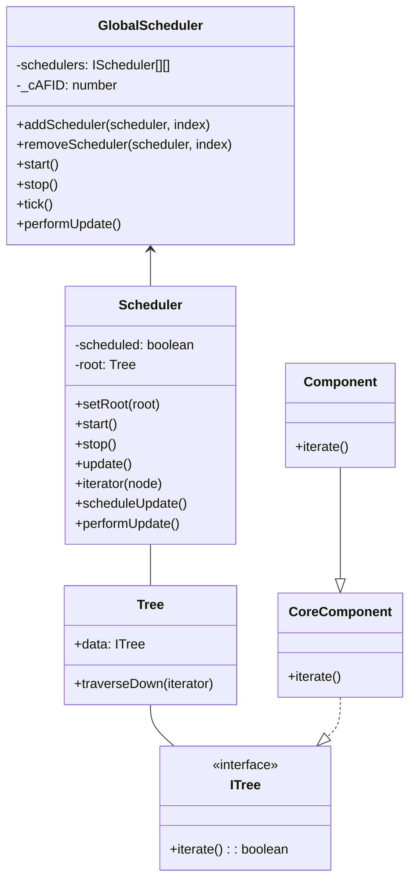
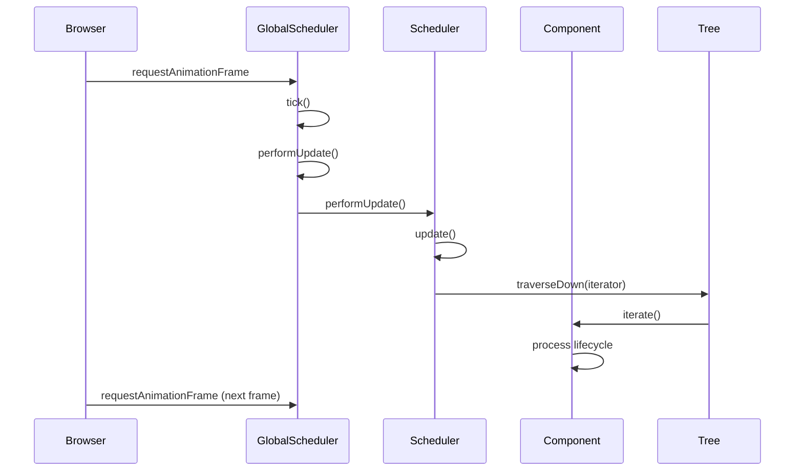
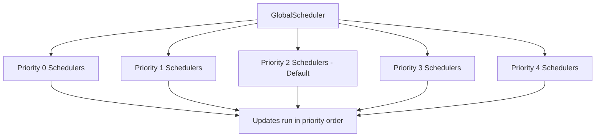
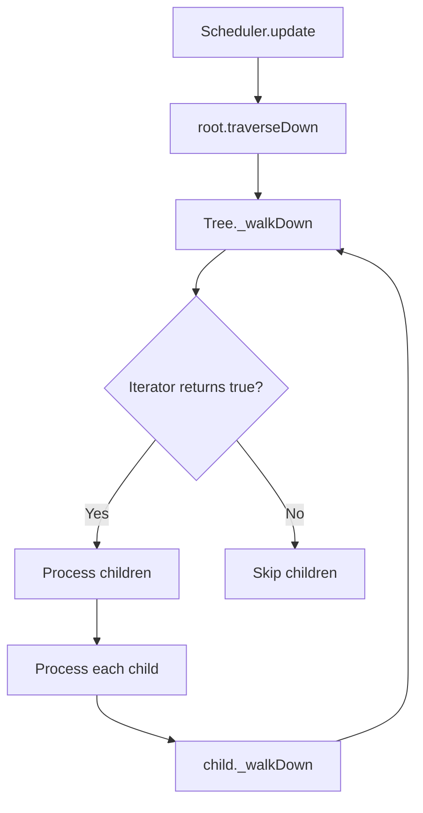
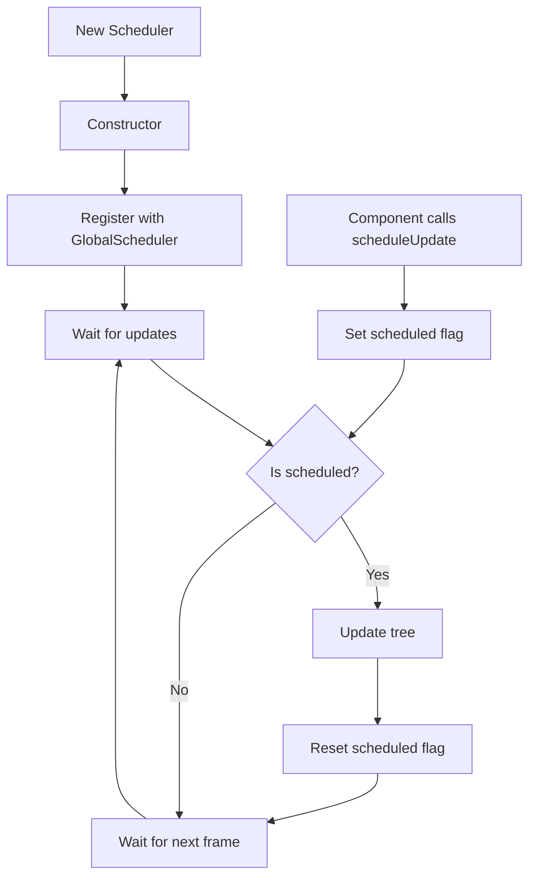
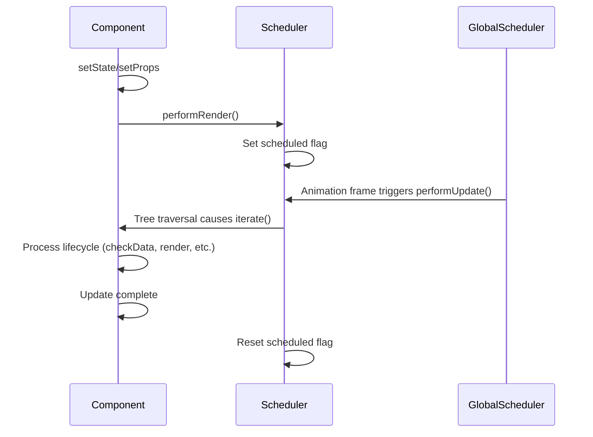

# Scheduler System Documentation

This document describes the scheduling system that coordinates component updates in the rendering engine, focusing on the `Scheduler` and `GlobalScheduler` classes.

## Scheduler Architecture

The scheduling system consists of two main classes:

1. **GlobalScheduler** - Manages the animation frame loop and coordinates multiple schedulers
2. **Scheduler** - Manages updates for a specific component tree



## Animation Frame Integration

The scheduler system integrates with the browser's requestAnimationFrame API (or setTimeout in non-browser environments):



## Update Scheduling

The scheduling system works as follows:

1. Component calls `performRender()` to schedule an update
2. This sets `scheduled` flag in the component's Scheduler instance
3. On the next animation frame, GlobalScheduler calls `performUpdate()` on each registered Scheduler
4. If a Scheduler is scheduled, it calls `update()` to traverse the component tree
5. Tree traversal invokes `iterate()` on each component in the tree
6. Components process their lifecycle methods and potentially request more updates

## Priority Levels

The GlobalScheduler supports multiple priority levels for schedulers:



Lower priority levels (0, 1) are processed before higher levels (3, 4), allowing critical updates to be processed first.

## Tree Traversal

During an update, the Scheduler traverses the component tree in depth-first order:



The traversal uses the Z-index ordering of components to determine the order of processing children.

## Scheduler Lifecycle



## Code Examples

### Basic Scheduler Usage

```typescript
// Create a scheduler
const scheduler = new Scheduler();

// Set the root component
const rootComponent = CoreComponent.mount(MyRootComponent, props);
scheduler.setRoot(rootComponent.__comp.treeNode);

// Start the scheduler
scheduler.start();

// Later, stop the scheduler when done
scheduler.stop();
```

### Component Integration with Scheduler

```typescript
class MyComponent extends Component {
  public updateValue(newValue) {
    this.setState({ value: newValue });
    // This calls performRender() which schedules an update
  }
  
  protected render() {
    // This will be called during the next animation frame
    console.log('Rendering with value:', this.state.value);
  }
}
```

## Optimizing Performance

The scheduling system is designed for optimal performance:

1. Updates are batched per animation frame
2. Multiple state/props changes trigger only one render per frame
3. Z-index ordering allows for efficient rendering of visual components
4. The system only traverses branches that need updating (when components return `false` from `iterate()`)
5. Multiple schedulers can be used for different update frequencies

## Handling Browser Environment Differences

The system adapts to different environments:

```typescript
// For browser environments
const rAF = window.requestAnimationFrame;
const cAF = window.cancelAnimationFrame;
const getNow = window.performance.now.bind(window.performance);

// For non-browser environments
const rAF = (fn) => global.setTimeout(fn, 16);
const cAF = global.clearTimeout;
const getNow = global.Date.now.bind(global.Date);
```

This allows the scheduler to work in both browser and non-browser JavaScript environments.

## Interaction with Component Lifecycle

The scheduler system interacts with component lifecycle as follows:



## Global Scheduler Instance

The system provides a global scheduler instance for convenience:

```typescript
export const globalScheduler = new GlobalScheduler();
export const scheduler = globalScheduler;
```

This allows components to share a single scheduler instance and animation frame loop. 