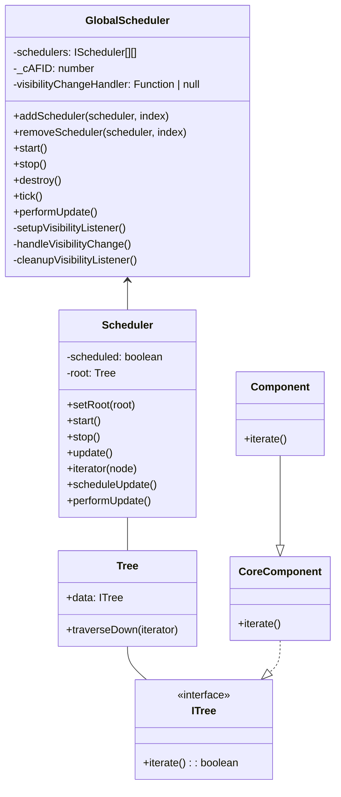
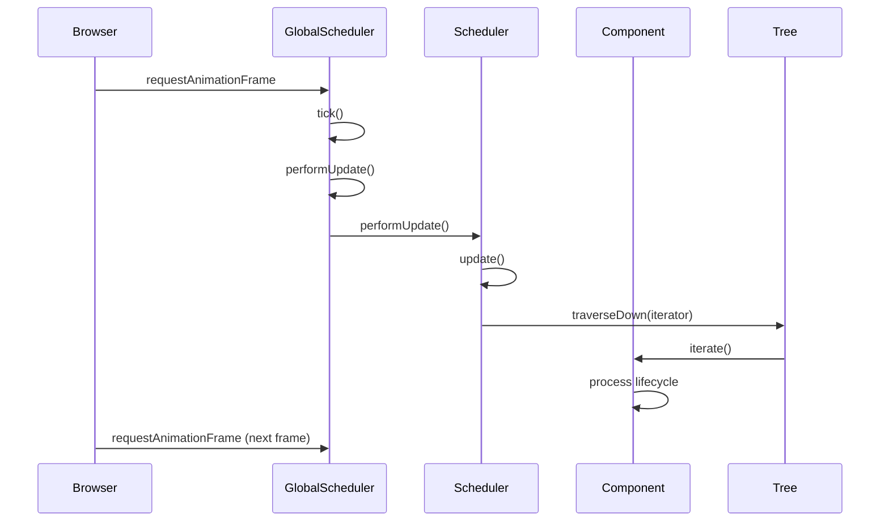
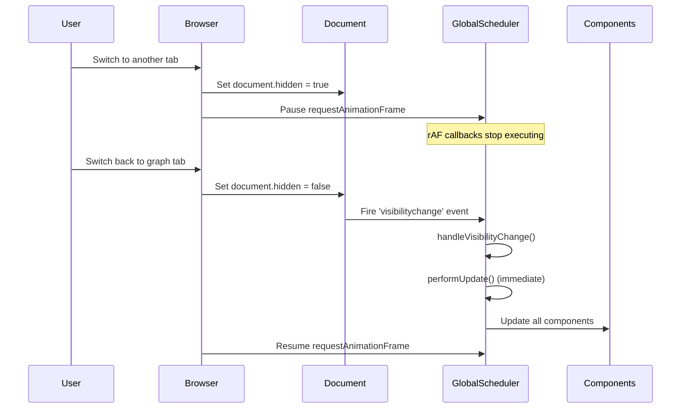
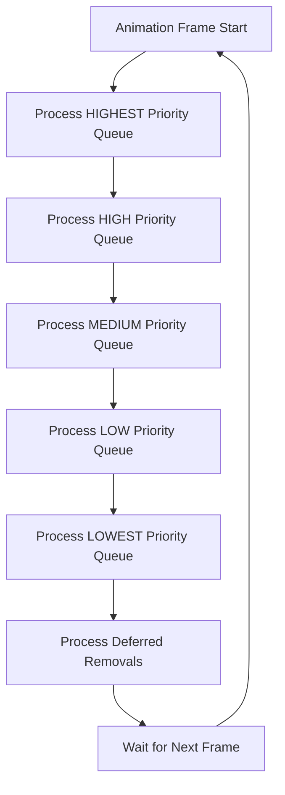
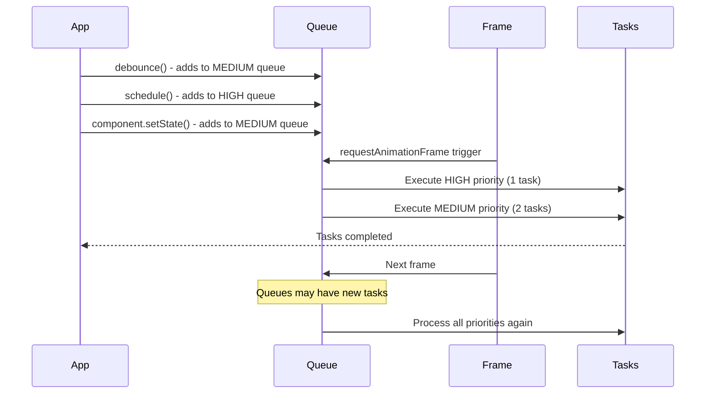
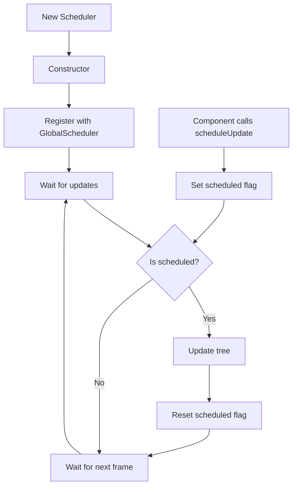
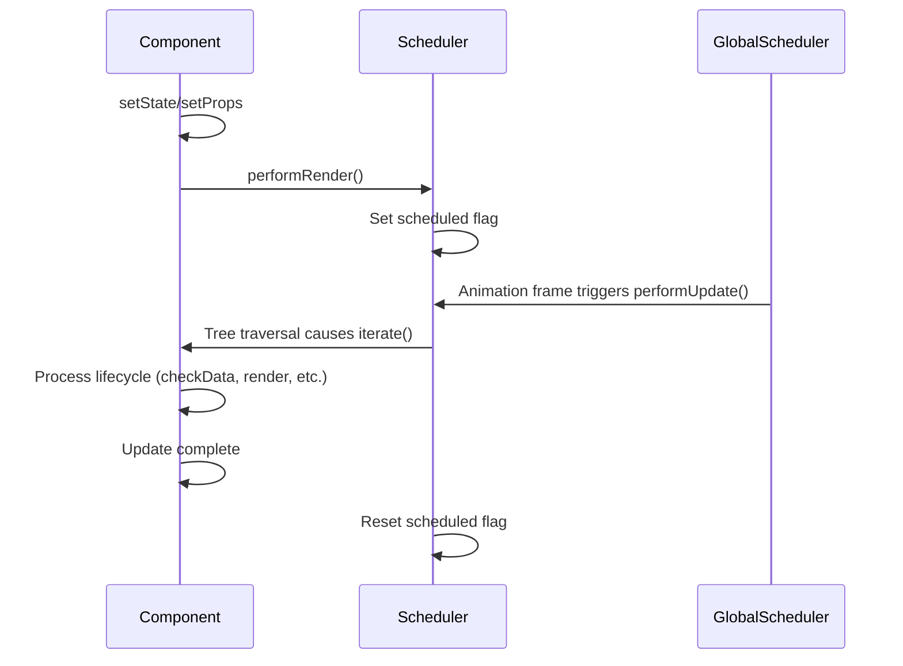

# Scheduler System Documentation

This document describes the scheduling system that coordinates component updates in the rendering engine, focusing on the `Scheduler` and `GlobalScheduler` classes.

> **Note:** This document is part of a series on the rendering architecture. See also [Component Lifecycle](./component-lifecycle.md), [Rendering Mechanism](../rendering/rendering-mechanism.md), and the integration document [Component Rendering and Lifecycle Integration](./component-rendering-lifecycle.md).

## Scheduler Architecture

The scheduling system consists of two main classes:

1. **GlobalScheduler** - Manages the animation frame loop and coordinates multiple schedulers
2. **Scheduler** - Manages updates for a specific component tree



## Animation Frame Integration

The scheduler system integrates with the browser's requestAnimationFrame API (or setTimeout in non-browser environments):



## Browser Background Behavior and Page Visibility

> ⚠️ **Important:** Browsers throttle or completely pause `requestAnimationFrame` execution when a tab is in the background. This is a critical consideration for the scheduler system.

### Background Tab Behavior

When a browser tab is not visible (e.g., opened in background, user switched to another tab), browsers implement the following optimizations:

| Browser | Behavior | Impact on Scheduler |
|---------|----------|---------------------|
| **Chrome** | Throttles rAF to 1 FPS | Severe slowdown, ~60x slower |
| **Firefox** | Pauses rAF completely | Complete halt until tab visible |
| **Safari** | Pauses rAF completely | Complete halt until tab visible |
| **Edge** | Throttles rAF to 1 FPS | Severe slowdown, ~60x slower |

### Why Browsers Do This

Browsers pause or throttle `requestAnimationFrame` in background tabs for several reasons:

1. **Battery Life** - Reduces CPU usage on mobile devices and laptops
2. **Performance** - Frees up resources for the active tab
3. **Fairness** - Prevents background tabs from consuming too many resources
4. **User Experience** - Prioritizes the visible tab

### Page Visibility API Integration

To handle this behavior, `GlobalScheduler` integrates with the [Page Visibility API](https://developer.mozilla.org/en-US/docs/Web/API/Page_Visibility_API):

```typescript
// In GlobalScheduler constructor
private setupVisibilityListener(): void {
  if (typeof document === "undefined") {
    return; // Not in browser environment
  }

  this.visibilityChangeHandler = this.handleVisibilityChange;
  document.addEventListener("visibilitychange", this.visibilityChangeHandler);
}

private handleVisibilityChange(): void {
  // Only update if page becomes visible and scheduler is running
  if (!document.hidden && this._cAFID) {
    // Perform immediate update when tab becomes visible
    this.performUpdate();
  }
}
```

### Visibility Change Flow



## Update Scheduling

The scheduling system coordinates when component updates happen:

1. Component calls `performRender()` to schedule an update
2. This sets a `scheduled` flag in the Scheduler
3. On the next animation frame, GlobalScheduler triggers updates for all scheduled components
4. The Scheduler traverses the component tree in a depth-first order
5. Each component's `iterate()` method is called during traversal
6. Components can control whether their children are processed by returning true/false from `iterate()`

## Priority Levels

The GlobalScheduler supports multiple priority levels (0-4):

- Lower priority levels (0, 1) are processed before higher levels (3, 4)
- This allows critical updates to be processed first
- Default priority is 2
- Multiple schedulers can exist at different priority levels

### Priority Enum

```typescript
export enum ESchedulerPriority {
  HIGHEST = 0,
  HIGH = 1,
  MEDIUM = 2,
  LOW = 3,
  LOWEST = 4,
}
```

## Task Queue in Frame

The scheduler system maintains a task queue that is processed each animation frame. Understanding how tasks are queued and executed is crucial for performance optimization.

### Queue Structure

The GlobalScheduler maintains **5 separate queues** (one per priority level):

```typescript
private schedulers: [
  IScheduler[],  // Priority 0 (HIGHEST)
  IScheduler[],  // Priority 1 (HIGH)
  IScheduler[],  // Priority 2 (MEDIUM)
  IScheduler[],  // Priority 3 (LOW)
  IScheduler[]   // Priority 4 (LOWEST)
];
```

### Frame Execution Order

Within each animation frame, tasks are executed in this order:



### How Tasks Enter the Queue

Tasks can be added to the queue through several mechanisms:

1. **Component Schedulers** - When `performRender()` is called on a component
2. **Manual Schedule** - Using `schedule()` utility function
3. **Debounced Functions** - Using `debounce()` with frame-based timing
4. **Throttled Functions** - Using `throttle()` with frame-based timing

```typescript
// Example: Adding tasks to different priority queues

// 1. Component rendering (uses component's scheduler priority)
component.setState({ value: newValue });
// Internally calls: scheduler.scheduleUpdate()

// 2. Manual schedule - runs once after N frames
const removeTask = schedule(
  () => console.log('Task executed'),
  {
    priority: ESchedulerPriority.HIGH,
    frameInterval: 2,  // Execute after 2 frames
    once: true,
  }
);

// 3. Debounced function - queues task when conditions met
const debouncedUpdate = debounce(
  () => updateUI(),
  {
    priority: ESchedulerPriority.LOW,
    frameInterval: 3,
    frameTimeout: 100,
  }
);
// Each call resets the frame counter
debouncedUpdate(); // Queues task

// 4. Throttled function - executes immediately, then queues next execution
const throttledScroll = throttle(
  () => handleScroll(),
  {
    priority: ESchedulerPriority.MEDIUM,
    frameInterval: 1,
  }
);
throttledScroll(); // Executes immediately
throttledScroll(); // Ignored, waiting for frame interval
```

### Task Execution Within a Frame

Each task in the queue has a `performUpdate()` method that is called with the elapsed time since frame start:

```typescript
public performUpdate() {
  const startTime = getNow();
  
  // Process each priority level sequentially
  for (let i = 0; i < this.schedulers.length; i += 1) {
    const schedulers = this.schedulers[i];
    
    // Execute all tasks at this priority level
    for (let j = 0; j < schedulers.length; j += 1) {
      const elapsedTime = getNow() - startTime;
      schedulers[j].performUpdate(elapsedTime);
    }
  }
  
  // Clean up removed schedulers
  this.processRemovals();
}
```

### Frame Counter Mechanism

The scheduler uses frame counters to implement frame-based delays:

```typescript
// Inside debounce implementation
const debouncedScheduler = {
  performUpdate: () => {
    frameCounter++;  // Increment on each frame
    const elapsedTime = getNow() - startTime;
    
    // Execute when BOTH conditions met
    if (frameCounter >= frameInterval && elapsedTime >= frameTimeout) {
      fn(...latestArgs);  // Execute the function
      frameCounter = 0;   // Reset counter
      removeScheduler();  // Remove from queue
    }
  },
};
```

### Performance Characteristics

| Aspect | Behavior | Impact |
|--------|----------|--------|
| **Tasks per frame** | All queued tasks execute each frame | O(n) where n = total tasks |
| **Priority processing** | Sequential, highest to lowest | Higher priority tasks execute first |
| **Frame budget** | No time limit per frame | Can cause frame drops if too many tasks |
| **Task removal** | Deferred until after all tasks execute | Prevents array mutation during iteration |

### Best Practices for Queue Management

1. **Use Appropriate Priorities**
   ```typescript
   // ✅ Critical rendering updates
   schedule(updateCanvas, { priority: ESchedulerPriority.HIGHEST });
   
   // ✅ UI feedback
   schedule(updateSidebar, { priority: ESchedulerPriority.MEDIUM });
   
   // ✅ Analytics, logging
   schedule(trackEvent, { priority: ESchedulerPriority.LOWEST });
   ```

2. **Avoid Queue Saturation**
   ```typescript
   // ❌ Bad: Creates new task every time
   function onMouseMove(e) {
     schedule(() => updatePosition(e.x, e.y), { frameInterval: 1 });
   }
   
   // ✅ Good: Reuses same debounced function
   const updatePosition = debounce(
     (x, y) => console.log(x, y),
     { frameInterval: 1 }
   );
   function onMouseMove(e) {
     updatePosition(e.x, e.y);
   }
   ```

3. **Clean Up Tasks**
   ```typescript
   // Always clean up when component unmounts
   useEffect(() => {
     const remove = schedule(task, { priority: ESchedulerPriority.LOW });
     return () => remove(); // Cleanup
   }, []);
   
   // Or use cancel method
   const debounced = debounce(fn, { frameInterval: 5 });
   return () => debounced.cancel();
   ```

4. **Monitor Frame Budget**
   ```typescript
   // In development, monitor task execution time
   const debouncedScheduler = {
     performUpdate: (elapsedTime: number) => {
       if (elapsedTime > 16) {
         console.warn('Frame budget exceeded:', elapsedTime);
       }
       // ... task logic
     },
   };
   ```

### Queue Visualization Example



## Tree Traversal

The traversal process follows these rules:

- Components are visited in depth-first order
- Children are ordered by z-index for proper rendering layering
- Component's `iterate()` return value controls whether children are processed
- This allows for efficient partial updates of the tree

For detailed flow diagrams showing these processes, see [Component Rendering and Lifecycle Integration](./component-rendering-lifecycle.md).

## Scheduler Lifecycle



## Code Examples

### Basic Scheduler Usage

```typescript
// Create a scheduler
const scheduler = new Scheduler();

// Set the root component
const rootComponent = CoreComponent.mount(MyRootComponent, props);
scheduler.setRoot(rootComponent.__comp.treeNode);

// Start the scheduler
scheduler.start();

// Later, stop the scheduler when done
scheduler.stop();
```

### Component Integration with Scheduler

```typescript
class MyComponent extends Component {
  public updateValue(newValue) {
    this.setState({ value: newValue });
    // This calls performRender() which schedules an update
  }
  
  protected render() {
    // This will be called during the next animation frame
    console.log('Rendering with value:', this.state.value);
  }
}
```

### Using Multiple Schedulers with Different Priority Levels

```typescript
// Create two schedulers with different priority levels
const highPriorityScheduler = new Scheduler();
const lowPriorityScheduler = new Scheduler();

// Add the schedulers to the global scheduler with different priority levels
globalScheduler.addScheduler(highPriorityScheduler, 0); // High priority
globalScheduler.addScheduler(lowPriorityScheduler, 4); // Low priority

// Start the global scheduler
globalScheduler.start();

// Assign different components to the schedulers
highPriorityScheduler.setRoot(highPriorityRootComponent.__comp.treeNode);
lowPriorityScheduler.setRoot(lowPriorityRootComponent.__comp.treeNode);
```

## Optimizing Performance

The scheduling system is designed for optimal performance:

1. Updates are batched per animation frame
2. Multiple state/props changes trigger only one render per frame
3. Z-index ordering allows for efficient rendering of visual components
4. The system only traverses branches that need updating (when components return `false` from `iterate()`)
5. Multiple schedulers can be used for different update frequencies

## Handling Browser Environment Differences

The system adapts to different environments:

```typescript
// For browser environments
const rAF = window.requestAnimationFrame;
const cAF = window.cancelAnimationFrame;
const getNow = window.performance.now.bind(window.performance);

// For non-browser environments
const rAF = (fn) => global.setTimeout(fn, 16);
const cAF = global.clearTimeout;
const getNow = global.Date.now.bind(global.Date);
```

This allows the scheduler to work in both browser and non-browser JavaScript environments.

## Interaction with Component Lifecycle

The scheduler system interacts with component lifecycle as follows:



## Global Scheduler Instance

The system provides a global scheduler instance for convenience:

```typescript
export const globalScheduler = new GlobalScheduler();
export const scheduler = globalScheduler;
```

This allows components to share a single scheduler instance and animation frame loop.

### Cleanup

In rare cases where you need to completely destroy the scheduler (e.g., testing, cleanup):

```typescript
// Stop scheduler and remove all event listeners
globalScheduler.destroy();
```

> **Note:** In normal application usage, you don't need to call `destroy()`. The global scheduler is designed to run for the entire lifetime of the application.

## Debugging the Scheduler

Debugging issues with the scheduler can be challenging, but there are several techniques you can use to identify and resolve problems:

1. **Logging**: Add console logs to the `performUpdate()` and `iterate()` methods to track the order in which components are being updated. This can help you identify performance bottlenecks or unexpected update patterns.
2. **Performance Profiling**: Use the browser's performance profiling tools to identify areas where the scheduler is spending the most time. This can help you pinpoint inefficient components or rendering logic.
3. **Breakpoints**: Set breakpoints in the scheduler's code to step through the update process and examine the state of components and the scheduler itself.
4. **Visualizations**: Create visualizations to track the number of updates per frame, the time spent in each phase of the update process, and the number of components being processed. This can help you identify trends and patterns that might not be apparent from logging or profiling alone.

## Related Documentation

- [Component Lifecycle](./component-lifecycle.md) - In-depth details about component lifecycle methods
- [Rendering Mechanism](../rendering/rendering-mechanism.md) - Architectural details of the rendering system
- [Component Rendering and Lifecycle Integration](./component-rendering-lifecycle.md) - Comprehensive guide showing how these systems work together