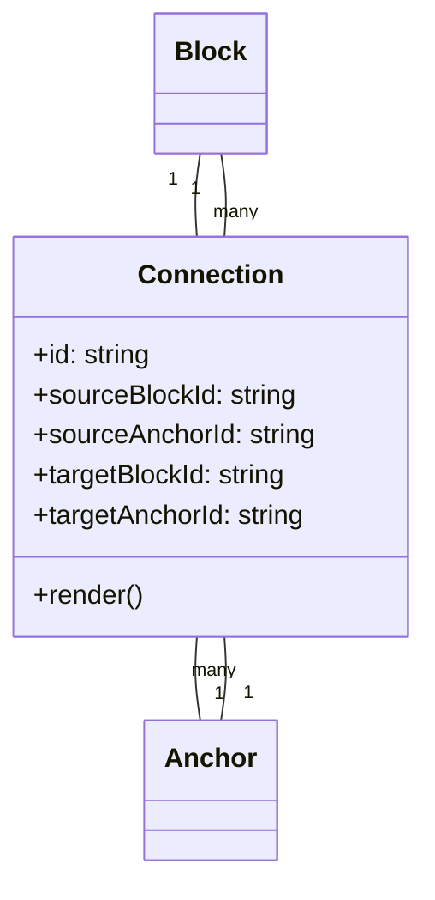
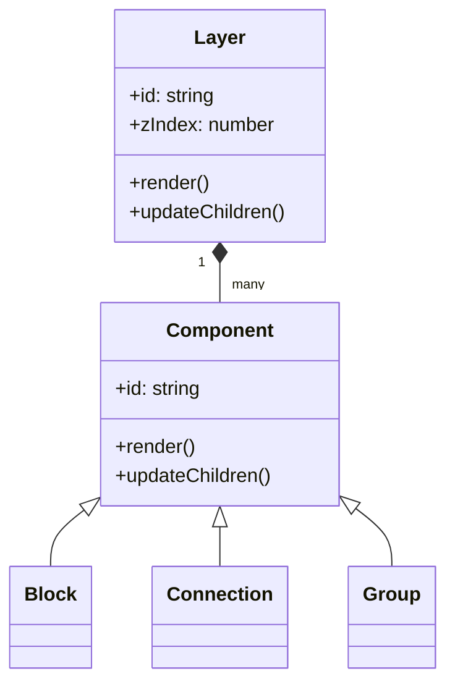
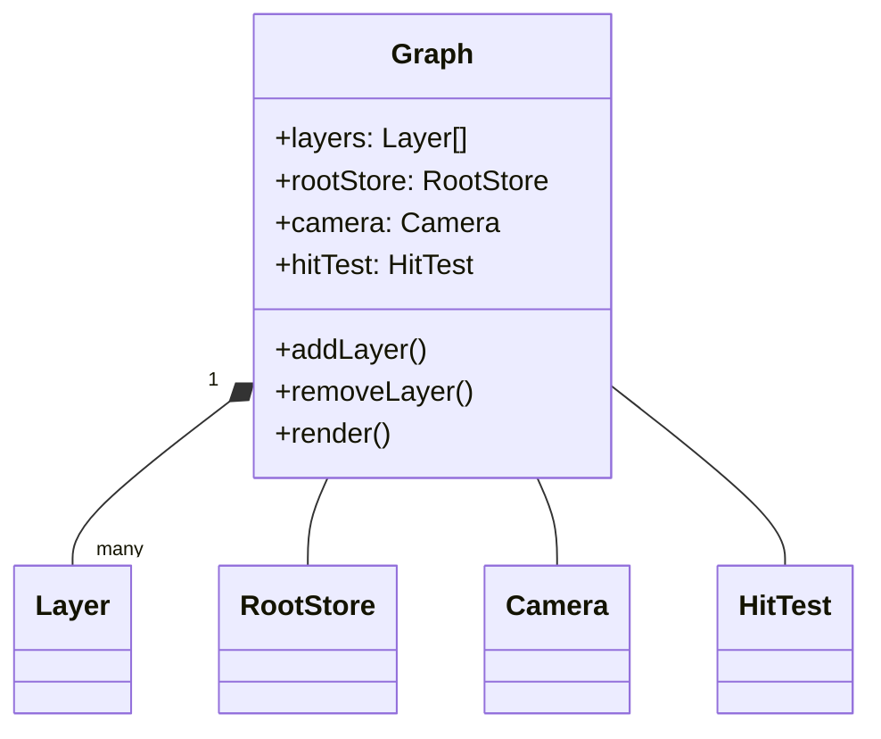
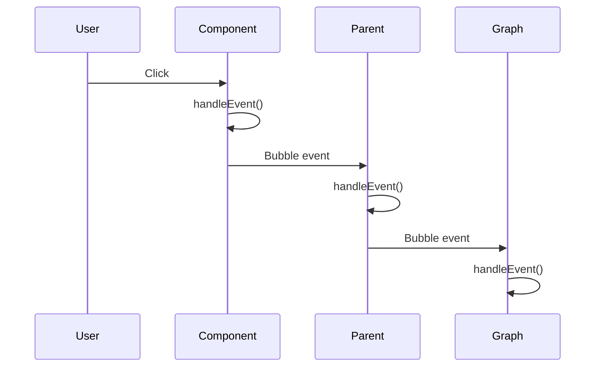
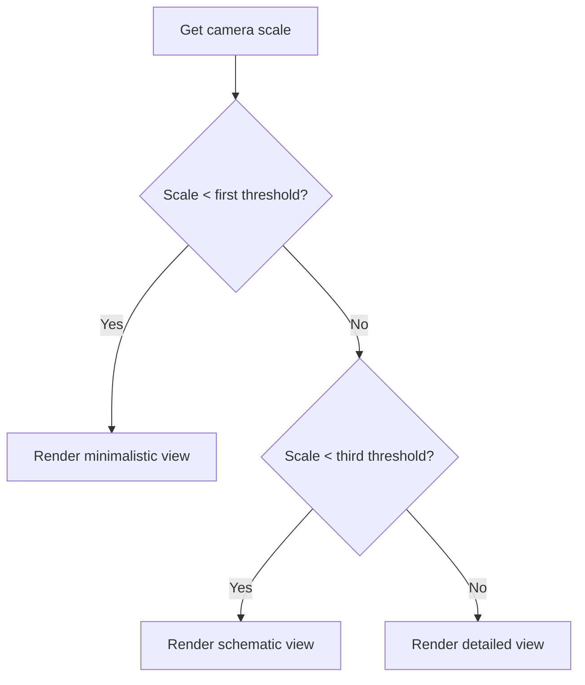

# System Patterns: @gravity-ui/graph

## System Architecture

The @gravity-ui/graph library is built on a layered architecture that separates concerns and enables flexibility and extensibility. The core architecture consists of the following layers:

### 1. Core Foundation

At the foundation level, the library provides:

- **Tree**: A hierarchical structure that manages parent-child relationships with z-index ordering
- **CoreComponent**: The fundamental component class that implements tree traversal and child management
- **Component**: Extends CoreComponent to add lifecycle hooks and state management
- **Scheduler**: Manages the timing of updates and traversal of the component tree

### 2. Rendering System

The rendering system is responsible for visual output and includes:

- **LayersService**: Manages multiple canvas layers with different z-indices
- **Camera**: Handles viewport transformation and zoom levels
- **HitTest**: Provides spatial indexing for efficient hit detection
- **BatchPath2D**: Optimizes rendering of similar elements (like connections)

### 3. Data Model

The data model manages the state of the graph:

- **RootStore**: The central store that manages all graph data
- **BlocksList**: Manages the collection of blocks
- **ConnectionList**: Manages the collection of connections
- **GroupsList**: Manages the collection of groups
- **Settings**: Manages graph configuration and settings

### 4. Component Layer

The component layer provides the visual elements:

- **Block**: The base component for graph nodes
- **Connection**: The base component for connections between blocks
- **Anchor**: The component for connection points on blocks
- **Group**: The component for grouping blocks

### 5. React Integration

The React integration layer enables seamless use with React applications:

- **GraphCanvas**: The main React component for rendering the graph
- **GraphBlock**: A wrapper for rendering custom block content
- **GraphBlockAnchor**: A wrapper for rendering custom anchor content
- **useGraph**: A hook for creating and managing graph instances

### 6. Extension Layer

The extension layer enables customization and extension:

- **Layers**: Custom layers that can add new functionality
- **Plugins**: Modular extensions that add specific features

## Key Technical Decisions

### 1. Hybrid Rendering Approach

The library uses a hybrid rendering approach that combines Canvas and HTML/React:

- **Canvas Rendering**: Used for high-performance rendering of the entire graph
- **HTML/React Rendering**: Used for rich interactions when zoomed in
- **Automatic Switching**: Based on zoom level and viewport

This approach provides the best of both worlds: high performance for large graphs and rich interactivity for focused interactions.

### 2. Component-Based Architecture

The library uses a component-based architecture inspired by React:

- **Component Lifecycle**: Components have a well-defined lifecycle with hooks
- **State Management**: Components manage their own state and respond to changes
- **Tree Structure**: Components are organized in a hierarchical tree
- **Event Delegation**: Events bubble up through the component tree

This approach provides a familiar programming model and enables complex component composition.

### 3. Spatial Indexing

The library uses spatial indexing for efficient hit detection:

- **R-tree**: Used for spatial indexing of components
- **HitBox**: Each component has a hit box that defines its spatial boundaries
- **Efficient Queries**: Spatial queries are used for hit detection and viewport culling

This approach enables efficient interaction with large graphs and optimizes rendering performance.

### 4. Batch Rendering

The library uses batch rendering for similar elements:

- **BatchPath2D**: Groups similar paths for efficient rendering
- **Z-index Ordering**: Ensures proper layering of elements
- **Style Grouping**: Minimizes context switching for better performance

This approach significantly improves rendering performance for large graphs with many connections.

## Design Patterns in Use

### 1. Observer Pattern

The library uses the observer pattern for reactive updates:

- **Signals**: Components can subscribe to signals for reactive updates
- **Event System**: Based on the DOM EventTarget API
- **Automatic Cleanup**: Subscriptions are automatically cleaned up on unmount

Example:
```typescript
// Subscribe to a signal
this.subscribeSignal(this.context.theme.colorSignal, (newColors) => {
  this.setState({ fillColor: newColors.getColorFor(this.props.type) });
  this.performRender();
});
```

### 2. Component Lifecycle Pattern

The library implements a comprehensive component lifecycle:

- **Initialization**: Constructor and willMount
- **Rendering**: willRender, render, didRender
- **Updates**: willIterate, didIterate
- **Children Management**: willUpdateChildren, updateChildren, didUpdateChildren
- **Cleanup**: unmount

Example:
```typescript
class MyComponent extends Component {
  protected willMount() {
    // Initialize component
  }
  
  protected render() {
    // Render component
  }
  
  protected unmount() {
    // Clean up resources
    super.unmount();
  }
}
```

### 3. Composition Pattern

The library uses composition for building complex components:

- **Parent-Child Relationships**: Components can have child components
- **Z-index Ordering**: Children are rendered in z-index order
- **Event Bubbling**: Events bubble up through the component hierarchy

Example:
```typescript
protected updateChildren() {
  return [
    ChildComponent.create({ /* props */ }, { key: 'child1' }),
    AnotherChild.create({ /* props */ }, { key: 'child2' })
  ];
}
```

### 4. Strategy Pattern

The library uses the strategy pattern for customizable behavior:

- **Custom Block Components**: Different block implementations can be registered
- **Custom Connection Components**: Different connection implementations can be registered
- **Rendering Strategies**: Different rendering strategies based on zoom level

Example:
```typescript
// Register custom block components
graph.updateSettings({
  blockComponents: {
    'action-block': ActionBlockComponent,
    'text-block': TextBlockComponent
  }
});
```

### 5. Factory Pattern

The library uses the factory pattern for component creation:

- **Component.create()**: Static factory method for creating components
- **Component.mount()**: Static factory method for mounting root components
- **Options**: Factory methods accept options for customization

Example:
```typescript
// Create a component using the factory method
const component = MyComponent.create({ /* props */ }, { key: 'my-component' });
```

## Component Relationships

### Block and Anchor Relationship

Blocks contain anchors as child components:

```mermaid
classDiagram
    Block "1" *-- "many" Anchor
    Block -- BlockState
    Anchor -- AnchorState
    
    class Block {
        +id: string
        +position: {x, y}
        +size: {width, height}
        +anchors: Anchor[]
        +render()
        +updateChildren()
    }
    
    class Anchor {
        +id: string
        +position: {x, y}
        +type: string
        +render()
    }
```

### Connection Relationships

Connections link blocks or anchors:



### Layer and Component Relationship

Layers contain components:



### Graph and Layer Relationship

The graph contains multiple layers:



## Event Model

The library uses a custom event system based on the DOM EventTarget API:



Events are dispatched and bubble up through the component hierarchy, allowing for event delegation and centralized event handling.

## Rendering Pipeline

The rendering pipeline follows these steps:

```mermaid
flowchart TD
    A[Component state/props update] --> B[performRender()]
    B --> C[Scheduler]
    C --> D[iterate()]
    D --> E[checkData()]
    E --> F{shouldRender?}
    F -->|Yes| G[willRender()]
    G --> H[render()]
    H --> I[didRender()]
    F -->|No| J[willNotRender()]
    I --> K{shouldUpdateChildren?}
    J --> K
    K -->|Yes| L[willUpdateChildren()]
    L --> M[updateChildren()]
    M --> N[didUpdateChildren()]
    K -->|No| O[didIterate()]
    N --> O
```

This pipeline ensures that components are rendered efficiently and only when necessary, with appropriate lifecycle hooks for customization.

## Scale-Dependent Rendering

The library uses scale-dependent rendering to optimize performance:



This approach ensures that components are rendered with an appropriate level of detail based on the current zoom level, optimizing performance while maintaining visual clarity.
