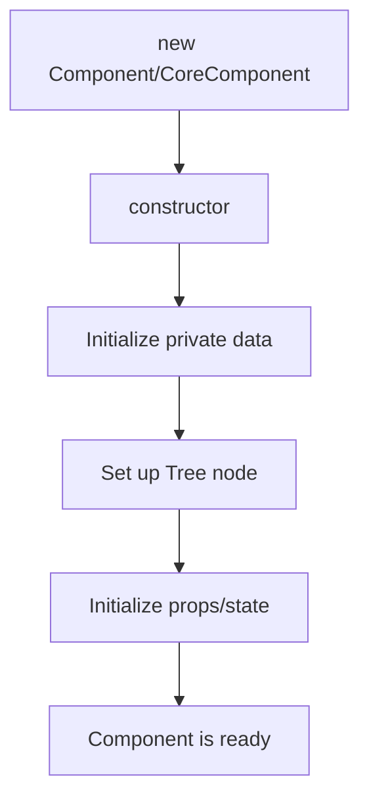

# Component Lifecycle

This document provides an in-depth explanation of the component lifecycle in the rendering system, focusing on both the CoreComponent and Component classes.

> **Note:** This document is part of a series on the rendering architecture. See also [Rendering Mechanism](../rendering/rendering-mechanism.md), [Scheduler System](./scheduler-system.md), and [Component Rendering Integration](./component-rendering-lifecycle.md).

## Overview

The component lifecycle consists of five main phases that each component goes through from creation to removal:

| Phase | Description |
|-------|-------------|
| Initialization | Component creation and setup |
| Mounting | First addition to the component tree |
| Updating | Processing state/props changes and rendering |
| Children Management | Creating and updating child components |
| Unmounting | Cleanup and removal from the tree |

## Lifecycle Phases

### 1. Initialization Phase



During initialization:
1. The component's constructor sets up private properties
2. The component is registered in the Tree structure
3. Initial props and state are established

### 2. CoreComponent Lifecycle

The CoreComponent provides the foundation with three main methods:

| Method | Purpose | When Called |
|--------|---------|-------------|
| `iterate()` | Manages the update cycle | Each frame |
| `updateChildren()` | Defines and updates child components | During children update |
| `render()` | Handles visual rendering | During render phase |

> **Note:** For details on how these methods interact with the rendering pipeline, see [Rendering Mechanism](../rendering/rendering-mechanism.md).

### 3. Component Lifecycle Methods

The Component class extends CoreComponent with additional lifecycle hooks:

#### Method Sequence

During component iteration, methods are called in this order:

1. First Iteration Only:
   - `willMount()`

2. Every Iteration:
   ```mermaid
   flowchart TD
       A[checkData] --> B[willIterate]
       B --> C{shouldRender?}
       C -->|Yes| D[willRender]
       D --> E[render]
       E --> F[didRender]
       C -->|No| G[willNotRender]
       G --> H{shouldUpdateChildren?}
       F --> H
       H -->|Yes| I[willUpdateChildren]
       I --> J[updateChildren]
       J --> K[didUpdateChildren]
       H -->|No| L[didIterate]
       K --> L
   ```

### 4. State and Props Management

When state or props change:

| Step | Action | Method |
|------|--------|---------|
| 1 | Changes called | `setState()` or `setProps()` |
| 2 | Changes buffered | Stored in `__data` |
| 3 | Update scheduled | `performRender()` |
| 4 | Changes processed | `checkData()` |
| 5 | Callbacks triggered | `propsChanged()` or `stateChanged()` |
| 6 | Render evaluated | Based on `shouldRender` flag |

### 5. Control Flags

Components use several boolean flags to control their behavior:

| Flag | Purpose | Default Value |
|------|---------|---------------|
| `firstIterate` | Tracks first iteration | `true` |
| `firstRender` | Tracks first render | `true` |
| `firstUpdateChildren` | Tracks first children update | `true` |
| `shouldRender` | Controls render() call | `true` |
| `shouldUpdateChildren` | Controls children updates | `true` |
| `shouldRenderChildren` | Controls children rendering | `true` |

## Examples

### Basic Component

```typescript
import { Component } from "@gravity-ui/graph";

class MyComponent extends Component {
  protected willMount() {
    // Initialize, similar to constructor but guaranteed to run before first render
    this.setState({ counter: 0 });
  }
  
  protected render() {
    // Render logic
    console.log('Rendering with counter:', this.state.counter);
  }
  
  public increment() {
    this.setState({ counter: this.state.counter + 1 });
  }
}
```

### Component with Children

```typescript
import { Component } from "@gravity-ui/graph";

class ParentComponent extends Component {
  protected updateChildren() {
    return [
      ChildComponent.create({ value: this.state.value }, { key: 'child1' }),
      AnotherChild.create({ data: this.props.data }, { key: 'child2' })
    ];
  }
  
  protected willUpdateChildren() {
    console.log('About to update children');
  }
  
  protected didUpdateChildren() {
    console.log('Children updated');
  }
}
```

## Best Practices

### Performance Optimization

1. Control rendering with lifecycle flags:
   ```typescript
   protected propsChanged(nextProps) {
     // Only render if relevant props have changed
     this.shouldRender = nextProps.value !== this.props.value;
   }
   ```

2. Batch state updates:
   ```typescript
   // Instead of multiple setState calls:
   // this.setState({ value: 1 });
   // this.setState({ count: 2 });
   
   // Batch updates in one call:
   this.setState({ value: 1, count: 2 });
   ```

> **Important:** Always clean up resources in the `unmount()` method to prevent memory leaks.
