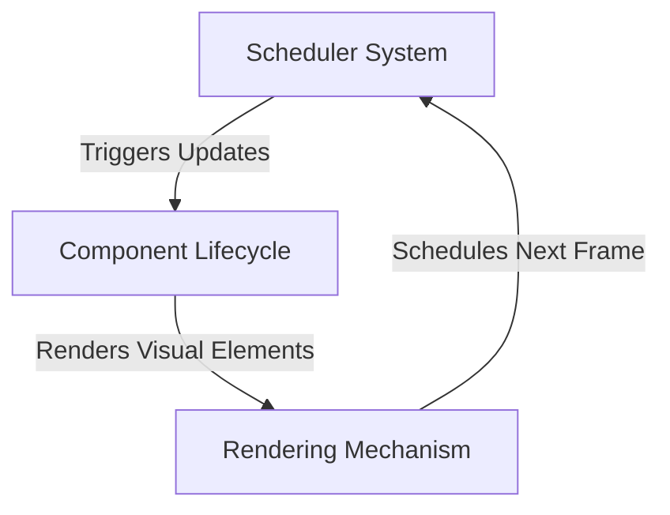
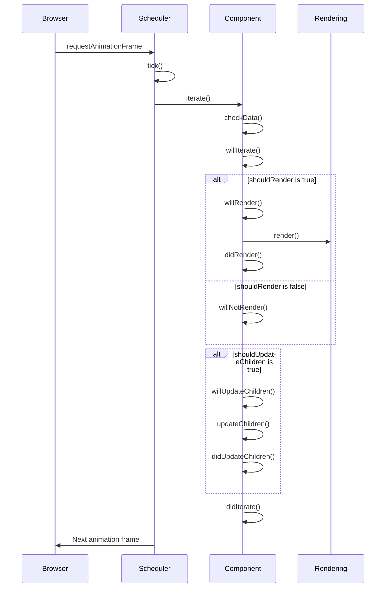

# Component Rendering and Lifecycle Integration

This document provides a comprehensive view of how the component lifecycle, rendering mechanism, and scheduler system work together to create the complete rendering pipeline.

## Architectural Overview

The rendering system consists of three interconnected subsystems:



Each subsystem has a specific responsibility:
- **Scheduler System**: Coordinates when updates happen using animation frames
- **Component Lifecycle**: Manages component state, updates, and child components
- **Rendering Mechanism**: Handles the actual visual representation of components

## Integrated Update Flow

The following sequence diagram shows how these systems interact during a typical update cycle:



## Key Integration Points

### 1. Component Updates and Scheduler

When a component's state or props change:

1. `Component.setState()` or `Component.setProps()` is called
2. `performRender()` schedules an update with the `Scheduler`
3. The `Scheduler` marks the component tree for update
4. On the next animation frame, the `Scheduler` traverses the component tree
5. Each component's `iterate()` method is called
6. The component processes its lifecycle methods based on its current state

From `scheduler-system.md`:
> Component calls `performRender()` to schedule an update. This method sets the `scheduled` flag in the component's `Scheduler` instance, indicating that the component tree needs to be updated.

From `component-lifecycle.md`:
> When state or props change, the system follows this sequence: User->Component: setState/setProps, Component->Buffer: Store in __data, Component->Scheduler: performRender(), Scheduler->Component: iterate() on next frame

### 2. Component Lifecycle and Rendering

The component lifecycle controls the rendering process through several key methods:

1. `iterate()` - The main entry point called by the scheduler
2. `checkData()` - Processes any pending state/props changes
3. `shouldRender` flag - Controls whether rendering occurs
4. `render()` - Creates the visual output when needed
5. `shouldUpdateChildren` flag - Controls whether children are updated

From `rendering-mechanism.md`:
> The rendering process follows these steps: Component state/props update via `setState`/`setProps`, `performRender()` schedules an update through the `Scheduler`, On the next animation frame, `Scheduler` traverses the component tree, Each component's `iterate()` method is called, Components process their data and execute their lifecycle methods, Child components are created, updated, or removed as needed

From `component-lifecycle.md`:
> The CoreComponent has three main methods: `iterate()` - Called on each frame, manages the update cycle, `updateChildren()` - Defines and updates child components, `render()` - Handles the visual rendering of the component

### 3. Tree Structure and Z-Index

All three systems interact with the Tree structure, which:
- Maintains the parent-child relationships between components
- Manages the z-index ordering for proper rendering
- Provides traversal methods for the scheduler

From `scheduler-system.md`:
> During an update, the Scheduler traverses the component tree in depth-first order: Tree._walkDown, Iterator returns true/false, Process/Skip children

From `rendering-mechanism.md`:
> The rendering mechanism is built upon a hierarchical tree structure with the following key components: Tree - The base hierarchical structure that manages parent-child relationships with z-index ordering

## Complete Rendering Lifecycle

Combining all three documents, we can map the complete lifecycle from state change to screen update:

1. **State/Props Change**
   - Component calls `setState()` or `setProps()`
   - Changes are buffered in the component's `__data`
   - Component calls `performRender()`

2. **Scheduling**
   - Scheduler sets the `scheduled` flag
   - GlobalScheduler manages animation frame timing
   - On the next frame, scheduler traverses the component tree

3. **Component Processing**
   - Component's `iterate()` method is called
   - For first iteration only, `willMount()` is called
   - `willIterate()` prepares for the update
   - `checkData()` processes buffered state/props changes
   - `propsChanged()` or `stateChanged()` handle specific changes

4. **Rendering Decision**
   - Component evaluates `shouldRender` flag
   - If true: `willRender()` → `render()` → `didRender()`
   - If false: `willNotRender()`

5. **Children Management**
   - Component evaluates `shouldUpdateChildren` flag
   - If true: `willUpdateChildren()` → `updateChildren()` → `didUpdateChildren()`
   - Child components are created, updated, or removed

6. **Completion**
   - `didIterate()` finalizes the component update
   - Scheduler moves to the next component or completes the frame
   - Browser renders the updated view
   - Process repeats on the next animation frame if needed

## Performance Optimization Strategies

Leveraging all three systems, developers can optimize performance:

1. **Control rendering with lifecycle flags**
   ```typescript
   protected propsChanged(nextProps) {
     // Only render if relevant props have changed
     this.shouldRender = nextProps.value !== this.props.value;
   }
   ```

2. **Skip child updates when not needed**
   ```typescript
   protected stateChanged(nextState) {
     // Only update children if specific state changed
     this.shouldUpdateChildren = nextState.items !== this.state.items;
   }
   ```

3. **Use z-index for optimal rendering**
   ```typescript
   // Set z-index for proper rendering order
   this.zIndex = 5; // Higher z-index components render on top
   ```

4. **Use scheduler priority levels**
   ```typescript
   // Create schedulers with different priority levels
   const highPriorityScheduler = new Scheduler();
   const lowPriorityScheduler = new Scheduler();
   
   // Add schedulers with different priorities
   globalScheduler.addScheduler(highPriorityScheduler, 0); // High priority
   globalScheduler.addScheduler(lowPriorityScheduler, 4); // Low priority
   ```

## Debugging and Troubleshooting

When debugging rendering issues, consider these cross-system approaches:

1. **Lifecycle Method Logging**
   - Add logs to component lifecycle methods to track execution
   - Check if expected methods are called in the right order

2. **Scheduler State Inspection**
   - Verify that updates are being scheduled
   - Check if component tree traversal is working correctly

3. **Render Performance Profiling**
   - Track time spent in render methods
   - Identify components that render unnecessarily

4. **Tree Structure Validation**
   - Ensure parent-child relationships are correct
   - Verify z-index ordering matches expectations

## Summary

The component lifecycle, rendering mechanism, and scheduler system are deeply interconnected:

- **Component Lifecycle** provides the methods and hooks that control component behavior
- **Rendering Mechanism** handles the visual representation and component structure
- **Scheduler System** coordinates when updates happen and how the tree is traversed

Understanding these connections is essential for effectively using and extending the graph visualization library.

## Related Documentation

- [Component Lifecycle](./component-lifecycle.md) - In-depth details about component lifecycle methods
- [Rendering Mechanism](../rendering/rendering-mechanism.md) - Architectural details of the rendering system
- [Scheduler System](./scheduler-system.md) - Explanation of the scheduling and update system