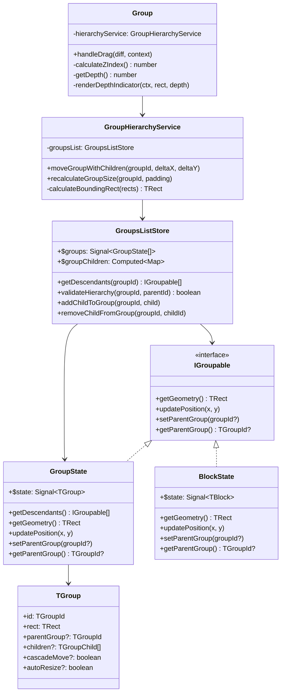
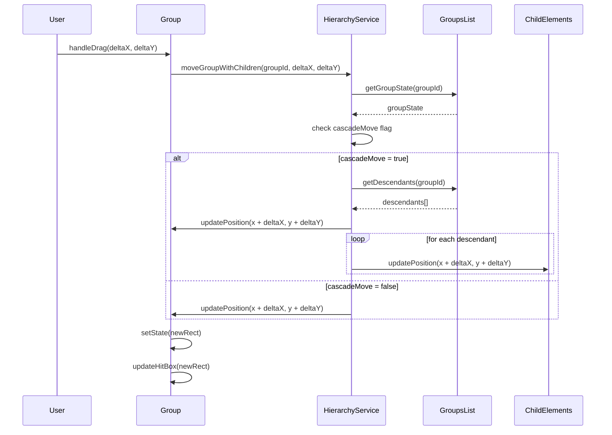
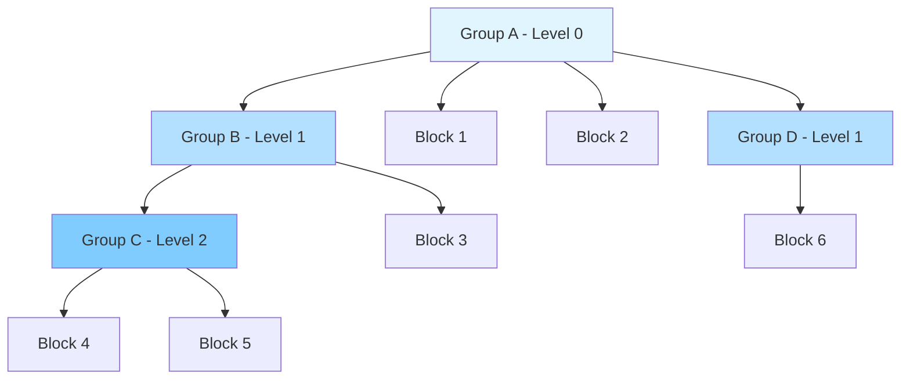

# Архитектура вложенных групп для GraphComponent

## Обзор задачи

Необходимо расширить текущую систему групп, чтобы поддерживать:
- Группировку не только блоков, но и любых GraphComponent (включая другие группы)
- Иерархическую структуру групп (группы в группах)
- Каскадное перемещение: при перетаскивании родительской группы все дочерние элементы перемещаются вместе с ней

## Анализ текущей архитектуры

### Текущие ограничения

1. **Модель данных [`TGroup`](src/store/group/Group.ts:10)**
   - Группы работают только с блоками через поле `group` в [`TBlock`](src/components/canvas/blocks/Block.ts:42)
   - Нет поддержки родительских/дочерних связей между группами
   - Связь блок→группа хранится в самом блоке, а не в группе

2. **Хранилище [`GroupsList`](src/store/group/GroupsList.ts:18)**
   - [`$blockGroups`](src/store/group/GroupsList.ts:25) - вычисляемое свойство группирует блоки по полю `group`
   - Нет механизма для отслеживания иерархии групп
   - Нет поддержки вложенных элементов

3. **Компонент [`Group`](src/components/canvas/groups/Group.ts:58)**
   - Рендерит только визуальную обертку вокруг блоков
   - Не поддерживает дочерние GraphComponent
   - Перетаскивание обновляет только блоки через [`updateBlocks`](src/components/canvas/groups/BlockGroups.ts:214)

4. **Слой [`BlockGroups`](src/components/canvas/groups/BlockGroups.ts:37)**
   - Жестко привязан к блокам через [`$groupsBlocksMap`](src/components/canvas/groups/BlockGroups.ts:152)
   - Не поддерживает произвольные GraphComponent

## Архитектурное решение

### 1. Модель данных для вложенных групп

#### 1.1 Расширение типа TGroup

```typescript
// src/store/group/Group.ts

export type TGroupChild = {
  type: 'block' | 'group' | 'component';
  id: string | number;
};

export interface TGroup {
  id: TGroupId;
  rect: TRect;
  selected?: boolean;
  component?: typeof Group;
  
  // НОВОЕ: Поддержка иерархии
  parentGroup?: TGroupId;           // ID родительской группы
  children?: TGroupChild[];          // Дочерние элементы
  
  // НОВОЕ: Настройки поведения
  cascadeMove?: boolean;             // Перемещать ли дочерние элементы (по умолчанию true)
  autoResize?: boolean;              // Автоматически изменять размер по содержимому (по умолчанию true)
}
```

#### 1.2 Универсальный интерфейс для группируемых элементов

```typescript
// src/store/group/types.ts

export interface IGroupable {
  id: string | number;
  getGeometry(): TRect;              // Получить геометрию элемента
  updatePosition(x: number, y: number): void;  // Обновить позицию
  setParentGroup(groupId?: TGroupId): void;    // Установить родительскую группу
  getParentGroup(): TGroupId | undefined;      // Получить родительскую группу
}
```

### 2. Система управления иерархией групп

#### 2.1 Расширение GroupsList для поддержки иерархии

```typescript
// src/store/group/GroupsList.ts

export class GroupsListStore {
  // Существующие свойства...
  
  // НОВОЕ: Карта дочерних элементов для каждой группы
  public $groupChildren = computed(() => {
    const childrenMap = new Map<TGroupId, IGroupable[]>();
    
    this.$groups.value.forEach(group => {
      const children: IGroupable[] = [];
      
      group.children?.forEach(child => {
        switch (child.type) {
          case 'block':
            const block = this.rootStore.blocksList.getBlockState(child.id);
            if (block) children.push(block);
            break;
          case 'group':
            const childGroup = this.getGroupState(child.id);
            if (childGroup) children.push(childGroup);
            break;
          // Можно добавить другие типы компонентов
        }
      });
      
      childrenMap.set(group.id, children);
    });
    
    return childrenMap;
  });
  
  // НОВОЕ: Получить все дочерние элементы рекурсивно
  public getDescendants(groupId: TGroupId): IGroupable[] {
    const result: IGroupable[] = [];
    const children = this.$groupChildren.value.get(groupId) || [];
    
    children.forEach(child => {
      result.push(child);
      
      // Если дочерний элемент - это группа, получить её потомков
      if (this.isGroup(child)) {
        result.push(...this.getDescendants(child.id));
      }
    });
    
    return result;
  }
  
  // НОВОЕ: Проверка на циклические зависимости
  public validateHierarchy(groupId: TGroupId, parentId: TGroupId): boolean {
    let current: TGroupId | undefined = parentId;
    
    while (current) {
      if (current === groupId) {
        return false; // Обнаружен цикл
      }
      const group = this.getGroup(current);
      current = group?.parentGroup;
    }
    
    return true;
  }
  
  // НОВОЕ: Добавить дочерний элемент в группу
  public addChildToGroup(groupId: TGroupId, child: TGroupChild): void {
    const group = this.getGroup(groupId);
    if (!group) return;
    
    // Проверка на циклы для групп
    if (child.type === 'group' && !this.validateHierarchy(child.id as TGroupId, groupId)) {
      throw new Error('Cannot create circular group dependency');
    }
    
    const children = group.children || [];
    this.updateGroups([{
      ...group,
      children: [...children, child]
    }]);
  }
  
  // НОВОЕ: Удалить дочерний элемент из группы
  public removeChildFromGroup(groupId: TGroupId, childId: string | number): void {
    const group = this.getGroup(groupId);
    if (!group) return;
    
    this.updateGroups([{
      ...group,
      children: group.children?.filter(c => c.id !== childId) || []
    }]);
  }
  
  private isGroup(item: IGroupable): item is GroupState {
    return 'asTGroup' in item;
  }
}
```

#### 2.2 Реализация IGroupable для GroupState

```typescript
// src/store/group/Group.ts

export class GroupState implements IGroupable {
  // Существующие свойства...
  
  // НОВОЕ: Реализация IGroupable
  public getGeometry(): TRect {
    return this.$state.value.rect;
  }
  
  public updatePosition(x: number, y: number): void {
    const rect = this.$state.value.rect;
    this.updateGroup({
      rect: {
        ...rect,
        x,
        y
      }
    });
  }
  
  public setParentGroup(groupId?: TGroupId): void {
    this.updateGroup({ parentGroup: groupId });
  }
  
  public getParentGroup(): TGroupId | undefined {
    return this.$state.value.parentGroup;
  }
  
  // НОВОЕ: Получить всех потомков
  public getDescendants(): IGroupable[] {
    return this.store.getDescendants(this.id);
  }
}
```

#### 2.3 Реализация IGroupable для BlockState

```typescript
// src/store/block/Block.ts

export class BlockState<T extends TBlock = TBlock> implements IGroupable {
  // Существующие свойства...
  
  // НОВОЕ: Реализация IGroupable
  public getGeometry(): TRect {
    return this.$geometry.value;
  }
  
  public updatePosition(x: number, y: number): void {
    this.updateXY(x, y);
  }
  
  public setParentGroup(groupId?: TGroupId): void {
    this.updateBlock({ group: groupId });
  }
  
  public getParentGroup(): TGroupId | undefined {
    return this.$state.value.group;
  }
}
```

### 3. Механизм каскадного перемещения

#### 3.1 Сервис для каскадных операций

```typescript
// src/services/group/GroupHierarchyService.ts

export class GroupHierarchyService {
  constructor(private groupsList: GroupsListStore) {}
  
  /**
   * Переместить группу и все её дочерние элементы
   */
  public moveGroupWithChildren(
    groupId: TGroupId, 
    deltaX: number, 
    deltaY: number
  ): void {
    const group = this.groupsList.getGroupState(groupId);
    if (!group) return;
    
    // Проверяем, нужно ли каскадное перемещение
    const groupData = group.asTGroup();
    if (groupData.cascadeMove === false) {
      // Перемещаем только саму группу
      this.moveElement(group, deltaX, deltaY);
      return;
    }
    
    // Получаем всех потомков
    const descendants = group.getDescendants();
    
    // Перемещаем группу
    this.moveElement(group, deltaX, deltaY);
    
    // Перемещаем всех потомков
    descendants.forEach(child => {
      this.moveElement(child, deltaX, deltaY);
    });
  }
  
  private moveElement(element: IGroupable, deltaX: number, deltaY: number): void {
    const geometry = element.getGeometry();
    element.updatePosition(geometry.x + deltaX, geometry.y + deltaY);
  }
  
  /**
   * Пересчитать размер группы на основе дочерних элементов
   */
  public recalculateGroupSize(groupId: TGroupId, padding: [number, number, number, number] = [20, 20, 20, 20]): void {
    const group = this.groupsList.getGroupState(groupId);
    if (!group) return;
    
    const groupData = group.asTGroup();
    if (groupData.autoResize === false) return;
    
    const children = this.groupsList.$groupChildren.value.get(groupId) || [];
    if (children.length === 0) return;
    
    // Вычисляем bounding box всех дочерних элементов
    const geometries = children.map(child => child.getGeometry());
    const rect = this.calculateBoundingRect(geometries);
    
    // Применяем padding
    const [top, right, bottom, left] = padding;
    group.updateGroup({
      rect: {
        x: rect.x - left,
        y: rect.y - top,
        width: rect.width + left + right,
        height: rect.height + top + bottom
      }
    });
  }
  
  private calculateBoundingRect(rects: TRect[]): TRect {
    if (rects.length === 0) {
      return { x: 0, y: 0, width: 0, height: 0 };
    }
    
    let minX = Infinity;
    let minY = Infinity;
    let maxX = -Infinity;
    let maxY = -Infinity;
    
    rects.forEach(rect => {
      minX = Math.min(minX, rect.x);
      minY = Math.min(minY, rect.y);
      maxX = Math.max(maxX, rect.x + rect.width);
      maxY = Math.max(maxY, rect.y + rect.height);
    });
    
    return {
      x: minX,
      y: minY,
      width: maxX - minX,
      height: maxY - minY
    };
  }
}
```

#### 3.2 Интеграция с компонентом Group

```typescript
// src/components/canvas/groups/Group.ts

export class Group<T extends TGroup = TGroup> extends GraphComponent<...> {
  // Существующие свойства...
  
  protected hierarchyService: GroupHierarchyService;
  
  constructor(props: TGroupProps, parent: BlockGroups) {
    super(props, parent);
    // ...
    this.hierarchyService = this.context.graph.groupHierarchyService;
  }
  
  // ИЗМЕНЕНО: Обработка перетаскивания с каскадным перемещением
  public override handleDrag(diff: DragDiff, _context: DragContext): void {
    // Используем сервис для каскадного перемещения
    this.hierarchyService.moveGroupWithChildren(
      this.props.id, 
      diff.deltaX, 
      diff.deltaY
    );
    
    // Обновляем визуальное представление
    const rect = {
      x: this.state.rect.x + diff.deltaX,
      y: this.state.rect.y + diff.deltaY,
      width: this.state.rect.width,
      height: this.state.rect.height,
    };
    this.setState({ rect });
    this.updateHitBox(rect);
  }
}
```

### 4. Система рендеринга вложенных групп

#### 4.1 Z-index и порядок отрисовки

```typescript
// src/components/canvas/groups/Group.ts

export class Group<T extends TGroup = TGroup> extends GraphComponent<...> {
  // НОВОЕ: Вычисление z-index на основе уровня вложенности
  protected calculateZIndex(): number {
    let depth = 0;
    let currentGroupId = this.groupState?.$state.value.parentGroup;
    
    while (currentGroupId) {
      depth++;
      const parentGroup = this.context.graph.rootStore.groupsList.getGroup(currentGroupId);
      currentGroupId = parentGroup?.parentGroup;
    }
    
    // Базовый z-index для групп + глубина вложенности
    // Родительские группы рисуются ниже дочерних
    return this.context.constants.group.BASE_Z_INDEX - depth;
  }
  
  public get zIndex() {
    return this.calculateZIndex();
  }
}
```

#### 4.2 Визуальная индикация вложенности

```typescript
// src/components/canvas/groups/Group.ts

export class Group<T extends TGroup = TGroup> extends GraphComponent<...> {
  // НОВОЕ: Рендеринг с учетом вложенности
  protected override render() {
    const ctx = this.context.ctx;
    const rect = this.getRect();
    
    // Определяем уровень вложенности для визуальной индикации
    const depth = this.getDepth();
    
    // Применяем разные стили в зависимости от уровня
    const alpha = Math.max(0.1, 1 - depth * 0.15); // Уменьшаем прозрачность для вложенных
    const borderWidth = this.style.borderWidth + depth; // Увеличиваем толщину границы
    
    // Рендерим с учетом состояния
    if (this.highlighted) {
      ctx.strokeStyle = this.adoptColor(this.style.highlightedBorder, { alpha });
      ctx.fillStyle = this.adoptColor(this.style.highlightedBackground, { alpha });
    } else if (this.state.selected) {
      ctx.strokeStyle = this.adoptColor(this.style.selectedBorder, { alpha });
      ctx.fillStyle = this.adoptColor(this.style.selectedBackground, { alpha });
    } else {
      ctx.strokeStyle = this.adoptColor(this.style.border, { alpha });
      ctx.fillStyle = this.adoptColor(this.style.background, { alpha });
    }
    
    ctx.lineWidth = borderWidth;
    
    // Рисуем с увеличенным радиусом скругления для вложенных групп
    const borderRadius = 8 + depth * 2;
    ctx.beginPath();
    ctx.roundRect(rect.x, rect.y, rect.width, rect.height, borderRadius);
    ctx.fill();
    ctx.stroke();
    
    // Опционально: рисуем индикатор уровня вложенности
    if (depth > 0) {
      this.renderDepthIndicator(ctx, rect, depth);
    }
  }
  
  private getDepth(): number {
    let depth = 0;
    let currentGroupId = this.groupState?.$state.value.parentGroup;
    
    while (currentGroupId) {
      depth++;
      const parentGroup = this.context.graph.rootStore.groupsList.getGroup(currentGroupId);
      currentGroupId = parentGroup?.parentGroup;
    }
    
    return depth;
  }
  
  private renderDepthIndicator(ctx: CanvasRenderingContext2D, rect: TRect, depth: number): void {
    // Рисуем маленькие точки в углу для индикации уровня
    const dotSize = 4;
    const spacing = 6;
    const startX = rect.x + 10;
    const startY = rect.y + 10;
    
    ctx.fillStyle = this.style.border;
    for (let i = 0; i < depth; i++) {
      ctx.beginPath();
      ctx.arc(startX + i * spacing, startY, dotSize, 0, Math.PI * 2);
      ctx.fill();
    }
  }
}
```

### 5. API для работы с вложенными группами

#### 5.1 Публичный API в Graph

```typescript
// src/api/PublicGraphApi.ts

export class PublicGraphApi {
  // Существующие методы...
  
  // НОВОЕ: Создать группу с дочерними элементами
  public createNestedGroup(config: {
    id: TGroupId;
    children: TGroupChild[];
    rect?: TRect;
    parentGroup?: TGroupId;
    cascadeMove?: boolean;
    autoResize?: boolean;
  }): TGroupId {
    const { id, children, rect, parentGroup, cascadeMove = true, autoResize = true } = config;
    
    // Вычисляем rect автоматически, если не указан
    const groupRect = rect || this.calculateGroupRect(children);
    
    const group: TGroup = {
      id,
      rect: groupRect,
      children,
      parentGroup,
      cascadeMove,
      autoResize
    };
    
    this.rootStore.groupsList.addGroup(group);
    
    // Обновляем родительскую группу, если указана
    if (parentGroup) {
      this.rootStore.groupsList.addChildToGroup(parentGroup, {
        type: 'group',
        id
      });
    }
    
    return id;
  }
  
  // НОВОЕ: Добавить элемент в группу
  public addToGroup(groupId: TGroupId, child: TGroupChild): void {
    this.rootStore.groupsList.addChildToGroup(groupId, child);
    
    // Пересчитываем размер группы, если включен autoResize
    const group = this.rootStore.groupsList.getGroup(groupId);
    if (group?.autoResize !== false) {
      this.graph.groupHierarchyService.recalculateGroupSize(groupId);
    }
  }
  
  // НОВОЕ: Удалить элемент из группы
  public removeFromGroup(groupId: TGroupId, childId: string | number): void {
    this.rootStore.groupsList.removeChildFromGroup(groupId, childId);
    
    // Пересчитываем размер группы
    const group = this.rootStore.groupsList.getGroup(groupId);
    if (group?.autoResize !== false) {
      this.graph.groupHierarchyService.recalculateGroupSize(groupId);
    }
  }
  
  // НОВОЕ: Переместить элемент между группами
  public moveToGroup(
    childId: string | number,
    childType: 'block' | 'group' | 'component',
    fromGroupId: TGroupId,
    toGroupId: TGroupId
  ): void {
    this.removeFromGroup(fromGroupId, childId);
    this.addToGroup(toGroupId, { type: childType, id: childId });
  }
  
  // НОВОЕ: Получить иерархию группы
  public getGroupHierarchy(groupId: TGroupId): {
    group: TGroup;
    children: IGroupable[];
    descendants: IGroupable[];
    parent?: TGroup;
  } {
    const group = this.rootStore.groupsList.getGroup(groupId);
    if (!group) {
      throw new Error(`Group ${groupId} not found`);
    }
    
    const groupState = this.rootStore.groupsList.getGroupState(groupId);
    const children = this.rootStore.groupsList.$groupChildren.value.get(groupId) || [];
    const descendants = groupState?.getDescendants() || [];
    const parent = group.parentGroup 
      ? this.rootStore.groupsList.getGroup(group.parentGroup)
      : undefined;
    
    return { group, children, descendants, parent };
  }
  
  private calculateGroupRect(children: TGroupChild[]): TRect {
    // Получаем геометрию всех дочерних элементов
    const rects: TRect[] = [];
    
    children.forEach(child => {
      if (child.type === 'block') {
        const block = this.rootStore.blocksList.getBlockState(child.id);
        if (block) rects.push(block.getGeometry());
      } else if (child.type === 'group') {
        const group = this.rootStore.groupsList.getGroup(child.id);
        if (group) rects.push(group.rect);
      }
    });
    
    return this.graph.groupHierarchyService['calculateBoundingRect'](rects);
  }
}
```

### 6. Интеграция с RootStore

```typescript
// src/store/index.ts

export class RootStore {
  // Существующие свойства...
  
  constructor(public graph: Graph) {
    // ...
    
    // НОВОЕ: Инициализация сервиса иерархии групп
    this.graph.groupHierarchyService = new GroupHierarchyService(this.groupsList);
  }
}
```

```typescript
// src/graph.ts

export class Graph extends EventTarget {
  // Существующие свойства...
  
  // НОВОЕ: Сервис для работы с иерархией групп
  public groupHierarchyService: GroupHierarchyService;
}
```

## Диаграммы архитектуры

### Диаграмма классов



### Диаграмма последовательности: Перетаскивание группы с дочерними элементами



### Диаграмма структуры данных: Иерархия групп



## План миграции

### Этап 1: Подготовка базовой инфраструктуры
1. Создать интерфейс [`IGroupable`](src/store/group/types.ts)
2. Расширить тип [`TGroup`](src/store/group/Group.ts:10) новыми полями
3. Реализовать [`IGroupable`](src/store/group/types.ts) в [`BlockState`](src/store/block/Block.ts:16) и [`GroupState`](src/store/group/Group.ts:17)

### Этап 2: Система управления иерархией
1. Создать [`GroupHierarchyService`](src/services/group/GroupHierarchyService.ts)
2. Расширить [`GroupsListStore`](src/store/group/GroupsList.ts:18) методами для работы с иерархией
3. Добавить валидацию циклических зависимостей

### Этап 3: Каскадное перемещение
1. Интегрировать [`GroupHierarchyService`](src/services/group/GroupHierarchyService.ts) в компонент [`Group`](src/components/canvas/groups/Group.ts:58)
2. Обновить логику перетаскивания в [`handleDrag`](src/components/canvas/groups/Group.ts:191)
3. Добавить поддержку флага `cascadeMove`

### Этап 4: Рендеринг и визуализация
1. Реализовать вычисление z-index на основе глубины вложенности
2. Добавить визуальную индикацию уровня вложенности
3. Оптимизировать рендеринг для вложенных структур

### Этап 5: Публичный API
1. Добавить методы в [`PublicGraphApi`](src/api/PublicGraphApi.ts) для работы с вложенными группами
2. Создать примеры использования
3. Написать документацию

### Этап 6: Тестирование и оптимизация
1. Написать unit-тесты для [`GroupHierarchyService`](src/services/group/GroupHierarchyService.ts)
2. Написать integration-тесты для каскадного перемещения
3. Провести performance-тестирование с глубокой вложенностью
4. Оптимизировать при необходимости

## Обратная совместимость

Решение спроектировано с учетом обратной совместимости:

1. **Существующие группы продолжат работать** - новые поля опциональны
2. **API остается неизменным** - старые методы работают как прежде
